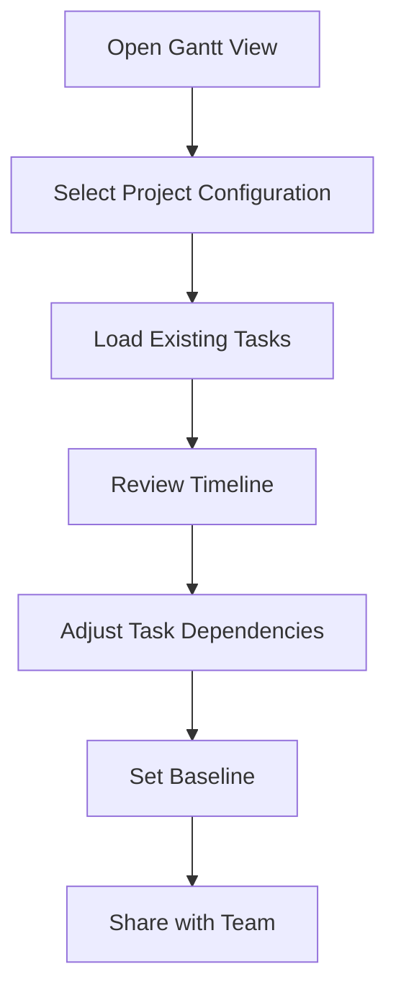
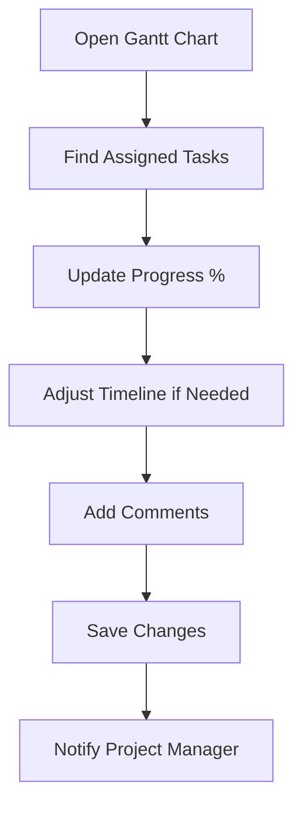
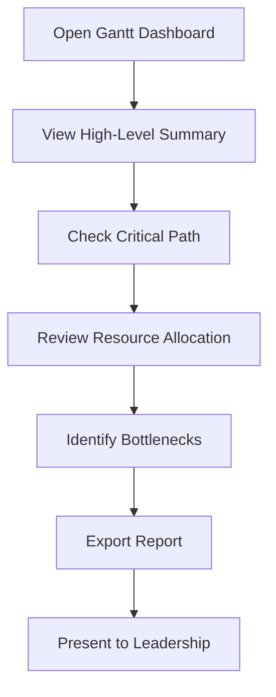
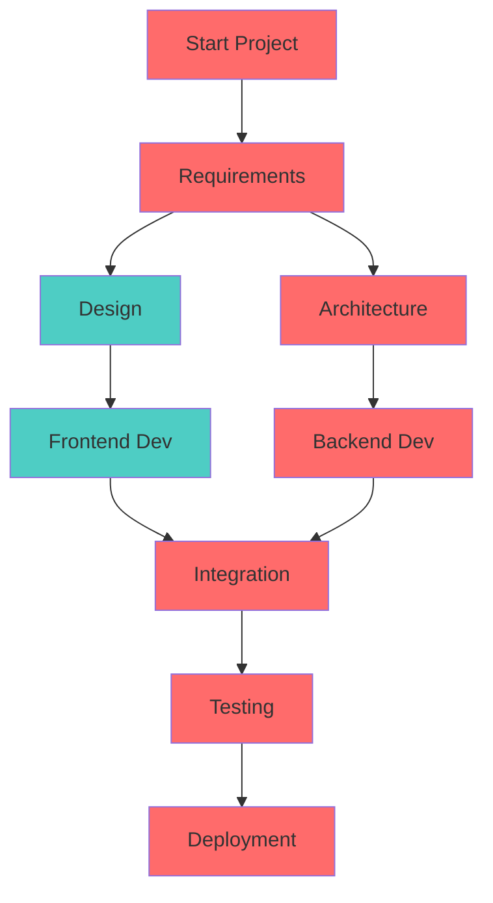

# Business Analysis: Gantt Chart Management

## Tổng quan

Gantt Chart trong Beqeek là công cụ lập kế hoạch và theo dõi tiến độ dự án theo dạng timeline. Hệ thống cho phép người dùng visualize task dependencies, track progress, và manage project schedules một cách trực quan.

## Mục tiêu nghiệp vụ

### 1. Project Planning & Visualization

- Hiển thị project timeline với tasks và milestones
- Visualize task dependencies và critical path
- Manage resource allocation và workload

### 2. Progress Tracking

- Real-time progress updates
- Baseline vs actual progress comparison
- Alert cho schedule deviations

### 3. Team Collaboration

- Assign tasks với clear timelines
- Coordinate task dependencies
- Communicate project status changes

## User flows và Scenarios

### Scenario 1: Project Manager Creates Project Plan

**User**: Project Manager  
**Goal**: Tạo project schedule cho Q1 2025



**Steps detail**:

1. User truy cập Active Tables
2. Click tab "Gantt"
3. Chọn configuration "Q1 2025 Project"
4. Thấy timeline từ Jan 1 → Mar 31
5. Xem các tasks với dependencies
6. Drag task bars để adjust timelines
7. Connect tasks để show dependencies
8. Click "Set Baseline" để save plan
9. Share Gantt view link với team

### Scenario 2: Team Member Updates Task Progress

**User**: Developer  
**Goal**: Update progress cho assigned tasks



**Steps detail**:

1. User opens shared Gantt link
2. Locates their tasks in timeline
3. Clicks progress bar và updates đến 75%
4. Drags end date if timeline needs adjustment
5. Adds comment explaining delay
6. System notifies stakeholders
7. Gantt chart updates với new progress

### Scenario 3: Stakeholder Reviews Project Status

**User**: Department Head  
**Goal**: Review overall project health



## Data Model và Configuration

### 1. Gantt Configuration Structure

```javascript
{
  ganttCharts: [
    {
      ganttScreenId: 'gantt-001', // Unique identifier
      screenName: 'Q1 2025 Project', // Display name
      taskNameField: 'title', // Field chứa task name
      startDateField: 'startDate', // Field chứa start date
      endDateField: 'endDate', // Field chứa end date
      progressField: 'progress', // Field chứa progress %
      dependencyField: 'dependencies', // Field chứa task dependencies
      milestoneField: 'isMilestone', // Field đánh dấu milestones
      assigneeField: 'assignedTo', // Field chứa assignee
      priorityField: 'priority', // Field chứa task priority

      // View settings
      defaultView: 'Month', // Day/Week/Month/Quarter
      showWeekends: true, // Hiển thị ngày cuối tuần
      showCriticalPath: true, // Highlight critical path
      colorScheme: 'default', // Màu sắc cho tasks

      // Advanced settings
      workingDays: [1, 2, 3, 4, 5], // Thứ 2-6 (Mon-Fri)
      workingHours: {
        start: '09:00',
        end: '17:00',
      },
      holidays: [
        // Ngày nghỉ
        '2025-01-01', // New Year
        '2025-01-27', // Tet holiday
      ],
    },
  ];
}
```

### 2. Task Data Structure

```javascript
{
  id: "task-123",
  title: "Implement user authentication",      // Task name
  description: "OAuth2 integration",         // Task description

  // Timeline data
  startDate: "2025-01-15T09:00:00Z",    // Planned start
  endDate: "2025-02-10T17:00:00Z",      // Planned end
  actualStartDate: "2025-01-16T10:30:00Z", // Actual start
  actualEndDate: null,                       // Actual end

  // Progress data
  progress: 45,                            // % complete
  progressByDay: [                          // Daily progress tracking
    { date: "2025-01-15", progress: 10 },
    { date: "2025-01-16", progress: 25 },
    { date: "2025-01-17", progress: 45 }
  ],

  // Dependencies
  dependencies: ["task-120", "task-121"], // Tasks cần complete trước
  dependents: ["task-124", "task-125"],    // Tasks chờ task này

  // Assignment data
  assignee: "John Doe",                     // Primary assignee
  teamMembers: ["Alice", "Bob"],            // Team members
  estimatedHours: 120,                       // Estimated effort
  actualHours: 54,                          // Actual effort spent

  // Classification
  priority: "high",                         // Task priority
  category: "Backend",                       // Task category
  tags: ["api", "security"],                // Task tags

  // Metadata
  isMilestone: false,                        // Is milestone task
  isCriticalPath: true,                     // On critical path
  riskLevel: "medium",                      // Risk assessment
  createdDate: "2025-01-01T00:00:00Z",     // When created
  lastUpdated: "2025-01-17T14:30:00Z"      // Last modification
}
```

## UI Components và Interactions

### 1. Gantt Chart Layout

```
┌─────────────────────────────────────────────────────────────────────────────┐
│ Q1 2025 Project                                           [🔽][⚙️] │
├─────────────────────────────────────────────────────────────────────────────┤
│ [Day][Week][Month] | [📍] [🔄] [📊] [📥] | [🔍] [👤]     │
├─────────────────────────────────────────────────────────────────────────────┤
│  January 2025                                                        │
│  ┌──────────────────────────────────────────────────────────────────────┐   │
│  │  Mon  Tue  Wed  Thu  Fri  Sat  Sun                          │   │
│  │   5     6     7     8     9    10    11                      │   │
│  │   12    13    14    15    16    17    18                      │   │
│  │   19    20    21    22    23    24    25                      │   │
│  │   26    27    28    29    30    31                             │   │
│  └──────────────────────────────────────────────────────────────────────┘   │
│                                                                      │
│  [🔴Critical Path]                                                  │
│  ┌─────────────────────────────────────────────────────────────────────┐ │
│  │ Task 1: Database Design                                   [👤JD] │ │
│  │ ████████████████████████████ 100%                        │ │
│  │ Jan 5 ────────────────── Jan 18                             │ │
│  └─────────────────────────────────────────────────────────────────────┘ │
│       │⬇                                                         │
│  ┌─────────────────────────────────────────────────────────────────────┐ │
│  │ Task 2: API Implementation                               [👤AS] │ │
│  │ ████████████████████████████ 75%                          │ │
│  │          Jan 15 ────────────────── Feb 10                      │ │
│  └─────────────────────────────────────────────────────────────────────┘ │
│       │⬇                                                         │
│  ┌─────────────────────────────────────────────────────────────────────┐ │
│  │ Task 3: Frontend Integration                             [👤BD] │ │
│  │ ████████████░░░░░░░░░░░░░░░ 40%                          │ │
│  │                    Feb 1 ────────────────── Feb 28             │ │
│  └─────────────────────────────────────────────────────────────────────┘ │
│                                                                      │
│  [⚪Milestone] Feb 15 - Beta Release                                │
│                                                                      │
└──────────────────────────────────────────────────────────────────────────────┘
```

### 2. Task Bar Component

```
┌──────────────────────────────────────────────────────────────────────────┐
│ 🟪 API Implementation                                    [👤Alice]  │
│ ████████████████████████████ 75%                         [📎3] │
│ Jan 15 ─────────────────────────────────────── Feb 10              │
│ [🔴 High] [🏷️ Backend] [⏱️ 80h] [💬 12] [⚙️]         │
└──────────────────────────────────────────────────────────────────────────┘
```

**Components explained**:

- **Task bar**: Shows duration và progress
- **Progress fill**: Visual progress percentage
- **Assignee avatar**: Who's responsible
- **Priority indicator**: Color-coded priority
- **Attachment count**: Number of files
- **Comment count**: Discussion thread length
- **Time tracking**: Estimated/actual hours
- **Tags**: Task categorization

### 3. Component Interactions

#### 3.1. Timeline Manipulation

- **Drag start date**: Adjust task timeline beginning
- **Drag end date**: Extend task duration
- **Drag entire task**: Move task trong timeline
- **Drag progress marker**: Update completion percentage
- **Create dependency**: Connect tasks với drag lines

#### 3.2. Task Details Panel

```
┌─────────────────────────────────────────┐
│ 📝 API Implementation              │
│                                    │
│ 👤 Assigned to: Alice Smith       │
│ 📅 Jan 15, 2025 - Feb 10, 2025 │
│ 📊 Progress: 75% (60/80 hours)   │
│                                    │
│ 🔗 Dependencies:                    │
│   • Database Design ✓               │
│   • Architecture Review ✓            │
│                                    │
│ 🏷️ Tags: Backend, API, Security    │
│ 💬 12 comments                     │
│ 📎 3 attachments                   │
│                                    │
│ [📝 Edit] [🗑️ Delete] [📤 Export]  │
└─────────────────────────────────────────┘
```

#### 3.3. View Controls

- **Time scale**: Day/Week/Month/Quarter toggle
- **Zoom controls**: Zoom in/out trên timeline
- **Filter panel**: Filter by assignee, priority, tags
- **Search bar**: Find tasks by name/description
- **Export options**: PDF, Excel, PNG formats

## Business Rules và Validations

### 1. Timeline Rules

```javascript
const timelineRules = {
  // Date validations
  startDateCannotBeAfterEnd: true,
  endDateCannotBeBeforeStart: true,
  milestonesCannotHaveDuration: true,

  // Working day rules
  excludeWeekends: true,
  respectHolidays: true,
  workingHours: '09:00-17:00',

  // Dependency rules
  cannotCreateCircularDependencies: true,
  dependencyMustBeValidTask: true,
  cannotDependOnSelf: true,
};
```

### 2. Progress Rules

```mermaid
stateDiagram-v2
    [*] --> NotStarted: Progress = 0%
    NotStarted --> InProgress: 0% < Progress < 100%
    InProgress --> Completed: Progress = 100%
    Completed --> InProgress: Reopen task

    note right of NotStarted
        Task created but not started
    note right of InProgress
        Work in progress
    note right of Completed
        Task finished
```

### 3. Dependency Types

```javascript
const dependencyTypes = {
  finish_to_start: {
    label: 'Finish-to-Start',
    description: 'Task B cannot start until Task A finishes',
    symbol: 'FS',
    example: 'Code Review FS Development',
  },

  start_to_start: {
    label: 'Start-to-Start',
    description: 'Task B cannot start until Task A starts',
    symbol: 'SS',
    example: 'QA SS Development',
  },

  finish_to_finish: {
    label: 'Finish-to-Finish',
    description: 'Task B cannot finish until Task A finishes',
    symbol: 'FF',
    example: 'Documentation FF Code',
  },

  start_to_finish: {
    label: 'Start-to-Finish',
    description: 'Task B cannot finish until Task A starts',
    symbol: 'SF',
    example: 'Training SF Current Support',
  },
};
```

## Advanced Features

### 1. Critical Path Analysis



**Critical Path**: Tasks red-tinted determine project duration

- Calculate longest path through project network
- Highlight tasks that delay project if late
- Show float/slack time for non-critical tasks

### 2. Resource Management

```javascript
{
  resourceAllocation: {
    teamMembers: [
      {
        id: "john-doe",
        name: "John Doe",
        capacity: 40, // hours/week
        skills: ["Backend", "Database"],
        currentWorkload: 35,
        availability: 5
      }
    ],

    workload: [
      {
        weekStart: "2025-01-13",
        memberWorkload: {
          "john-doe": 35,
          "alice-smith": 40,
          "bob-johnson": 38
        }
      }
    ]
  }
}
```

**Resource Views**:

- **Workload heatmap**: Visualize team capacity
- **Overallocation alerts**: Highlight overloaded team members
- **Resource leveling**: Auto-adjust task assignments
- **Skill matching**: Match tasks to team expertise

### 3. Baseline Management

```javascript
{
  baselines: [
    {
      id: "baseline-001",
      name: "Original Plan",
      createdDate: "2025-01-01",
      snapshot: {
        tasks: [...], // Complete task snapshot
        dependencies: [...],
        totalDuration: 90,
        estimatedCost: 150000
      }
    },
    {
      id: "baseline-002",
      name: "Revised Plan (Jan 15)",
      createdDate: "2025-01-15",
      changes: [
        {
          taskId: "task-123",
          field: "endDate",
          oldValue: "2025-02-05",
          newValue: "2025-02-10",
          reason: "Scope change request"
        }
      ]
    }
  ]
}
```

**Baseline Features**:

- **Version control**: Track plan evolution
- **Variance analysis**: Compare actual vs baseline
- **Change tracking**: Log all plan modifications
- **Rollback capability**: Restore previous baselines

## Performance Requirements

### 1. Rendering Performance

| Metric             | Target      | Notes                  |
| ------------------ | ----------- | ---------------------- |
| Initial load       | < 3 seconds | 100 tasks              |
| Zoom operations    | < 500ms     | Timeline zoom in/out   |
| Task drag          | < 100ms     | Smooth visual feedback |
| Dependency drawing | < 200ms     | Connection lines       |
| Progress updates   | < 1 second  | UI refresh             |

### 2. Data Management

| Metric                | Target       | Notes                   |
| --------------------- | ------------ | ----------------------- |
| Tasks per project     | 500 max      | Reasonable limit        |
| Dependencies per task | 10 max       | Complexity control      |
| Concurrent users      | 50 per Gantt | Real-time collaboration |
| Auto-save interval    | 30 seconds   | Data persistence        |

## Security Considerations

### 1. Access Control

```javascript
const ganttPermissions = {
  view: ['read', 'write', 'admin'],
  edit: ['write', 'admin'],
  create: ['write', 'admin'],
  delete: ['write', 'admin'],
  changeBaseline: ['admin'],
  manageTeam: ['admin'],
  export: ['read', 'write', 'admin'],
};
```

### 2. Data Protection

- **Field encryption**: Sensitive dates/durations encrypted
- **Audit trail**: All timeline changes logged
- **Version history**: Track all task modifications
- **Secure sharing**: Time-limited access links

## Mobile Responsiveness

### 1. Mobile Layout

```
┌─────────────────────────────────┐
│ Q1 2025 Project        [⚙️] │
│ [Week] [🔍] [👤]            │
├─────────────────────────────────┤
│ Jan 2025                    │
│ ┌─────────────────────────────┐│
│ │ 15  16  17  18  19  20 ││
│ │ 21  22  23  24  25  26 ││
│ │ 27  28  29  30  31     ││
│ └─────────────────────────────┘│
│                              │
│ 🟪 API Implementation       │
│ [👤Alice] 75%              │
│ Jan 15 - Feb 10              │
│                              │
│ [📝] [👥]                  │
│                              │
│ 🟪 Database Design         │
│ [👤John] 100% ✓             │
│ Jan 5 - Jan 18               │
│                              │
│ ──────────────────────────────│
│ [Load More Tasks...]          │
└─────────────────────────────────┘
```

### 2. Mobile Interactions

- **Touch timeline**: Scroll horizontal through months
- **Tap tasks**: Open detail panel
- **Long press**: Enter edit mode
- **Pinch zoom**: Zoom in/out on timeline
- **Swipe**: Navigate between weeks/months

## Integration Points

### 1. Project Management Tools

```javascript
{
  integrations: {
    jira: {
      syncTasks: true,
      syncProgress: true,
      bidirectionalSync: false
    },
    trello: {
      importCards: true,
      exportGantt: true,
      mapFields: {
        title: "name",
        dueDate: "due",
        assignee: "member"
      }
    },
    slack: {
      notifications: true,
      dailyDigest: true,
      commands: "/gantt status"
    }
  }
}
```

### 2. Calendar Systems

- **Google Calendar**: Sync task due dates
- **Outlook Calendar**: Project milestones
- **Apple Calendar**: Team availability
- **Team Calendars**: Resource scheduling

### 3. Time Tracking Systems

- **Harvest**: Track actual hours worked
- **Toggl**: Manual time entry
- **Clockify**: Automatic time tracking
- **Custom time logs**: Built-in timer

## Reporting và Analytics

### 1. Project Health Dashboard

```
┌─────────────────────────────────────────┐
│ Project Status: Q1 2025              │
├─────────────────────────────────────────┤
│ 📊 Overall Progress: 68%           │
│ ████████████████████████░░░░░      │
│                                     │
│ 📅 Timeline Status:                  │
│ 🟢 On Track: 45 tasks               │
│ 🟡 At Risk: 8 tasks                │
│ 🔴 Delayed: 3 tasks                │
│                                     │
│ 👥 Team Performance:                 │
│ 🟢 John: 100% utilization           │
│ 🟢 Alice: 85% utilization          │
│ 🟡 Bob: 120% overload              │
│                                     │
│ ⚡ Key Metrics:                      │
│ • Cycle Time: 14 days                │
│ • Velocity: 8 points/week            │
│ • Burn Rate: $5,000/week            │
│ • Remaining Budget: $85,000           │
└─────────────────────────────────────────┘
```

### 2. Export Capabilities

```javascript
const exportFormats = {
  pdf: {
    includeCharts: true,
    includeNotes: true,
    includeBaselines: true,
    pageSize: 'A3',
    orientation: 'landscape',
  },

  excel: {
    includeRawData: true,
    includeFormulas: true,
    includeDependencies: true,
    multipleSheets: true,
  },

  png: {
    resolution: 'high',
    includeTimeline: true,
    includeLegend: true,
    transparentBackground: false,
  },

  json: {
    includeAllFields: true,
    includeMetadata: true,
    includeHistory: true,
    prettyFormat: true,
  },
};
```

## Testing Strategy

### 1. Manual Testing Checklist

#### Core Functionality

- [ ] Load Gantt với 100+ tasks
- [ ] Drag task bars để adjust dates
- [ ] Create task dependencies
- [ ] Update task progress
- [ ] Switch timeline views (Day/Week/Month)

#### Advanced Features

- [ ] Critical path calculation correct
- [ ] Baseline creation và comparison
- [ ] Resource allocation alerts
- [ ] Export formats generate correctly
- [ ] Mobile responsive interactions

#### Performance

- [ ] Smooth zooming/panning
- [ ] Quick task updates
- [ ] Large dataset handling
- [ ] Real-time collaboration

### 2. Automated Testing

```javascript
describe('Gantt Chart', () => {
  test('drag task updates dates correctly', async () => {
    renderGanttChart();
    const taskBar = screen.getByTestId('task-api-implementation');

    // Drag task 5 days forward
    fireEvent.dragStart(taskBar);
    fireEvent.drop(screen.getByTestId('timeline-day-20'));

    await waitFor(() => {
      expect(patchTask).toHaveBeenCalledWith(
        expect.objectContaining({
          record: expect.objectContaining({
            endDate: '2025-02-15',
          }),
        }),
      );
    });
  });

  test('dependency creation prevents circular references', () => {
    const tasks = [
      { id: 'task-1', dependencies: ['task-2'] },
      { id: 'task-2', dependencies: ['task-1'] },
    ];

    expect(() => createDependency('task-1', 'task-2')).toThrow('Circular dependency detected');
  });

  test('critical path calculation', () => {
    const projectData = createTestProject();
    const criticalPath = calculateCriticalPath(projectData);

    expect(criticalPath).toHaveLength(5);
    expect(criticalPath[0].id).toBe('start-task');
    expect(criticalPath[4].id).toBe('end-task');
  });
});
```

## Future Enhancements

### Phase 1 (3 months)

- ✅ Resource leveling automation
- ✅ What-if scenario planning
- ✅ Custom field templates
- ✅ Advanced notification rules

### Phase 2 (6 months)

- ✅ Risk assessment dashboard
- ✅ Budget tracking và cost analysis
- ✅ Multi-project portfolio view
- ✅ AI-powered scheduling suggestions

### Phase 3 (12 months)

- ✅ Real-time collaboration with cursors
- ✅ Advanced reporting với drill-down
- ✅ Integration với time tracking auto-population
- ✅ Predictive analytics cho project completion

## Success Metrics

### 1. User Adoption

- **Daily active users**: > 70% project team members
- **Gantt creation**: +15% new projects per quarter
- **Feature usage**: > 80% users use dependency tracking

### 2. Project Performance

- **On-time delivery**: +25% projects finish on schedule
- **Budget adherence**: +20% better cost control
- **Team productivity**: +30% task completion rate

### 3. System Performance

- **Load time**: < 3 seconds for large projects
- **Update latency**: < 1 second for real-time changes
- **Uptime**: 99.8% availability during business hours

---

**Document Version**: 1.0  
**Last Updated**: 2025-11-03  
**Author**: Product Team  
**Review Status**: Ready for Development
