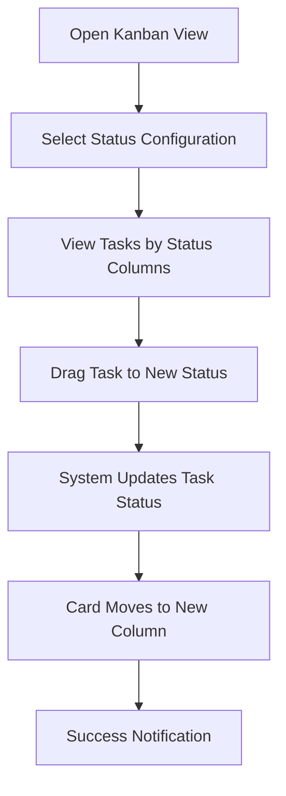
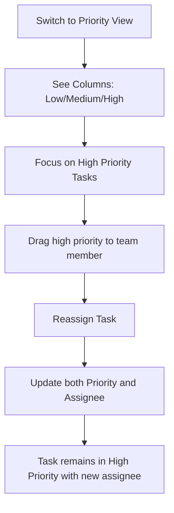

# Business Analysis: Kanban Board Management

## Tổng quan

Kanban Board trong Beqeek là một công cụ quản lý công việc trực quan, cho phép người dùng theo dõi tiến độ của các bản ghi thông qua các cột trạng thái khác nhau. Hệ thống hỗ trợ multi-kanban configuration cho cùng một bảng dữ liệu.

## Mục tiêu nghiệp vụ

### 1. Quản lý công việc trực quan

- Hiển thị các bản ghi dưới dạng cards
- Di chuyển cards giữa các cột trạng thái
- Cập nhật trạng thái real-time

### 2. Multi-dimensional views

- Xem cùng dữ liệu theo nhiều góc độ khác nhau
- Switch giữa các cấu hình Kanban khác nhau

### 3. Collaboration và tracking

- Track ai làm gì, khi nào
- Maintain audit trail của trạng thái changes

## User flows và Scenarios

### Scenario 1: Quản lý Task bằng Kanban Status

**User**: Project Manager  
**Goal**: Theo dõi tiến độ các task trong dự án



**Steps detail**:

1. User truy cập vào bảng Active Tables
2. Click tab "Kanban"
3. Chọn configuration "Task Status" từ dropdown
4. Thấy các cột: To Do → In Progress → Review → Done
5. Drag task "Fix login bug" từ "In Progress" → "Review"
6. System tự động update trạng thái trong database
7. Card di chuyển đến cột "Review"
8. Hiển thị notification "Cập nhật trạng thái thành công"

### Scenario 2: View Tasks by Priority Level

**User**: Team Lead  
**Goal**: Ưu tiên xử lý các task high priority



**Steps detail**:

1. User click dropdown "Task Status"
2. Select "Priority View"
3. Kanban board restructure với các cột: Low Priority → Medium Priority → High Priority
4. User thấy 3 tasks trong cột "High Priority"
5. Drag task "API performance issue" và assign cho developer "John"
6. System update cả priority và assignee
7. Task remain trong "High Priority" column với assignee mới

### Scenario 3: Date-based Filtering

**User**: Developer  
**Goal**: Xem tasks due this week

```mermaid
graph TD
    A[Open Date Filter] --> B[Select "This Week"]
    B --> C[Board Shows Only Tasks Due This Week]
    C --> D[Work on Tasks]
    D --> E[Complete Task]
    E --> F[Card Moves to Done Column]
    F --> G[Update Task Status to Done]
```

## Data Model và Configuration

### 1. Kanban Configuration Structure

```javascript
{
  kanbanConfigs: [
    {
      kanbanScreenId: 'kanban-001', // Unique identifier
      screenName: 'Task Status', // Display name
      statusField: 'status', // Field chứa trạng thái
      options: [
        // Các cột/trạng thái
        {
          value: 'todo', // Database value
          label: 'To Do', // Display label
          color: '#6B7280', // Column color (optional)
        },
        {
          value: 'inprogress',
          label: 'In Progress',
          color: '#3B82F6',
        },
        {
          value: 'review',
          label: 'Review',
          color: '#F59E0B',
        },
        {
          value: 'done',
          label: 'Done',
          color: '#10B981',
        },
      ],
    },
    {
      kanbanScreenId: 'kanban-002',
      screenName: 'Priority View',
      statusField: 'priority',
      options: [
        { value: 'low', label: 'Low Priority', color: '#6B7280' },
        { value: 'medium', label: 'Medium Priority', color: '#F59E0B' },
        { value: 'high', label: 'High Priority', color: '#EF4444' },
      ],
    },
  ];
}
```

### 2. Record Data Mapping

Mỗi bản ghi được hiển thị trên Kanban với các thông tin:

```javascript
{
  id: "record-123",
  title: "Fix login authentication issue",  // Primary display field
  description: "Users report login fails",    // Secondary display
  assignee: "John Doe",                  // User assignment
  priority: "high",                      // Current priority
  dueDate: "2025-11-10",               // Due date
  tags: ["bug", "auth"],                 // Tags for categorization
  attachments: 3,                        // Number of attachments
  comments: 5,                          // Comment count
  createdAt: "2025-11-01T09:00:00Z"    // Creation time
}
```

## UI Components và Interactions

### 1. Kanban Board Layout

```
┌─────────────────────────────────────────────────────────────────────┐
│ Kanban Board: Task Status                                [🔽] │
├─────────────────────────────────────────────────────────────────────┤
│ Date Filter: [This Week ▼]  │ [🔄] [➕] [⚙️]      │
├─────────────────────────────────────────────────────────────────────┤
│  To Do (12)       │  In Progress (8)   │  Review (5) │
│ ┌─────────────────┐ │ ┌─────────────────┐ │ ┌───────────┐ │
│ │ Fix login bug  │ │ │ API perf issue│ │ │ Code review│ │
│ │ +John         │ │ │ +Sarah        │ │ │ +Mike     │ │
│ │ 📎 3 💬 5    │ │ │ 🔴 High      │ │ │ 📅 Nov 12 │ │
│ └─────────────────┘ │ └─────────────────┘ │ └───────────┘ │
│ ┌─────────────────┐ │ ┌─────────────────┐ │             │
│ │ Update docs    │ │ │ Database sync  │ │             │
│ │ +Alice        │ │ │ +Tom          │ │             │
│ │ 📎 1 💬 2    │ │ │ 🟡 Medium    │ │             │
│ └─────────────────┘ │ └─────────────────┘ │             │
│                     │                   │             │
├─────────────────────┼───────────────────┼─────────────┤
│ [Load More...]      │ [Load More...]      │ [Load More...] │
└─────────────────────┴───────────────────┴─────────────┘
```

### 2. Card Component Structure

```
┌─────────────────────────────┐
│ 📌 Fix login bug         │  ← Priority indicator
│                          │
│ 👤 John Doe              │  ← Assignee
│ 📅 Due: Nov 10, 2025   │  ← Due date
│                          │
│ 🔴 High 🏷️ bug 🏷️ auth│  ← Priority, Tags
│ 📎 3 attachments 💬 5    │  ← Attachments, Comments
│                          │
│ [⚙️] [🗑️]              │  ← Actions menu
└─────────────────────────────┘
```

### 3. Component Interactions

#### 3.1. Drag & Drop

- **Trigger**: Mouse down trên card, drag sang column khác
- **Visual feedback**: Card follows mouse, destination column highlights
- **Drop action**: Update trạng thái trong database
- **Success animation**: Card slides vào position mới
- **Error handling**: Card jumps back nếu API fail

#### 3.2. Quick Actions

- **Inline edit**: Click vào title để rename task
- **Assignee change**: Click avatar để reassign
- **Status quick change**: Right-click menu với status options
- **Add card**: "+" button ở bottom mỗi column

#### 3.3. Filtering và Sorting

- **Date filter**: Dropdown với preset ranges
- **Multi-select filter**: Filter theo assignee, tags
- **Search bar**: Real-time search trong card titles
- **Sort options**: By due date, priority, assignee

## Business Rules và Validations

### 1. Permission Rules

```javascript
const permissions = {
  // View permissions
  canViewBoard: ['read', 'write', 'admin'],

  // Card operations
  canCreateCard: ['write', 'admin'],
  canEditCard: ['write', 'admin'],
  canDeleteCard: ['write', 'admin'],
  canMoveCard: ['write', 'admin'],

  // Column operations
  canAddColumn: ['admin'],
  canEditColumn: ['admin'],
  canReorderColumn: ['write', 'admin'],
};
```

### 2. State Transitions

```mermaid
stateDiagram-v2
    [*] --> Todo
    Todo --> InProgress: Start work
    InProgress --> Review: Submit for review
    InProgress --> Todo: Pause work
    Review --> InProgress: Request changes
    Review --> Done: Approve
    Done --> InProgress: Reopen

    note right of Todo
        New task created
    note right of InProgress
        Work in progress
    note right of Review
        Pending approval
    note right of Done
        Completed
```

### 3. Validation Rules

- **Required fields**: Title phải có trước khi create card
- **Due dates**: Không thể set due date trong quá khứ
- **Assignee validation**: Chỉ assign cho users có permission
- **Column limits**: Max 100 cards per column (performance)
- **File attachment**: Max 10MB per file

## Performance Requirements

### 1. Loading Performance

- **Initial load**: < 2 seconds cho 50 cards
- **Lazy loading**: Load 20 cards per column
- **Virtual scrolling**: Cho boards với 500+ cards
- **Caching**: Local cache của card data

### 2. Interaction Performance

- **Drag response**: < 100ms visual feedback
- **Drop completion**: < 500ms database update
- **Search response**: < 300ms search results
- **Filter application**: < 1 second board refresh

## Security Considerations

### 1. Data Protection

- **E2EE encryption**: Sensitive fields được mã hóa client-side
- **Field-level access**: Hiển thị dựa trên user permissions
- **Audit trail**: Log tất cả state changes với timestamps

### 2. Access Control

- **Workspace-based**: Users chỉ access boards trong workspace
- **Role-based permissions**: Admin, Manager, Member roles
- **Share links**: Temporary access links với expiration

## Mobile Responsiveness

### 1. Mobile Layout

```
┌─────────────────────────┐
│ Task Status     [🔽] │
│ [This Week ▼] [⚙️]  │
├─────────────────────────┤
│ To Do (12)           │
│ ┌─────────────────────┐│
│ │ Fix login bug      ││
│ │ 👤 John 📅 Nov 10││
│ │ 🔴 High          ││
│ └─────────────────────┘│
│ ┌─────────────────────┐│
│ │ Update docs       ││
│ │ 👤 Alice 📅 Nov 12││
│ └─────────────────────┘│
│                      │
│ [Load More...]       │
└─────────────────────────┘
```

### 2. Mobile Interactions

- **Touch drag**: Long press để pick up card
- **Swipe gestures**: Swipe để show context menu
- **Horizontal scroll**: Swipe giữa các columns
- **Pull-to-refresh**: Reload latest data

## Analytics và Reporting

### 1. Board Metrics

- **Cycle time**: Average time from To Do → Done
- **Throughput**: Number of cards completed per week
- **WIP limits**: Work in progress by column
- **Bottleneck detection**: Columns with longest wait times

### 2. User Activity

- **Cards created**: By user, by time period
- **Cards moved**: State change frequency
- **Collaboration index**: Cross-user assignments
- **Time tracking**: Time spent on each card

## Integration Points

### 1. Calendar Integration

- **Due dates sync**: Với Google Calendar, Outlook
- **Calendar view**: Kanban cards trong calendar timeline
- **Meeting scheduling**: Cards liên quan đến meetings

### 2. Notification System

- **Email alerts**: Due date reminders, assignments
- **In-app notifications**: Real-time board updates
- **Mobile push**: Critical board activities
- **Slack integration**: Board status updates

### 3. File Management

- **Attachment storage**: Cloud storage integration
- **Preview generation**: Images, PDFs thumbnails
- **Version control**: File versions trong cards
- **Sharing permissions**: File access control

## Testing Strategy

### 1. Manual Testing Checklist

#### Basic Functionality

- [ ] Load board với 50+ cards
- [ ] Drag card giữa các columns
- [ ] Create new card trong column
- [ ] Edit card title và description
- [ ] Delete card với confirmation
- [ ] Switch giữa các kanban configurations

#### Filtering và Search

- [ ] Date filter với các presets
- [ ] Multi-select filter cho assignees
- [ ] Text search trong card titles
- [ ] Filter combinations work correctly

#### Performance

- [ ] Smooth drag animations
- [ ] Quick response to interactions
- [ ] Lazy loading không interrupt UX
- [ ] Large datasets (500+ cards) responsive

#### Security

- [ ] Permission-based access control
- [ ] Encrypted fields display correctly
- [ ] Audit trail records changes
- [ ] Share links expire properly

### 2. Automated Testing

```javascript
describe('Kanban Board', () => {
  test('drag and drop updates card status', async () => {
    renderKanbanBoard();
    const sourceCard = screen.getByText('Fix login bug');
    const targetColumn = screen.getByTestId('column-review');

    fireEvent.dragStart(sourceCard);
    fireEvent.dragOver(targetColumn);
    fireEvent.drop(targetColumn);

    await waitFor(() => {
      expect(screen.getByText('Cập nhật trạng thái thành công')).toBeInTheDocument();
    });

    // Verify API call
    expect(patchRecord).toHaveBeenCalledWith(
      expect.objectContaining({
        record: expect.objectContaining({
          status: 'review',
        }),
      }),
    );
  });

  test('switch kanban configuration updates board layout', () => {
    renderKanbanBoard();

    const configSelect = screen.getByTestId('kanban-config-select');
    fireEvent.change(configSelect, { target: { value: 'priority-view' } });

    expect(screen.getByText('Low Priority')).toBeInTheDocument();
    expect(screen.getByText('Medium Priority')).toBeInTheDocument();
    expect(screen.getByText('High Priority')).toBeInTheDocument();
    expect(screen.queryByText('To Do')).not.toBeInTheDocument();
  });
});
```

## Future Enhancements

### Phase 1 (3 months)

- ✅ Custom column colors và icons
- ✅ Card templates cho common task types
- ✅ Bulk operations (multi-select cards)
- ✅ Board sharing với external users

### Phase 2 (6 months)

- ✅ Advanced automation (rules-based)
- ✅ Time tracking integration
- ✅ Custom fields trên cards
- ✅ Board analytics dashboard

### Phase 3 (12 months)

- ✅ AI-powered task suggestions
- ✅ Resource allocation optimization
- ✅ Cross-board dependency tracking
- ✅ Mobile app native version

## Success Metrics

### 1. User Adoption

- **Daily active users**: > 80% of workspace members
- **Board creation rate**: +25% quarter over quarter
- **Feature usage**: > 60% users use drag & drop weekly

### 2. Productivity Impact

- **Task completion time**: -30% average time per task
- **Team collaboration**: +40% cross-user assignments
- **Visibility improvement**: -50% "what should I work on" questions

### 3. Technical Performance

- **Load time**: < 2 seconds (95th percentile)
- **Uptime**: 99.9% availability
- **Error rate**: < 0.1% failed operations

---

**Document Version**: 1.0  
**Last Updated**: 2025-11-03  
**Author**: Product Team  
**Review Status**: Ready for Development
