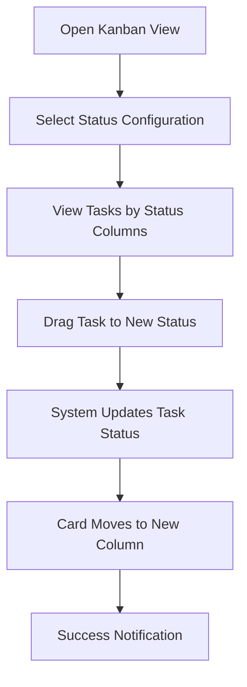
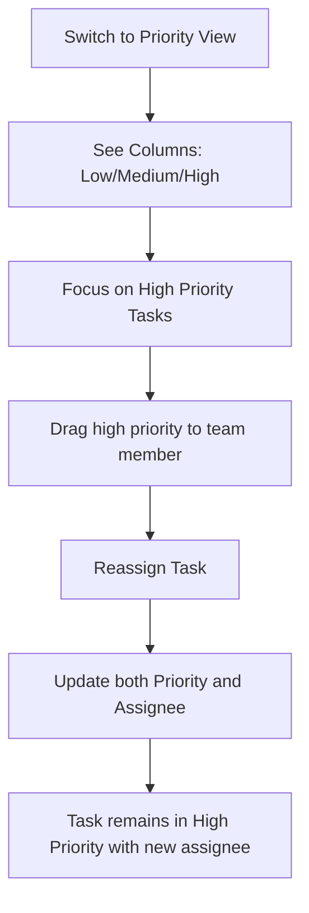

# Business Analysis: Kanban Board Management (Fixed Version)

## User flows và Scenarios

### Scenario 1: Quản lý Task bằng Kanban Status

**User**: Project Manager  
**Goal**: Theo dõi tiến độ các task trong dự án



### Scenario 2: View Tasks by Priority Level

**User**: Team Lead  
**Goal**: Ưu tiên xử lý các task high priority



### Scenario 3: Date-based Filtering

**User**: Developer  
**Goal**: Xem tasks due this week

```mermaid
graph TD
    A[Open Date Filter] --> B[Select "This Week"]
    B --> C[Board Shows Only Tasks Due This Week]
    C --> D[Work on Tasks]
    D --> E[Complete Task]
    E --> F[Card Moves to Done Column]
    F --> G[Update Task Status to Done]
```

## State Transitions

```mermaid
stateDiagram-v2
    [*] --> Todo
    Todo --> InProgress: Start work
    InProgress --> Review: Submit for review
    InProgress --> Todo: Pause work
    Review --> InProgress: Request changes
    Review --> Done: Approve
    Done --> InProgress: Reopen

    note right of Todo
        New task created
    note right of InProgress
        Work in progress
    note right of Review
        Pending approval
    note right of Done
        Completed
```
