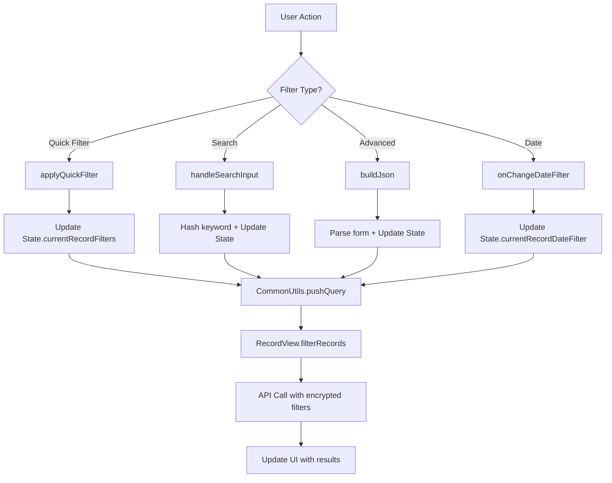

# Business Analysis: Table Records Filtering System

## Tổng quan

Hệ thống Active Tables trong Beqeek hỗ trợ nhiều tầng lọc dữ liệu phức tạp, cho phép người dùng tìm kiếm và lọc bản ghi theo nhiều tiêu chí khác nhau. Tài liệu này phân tích chi tiết về các loại filter, luồng hoạt động và khả năng của hệ thống.

## Phân loại hệ thống filtering

### 1. Quick Filters (Bộ lọc nhanh)

**Mục đích**: Cho phép người dùng lọc nhanh bằng các dropdown sẵn có trong header.

**Các field được hỗ trợ**:

- `CHECKBOX_YES_NO`: Yes/No
- `SELECT_ONE`: Single choice options
- `SELECT_LIST`: Multiple choice options
- `SELECT_ONE_WORKSPACE_USER`: Single user selection
- `SELECT_LIST_WORKSPACE_USER`: Multiple user selection

**Cấu hình**:

```javascript
// Trong table.config.quickFilters
{
  quickFilters: [
    {
      fieldName: 'status', // Tên trường trong database
      type: 'SELECT_ONE', // Type của trường
    },
  ];
}
```

**Vị trí UI**: Header bar bên phải, ngay cạnh search box.

### 2. Full-text Search (Tìm kiếm toàn văn bản)

**Mục đích**: Tìm kiếm nội dung trên tất cả các trường có thể tìm kiếm.

**Luồng hoạt động**:

1. Người dùng nhập vào search box `#search-records`
2. Text được tokenize và hash với `CommonUtils.hashKeyword()`
3. Lưu vào `States.currentRecordFilters.fulltext`
4. Gửi kèm request API để server tìm kiếm

**Cấu trúc filter**:

```javascript
{
  fulltext: 'hashed_tokens_space_separated'; // Tokens đã được hash
}
```

### 3. Advanced Filter Builder (Bộ lọc nâng cao)

**Mục đích**: Cho phép người dùng tạo các điều kiện lọc phức tạp với nhiều tiêu chí.

**Cấu trúc class**:

```javascript
class RecordFilterBuilder {
  constructor() {
    this.fields = States.currentTable.config.fields;
    this.addFilterBtn = document.getElementById('add-filter');
    this.filtersContainer = document.getElementById('dxft-filters-container');
  }
}
```

**Các thành phần**:

- **Field Selection**: Dropdown chọn trường muốn lọc
- **Operator Selection**: Các toán tử so sánh (=, !=, >, <, >=, <=, in, not in)
- **Value Input**: Input giá trị theo loại field
- **Dynamic Rows**: Thêm/xóa nhiều điều kiện lọc

**Các operators hỗ trợ**:

```javascript
const operators = {
  // Equality operators
  '=': 'Bằng',
  '!=': 'Khác bằng',

  // Range operators (cho numeric/date)
  '>': 'Lớn hơn',
  '<': 'Nhỏ hơn',
  '>=': 'Lớn hơn hoặc bằng',
  '<=': 'Nhỏ hơn hoặc bằng',

  // List operators
  in: 'Nằm trong',
  not_in: 'Không nằm trong',

  // String operators
  contains: 'Chứa',
  not_contains: 'Không chứa',
  starts_with: 'Bắt đầu bằng',
  ends_with: 'Kết thúc bằng',
};
```

### 4. Date Filters (Bộ lọc theo thời gian)

**Mục đích**: Lọc bản ghi theo khoảng thời gian.

**Các khoảng thời gian hỗ trợ**:

- `today`: Hôm nay
- `yesterday`: Hôm qua
- `this_week`: Tuần này
- `last_week`: Tuần trước
- `this_month`: Tháng này
- `last_month`: Tháng trước
- `this_quarter`: Quý này
- `last_quarter`: Quý trước
- `this_year`: Năm nay
- `last_year`: Năm trước

**Vị trí UI**: Dropdown selector trong Kanban view.

## Luồng hoạt động của hệ thống

### 1. Initial State Setup

```javascript
// Khi load trang
States.currentRecordFilters = queryParams?.filtering || {
  record: {}, // Nested object cho field-level filters
};
States.currentRecordDateFilter = null;
```

### 2. Filter Application Flow



### 3. Filter Persistence

**URL Persistence**: Filter được lưu trong URL parameters:

```javascript
CommonUtils.pushQuery({
  filtering: Object.fromEntries(Object.entries(States.currentRecordFilters).filter(([key]) => key !== 'fulltext')),
  dateFilter: States.currentRecordDateFilter || null,
});
```

**State Management**:

- Global state trong `States.currentRecordFilters`
- View-specific state cho Table/Kanban/Gantt

### 4. API Integration

**Endpoint**: `POST /api/workspace/{workspaceId}/workflow/get/active_tables/{tableId}/records`

**Request structure**:

```javascript
{
  paging: 'cursor',
  filtering: {
    // Advanced filters
    record: {
      'status:=': 'done',           // Field + operator + value
      'priority:>=': 'medium',
      'created_at:>=': '2024-01-01'
    },

    // Quick filters
    assigned_user: 'user123',

    // Full-text search
    fulltext: 'hashed_search_tokens',

    // Reference filters
    'project:in': ['proj1', 'proj2']
  },
  next_id: 'cursor_string',
  direction: 'asc',
  limit: 20
}
```

## Bảo mật và Mã hóa

### 1. Field-level Encryption

Các trường được mã hóa trước khi gửi API dựa trên type:

```javascript
// Text fields: AES-256-CBC
['SHORT_TEXT', 'RICH_TEXT', 'TEXT', 'EMAIL', 'URL'][
  // Numeric/Date fields: Order Preserving Encryption (OPE)
  ('INTEGER', 'NUMERIC', 'DATE', 'DATETIME', 'TIME', 'YEAR', 'MONTH', 'DAY', 'HOUR', 'MINUTE', 'SECOND')
][
  // Select fields: HMAC-SHA256
  ('CHECKBOX_YES_NO', 'CHECKBOX_ONE', 'CHECKBOX_LIST', 'SELECT_ONE', 'SELECT_LIST')
][
  // Reference fields: Không mã hóa
  ('SELECT_ONE_RECORD', 'SELECT_LIST_RECORD', 'SELECT_ONE_WORKSPACE_USER', 'SELECT_LIST_WORKSPACE_USER')
];
```

### 2. Search Tokenization

```javascript
// Full-text search được tokenize và hash
static tokenize(text) {
  return text
    .normalize('NFD')        // Tách dấu tiếng Việt
    .replace(/[\u0300-\u036f]/g, '')  // Xóa dấu
    .toLowerCase()
    .split(/\W+/)         // Tách theo ký tự không phải chữ cái/số
    .filter(Boolean);        // Xóa phần tử rỗng
}

static hashKeyword(text, tableToken = '') {
  const tokens = this.tokenize(text);
  return tokens.map(token =>
    CryptoJS.HmacSHA256(token, tableToken).toString(CryptoJS.enc.Hex)
  );
}
```

## Các View hỗ trợ

### 1. Records Table View

- Full-text search trong header
- Quick filters bar
- Advanced filter popup
- Pagination với cursor

### 2. Kanban View

- Quick filters cho các column
- Date filter riêng cho Kanban
- Filter theo status field

### 3. Gantt Chart View

- Quick filters
- Date range filtering
- Filter theo task-related fields

### 4. Charts View

- Quick filters để thống kê
- Date filtering cho reports

## Performance Considerations

### 1. Client-side Optimizations

**Debouncing**: Search input được debounced để tránh quá nhiều API calls.

**Caching**: Filter results được cache trong `States.recordsBag` để tránh duplicate requests.

**Lazy Loading**: Select2 dropdowns với AJAX thay vì load toàn bộ options.

### 2. Server-side Optimizations

**Cursor-based Pagination**: Hiệu quả hơn cho large datasets.

**Indexing Support**: Hashed keywords được tạo để database indexing.

**Encryption Performance**: OPE cho numeric fields để vẫn có range queries.

## User Experience Flow

### Scenario 1: Quick Status Filter

1. User clicks "Status" dropdown in quick filter bar
2. Selects "In Progress" from options
3. System calls `applyQuickFilter('status', 'inprogress')`
4. Updates URL with filter parameter
5. Calls API with encrypted filter value
6. Renders updated table/kanban

### Scenario 2: Advanced Multi-field Filter

1. User clicks "Filter List" button
2. System opens advanced filter popup
3. User adds multiple conditions:
   - Priority: >= High
   - Due Date: <= Today
   - Assigned To: User123
4. System builds JSON filter object
5. Applies to all views (table/kanban/gantt)

### Scenario 3: Full-text Search

1. User types "project alpha" in search box
2. System tokenizes and hashes search terms
3. Adds to API call as `fulltext` parameter
4. Server searches across all searchable fields
5. Results highlighted in UI

## Limitations và Future Enhancements

### Current Limitations

- ❌ No saved filter templates
- ❌ No filter combinations (AND/OR logic)
- ❌ Limited to equality/range operators
- ❌ No date range picker (only presets)

### Proposed Enhancements

- ✅ Filter templates với save/load functionality
- ✅ Advanced boolean logic (AND/OR/NOT combinations)
- ✅ Custom date range picker
- ✅ Filter export/import
- ✅ Real-time filter preview with result count
- ✅ Filter sharing giữa users

## Technical Debt Areas

1. **Filter State Management**:
   - Current implementation phân tán state qua nhiều class
   - Cần centralize trong Redux/Zustand store

2. **Encryption Overhead**:
   - Hash toàn bộ search terms có thể impact performance
   - Cần optimize cho large text fields

3. **UI Responsiveness**:
   - Advanced filter popup cần responsive design
   - Mobile experience cần cải thiện

## Testing Checklist

### Manual Testing

- [ ] Quick filters apply correctly to all views
- [ ] Full-text search returns relevant results
- [ ] Advanced filter handles all operators
- [ ] Date filters work with timezones
- [ ] Filter persistence via URL reload
- [ ] Encrypted filters decrypt correctly server-side
- [ ] Empty filter returns all records

### Automated Testing

```javascript
describe('Filter System', () => {
  test('quick filter updates URL parameters', () => {
    applyQuickFilter('status', 'done');
    expect(window.location.search).toContain('status=done');
  });

  test('search terms are tokenized and hashed', () => {
    const hashed = hashKeyword('test search');
    expect(hashed).toHaveLength(2); // ['test', 'search']
    expect(hashed[0]).toMatch(/^[a-f0-9]{64}$/);
  });

  test('advanced filter builds correct JSON', () => {
    // Test filter builder logic
  });
});
```

## Conclusion

Hệ thống filtering trong Active Tables cung cấp khả năng tìm kiếm và lọc dữ liệu đa dạng, từ quick filters đơn giản đến advanced filters phức tạp. Architecture hiện tại hỗ trợ encryption, multiple views, và cursor-based pagination. Tuy nhiên vẫn còn room for improvement về UX, performance, và advanced filter logic.

Recommendation cho phase tiếp theo:

1. Implement filter templates
2. Add boolean logic support
3. Optimize client-side performance
4. Enhance mobile UX

---

**Document Version**: 1.0  
**Last Updated**: 2025-11-03  
**Author**: Engineering Team  
**Review Status**: Pending
