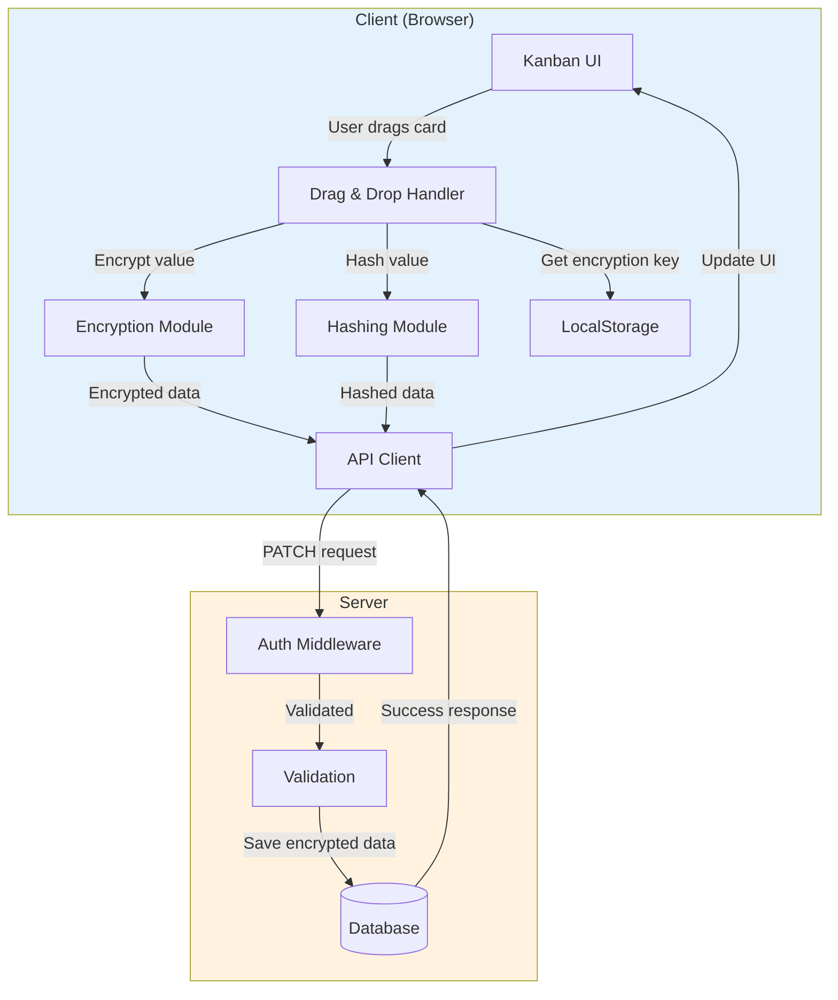
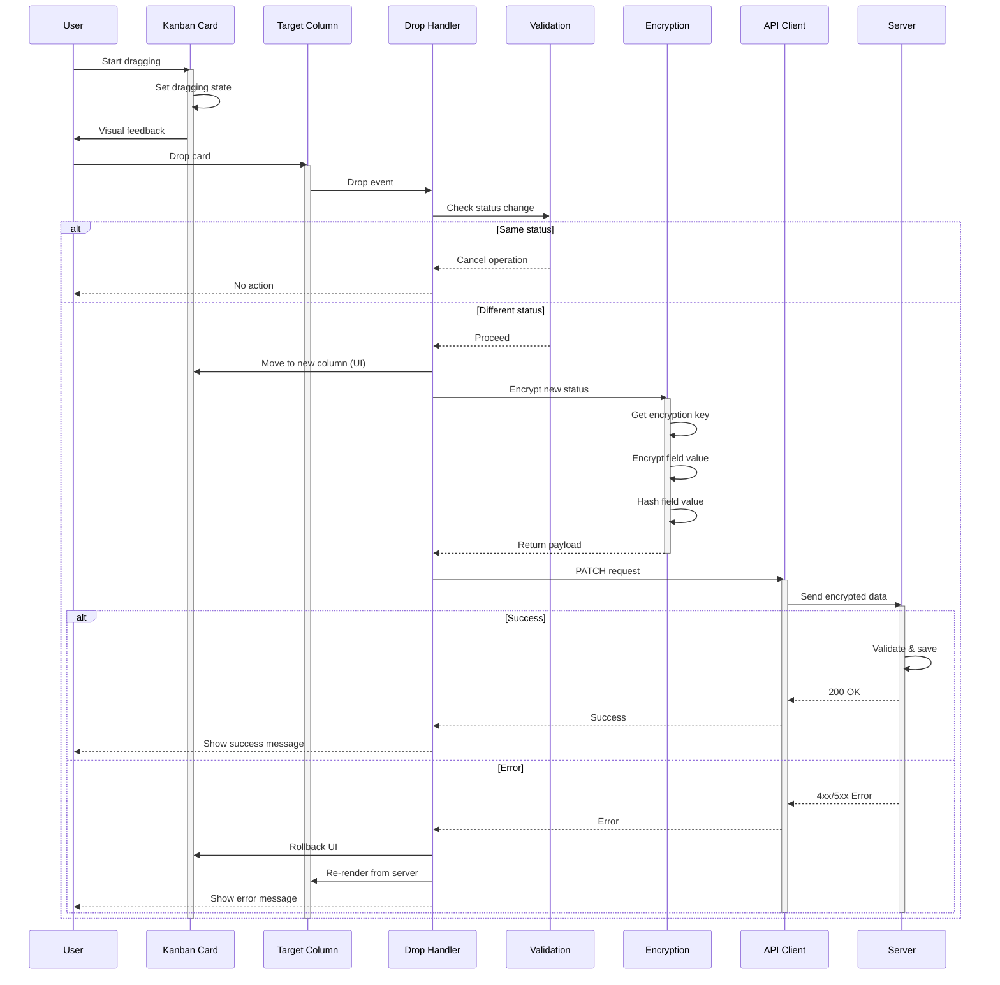
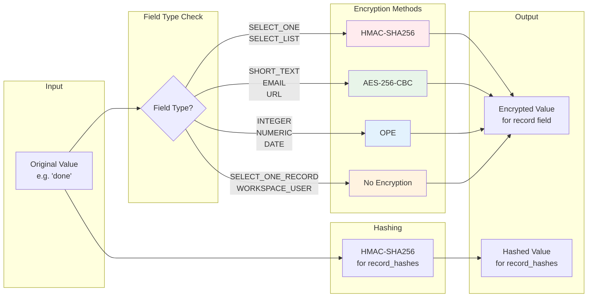
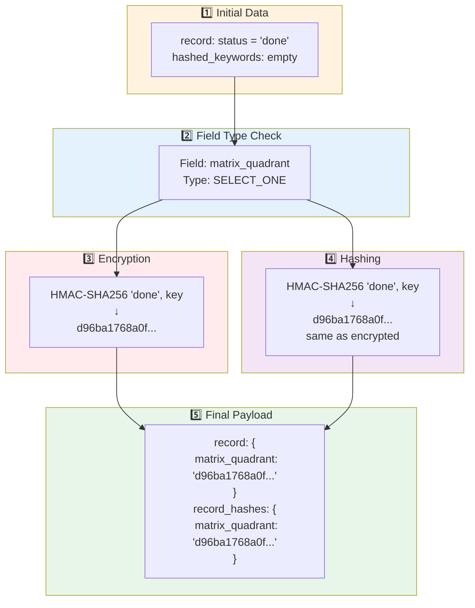
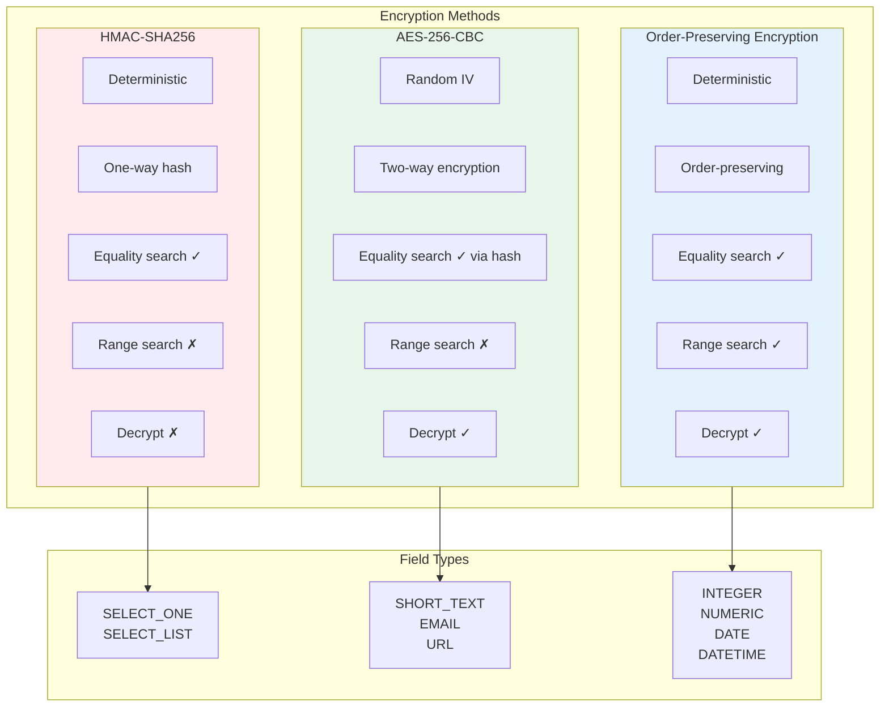
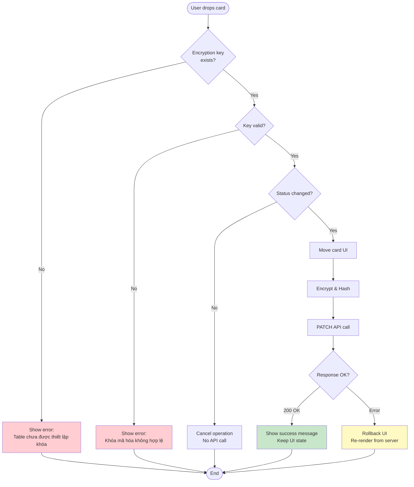
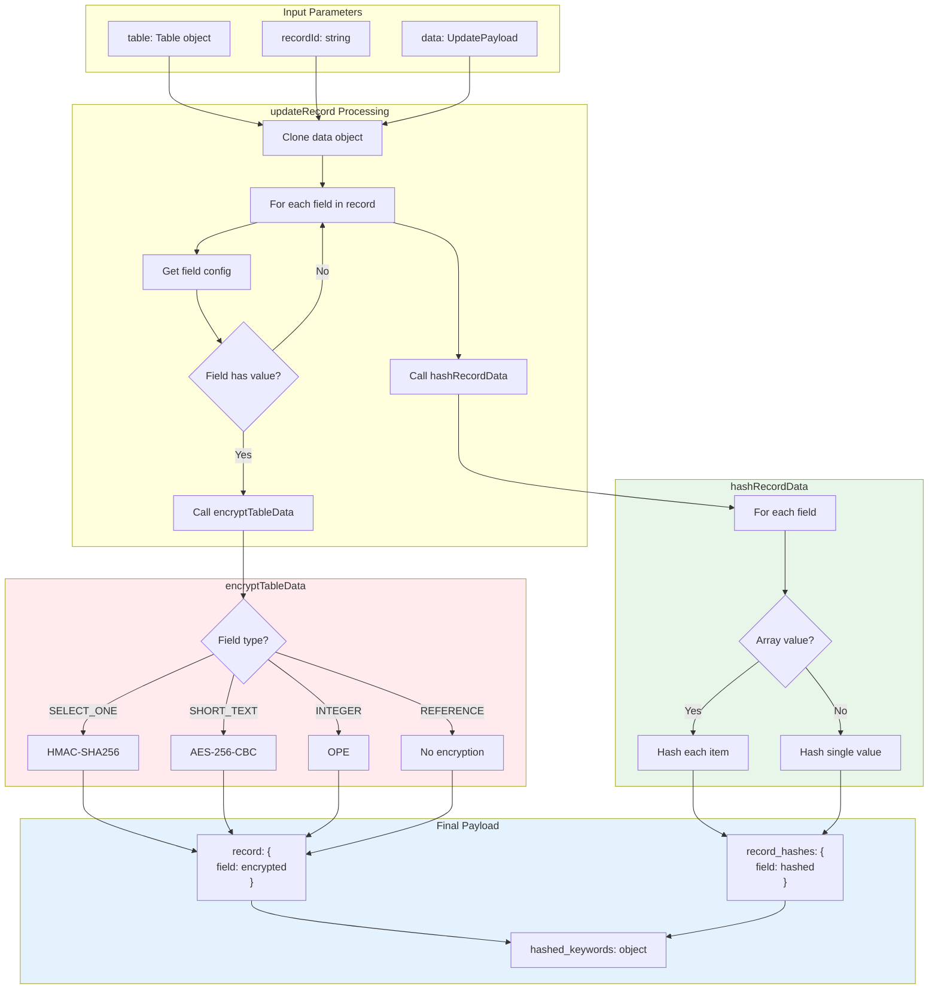
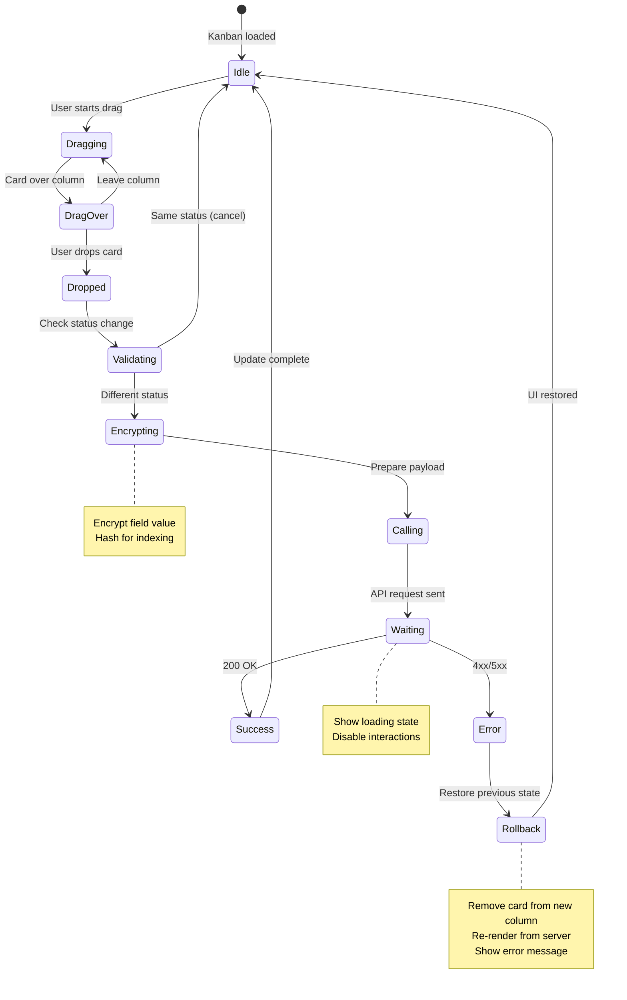
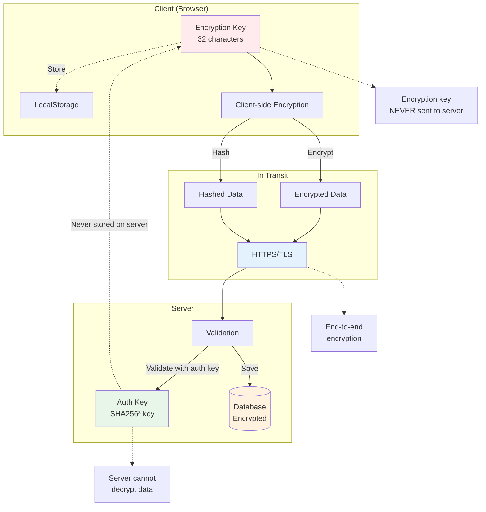
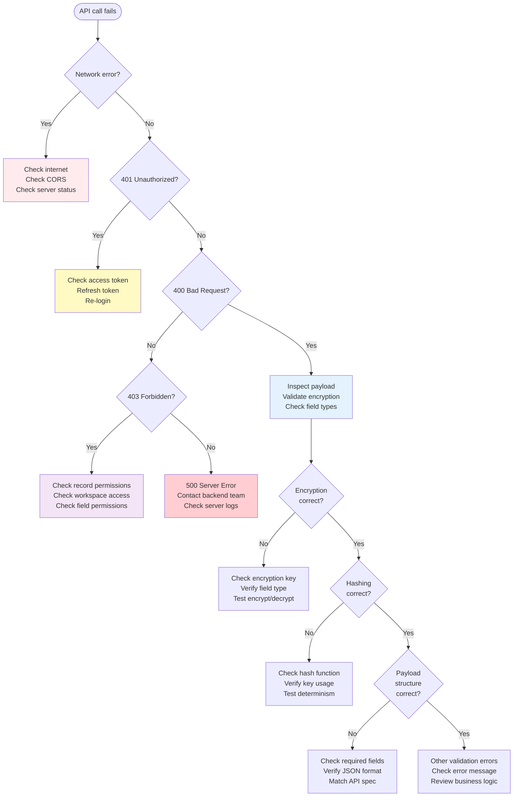

# Kanban Drag & Drop - Visual Flow Diagrams

## 1. Overall System Architecture

## 2. Drag & Drop Event Flow

## 3. Encryption Pipeline

## 4. Data Transformation Flow

## 5. Encryption Methods Comparison

## 6. Error Handling Flow

## 7. Payload Construction Detailed

## 8. State Management Flow

## 9. Security Model

## 10. Debugging Decision Tree

## Legend

### Colors in Diagrams

- 🔴 **Red** (#ffebee): HMAC-SHA256 encryption
- 🟢 **Green** (#e8f5e9): AES-256-CBC encryption
- 🔵 **Blue** (#e3f2fd): OPE encryption / Data flow
- 🟡 **Yellow** (#fff3e0): No encryption / Warnings
- 🟣 **Purple** (#f3e5f5): Hashing operations

### Symbols

- `→` : Synchronous flow
- `-.->` : Asynchronous flow / Reference
- `🔒` : Encrypted data
- `#️⃣` : Hashed data
- `⚠️` : Warning / Validation required
- `✓` : Supported operation
- `✗` : Unsupported operation

---

**Note**: These diagrams are written in Mermaid syntax and can be rendered in:

- GitHub (native support)
- GitLab (native support)
- VS Code (with Mermaid extension)
- Online editors (mermaid.live)
