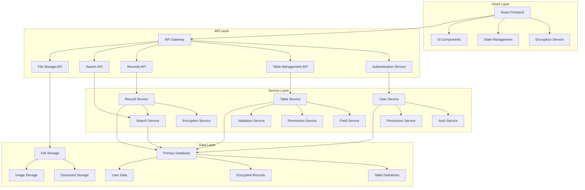
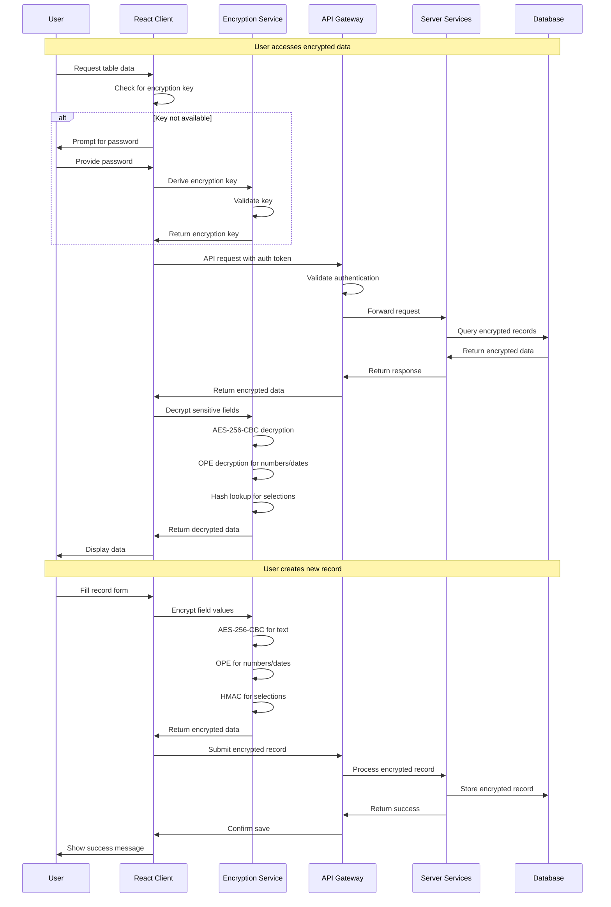

# System Architecture: Active Tables React Implementation

## Table of Contents

1. [Architecture Overview](#architecture-overview)
2. [Technology Stack](#technology-stack)
3. [Component Architecture](#component-architecture)
4. [State Management](#state-management)
5. [Security Architecture](#security-architecture)
6. [API Architecture](#api-architecture)
7. [Data Flow Architecture](#data-flow-architecture)
8. [Performance Architecture](#performance-architecture)
9. [Scalability Design](#scalability-design)
10. [Deployment Architecture](#deployment-architecture)

## Architecture Overview

### High-Level Architecture Diagram



### Architecture Principles

1. **Security-First Design**: End-to-end encryption with client-side key management
2. **Microservices Architecture**: Loosely coupled services with well-defined interfaces
3. **Component-Based Frontend**: Modular React components with reusable patterns
4. **API-First Integration**: RESTful APIs with comprehensive documentation
5. **Scalability**: Horizontal scaling support with stateless services
6. **Performance**: Optimized for real-time encryption and large datasets
7. **Maintainability**: Clean code architecture with comprehensive testing

## Technology Stack

### Frontend Technologies

#### Core Framework

- **React 18+**: Modern React with concurrent features
- **TypeScript**: Type safety and enhanced developer experience
- **Vite**: Fast build tool and development server

#### State Management

- **Zustand**: Lightweight state management with TypeScript support
- **React Query (TanStack Query)**: Server state management and caching
- **React Hook Form**: Form state management and validation

#### UI Components

- **Material-UI (MUI)**: Component library with consistent design
- **Emotion**: CSS-in-JS styling solution
- **React Virtualized**: Large dataset rendering optimization

#### Utility Libraries

- **CryptoJS**: Client-side encryption implementation
- **Axios**: HTTP client with interceptors
- **React Router**: Client-side routing
- **React Hook Form**: Form handling and validation
- **React Hot Toast**: Notification system

### Backend Technologies

#### Core Framework

- **Laravel 9+**: PHP framework with comprehensive features
- **MySQL 8+**: Primary database with JSON support
- **Redis**: Caching and session storage

#### Security & Encryption

- **OpenSSL**: Server-side encryption operations
- **JWT**: Authentication token management
- **Laravel Sanctum**: API authentication

#### Development Tools

- **PHPUnit**: Unit and integration testing
- **Laravel Telescope**: Application debugging
- **Laravel Horizon**: Queue monitoring

### Infrastructure & DevOps

#### Containerization & Orchestration

- **Docker**: Containerization of services
- **Kubernetes**: Container orchestration and scaling
- **Docker Compose**: Local development environment

#### CI/CD Pipeline

- **GitHub Actions**: Continuous integration and deployment
- **Laravel Dusk**: End-to-end testing
- **Codeception**: Comprehensive testing framework

#### Monitoring & Logging

- **Laravel Telescope**: Application monitoring
- **ELK Stack**: Log aggregation and analysis
- **Prometheus & Grafana**: Metrics and monitoring

## Component Architecture

### Frontend Component Hierarchy

```
src/
├── components/
│   ├── common/
│   │   ├── Layout/
│   │   │   ├── AppLayout.jsx
│   │   │   ├── Header.jsx
│   │   │   ├── Sidebar.jsx
│   │   │   └── Footer.jsx
│   │   ├── UI/
│   │   │   ├── Button/
│   │   │   ├── Input/
│   │   │   ├── Modal/
│   │   │   ├── Table/
│   │   │   └── Form/
│   │   └── Utils/
│   │       ├── Loading/
│   │       ├── ErrorBoundary/
│   │       └── ProtectedRoute/
│   ├── ActiveTable/
│   │   ├── TableConfig/
│   │   │   ├── GeneralConfig/
│   │   │   │   ├── GeneralConfig.jsx
│   │   │   │   └── GeneralConfig.test.jsx
│   │   │   ├── FieldsConfig/
│   │   │   │   ├── FieldsConfig.jsx
│   │   │   │   ├── FieldEditor/
│   │   │   │   │   ├── FieldEditor.jsx
│   │   │   │   │   ├── TextField.jsx
│   │   │   │   │   ├── NumberField.jsx
│   │   │   │   │   ├── DateField.jsx
│   │   │   │   │   ├── SelectField.jsx
│   │   │   │   │   └── ReferenceField.jsx
│   │   │   │   └── FieldList.jsx
│   │   │   ├── ActionsConfig/
│   │   │   │   ├── ActionsConfig.jsx
│   │   │   │   ├── ActionEditor.jsx
│   │   │   │   └── DefaultActions.jsx
│   │   │   ├── PermissionsConfig/
│   │   │   │   ├── PermissionsConfig.jsx
│   │   │   │   ├── RoleSelector.jsx
│   │   │   │   └── PermissionMatrix.jsx
│   │   │   └── DangerZone/
│   │   │       ├── DangerZone.jsx
│   │   │       ├── TableDeletion.jsx
│   │   │       └── DataExport.jsx
│   │   ├── Records/
│   │   │   ├── RecordsTable/
│   │   │   │   ├── RecordsTable.jsx
│   │   │   │   ├── TableHeader/
│   │   │   │   │   ├── ColumnSelector.jsx
│   │   │   │   │   ├── FilterPanel.jsx
│   │   │   │   │   └── SearchBox.jsx
│   │   │   │   ├── TableBody/
│   │   │   │   │   ├── TableRow.jsx
│   │   │   │   │   ├── TableCell/
│   │   │   │   │   │   ├── TextCell.jsx
│   │   │   │   │   │   ├── NumberCell.jsx
│   │   │   │   │   │   ├── DateCell.jsx
│   │   │   │   │   │   ├── SelectCell.jsx
│   │   │   │   │   │   └── ReferenceCell.jsx
│   │   │   │   │   └── VirtualizedTableBody.jsx
│   │   │   │   └── TableFooter/
│   │   │   │       ├── Pagination.jsx
│   │   │   │       └── RowActions.jsx
│   │   │   ├── RecordForm/
│   │   │   │   ├── RecordForm.jsx
│   │   │   │   ├── FormWizard.jsx
│   │   │   │   ├── FormValidation/
│   │   │   │   │   ├── ValidationSummary.jsx
│   │   │   │   │   ├── FieldValidator.jsx
│   │   │   │   │   └── CrossFieldValidator.jsx
│   │   │   │   └── FormActions/
│   │   │   │       ├── SaveButton.jsx
│   │   │   │       ├── CancelButton.jsx
│   │   │   │       └── DeleteButton.jsx
│   │   │   ├── RecordDetail/
│   │   │   │   ├── RecordDetail.jsx
│   │   │   │   ├── DetailView/
│   │   │   │   │   ├── FieldDisplay/
│   │   │   │   │   │   ├── TextFieldDisplay.jsx
│   │   │   │   │   │   ├── NumberFieldDisplay.jsx
│   │   │   │   │   │   └── SelectFieldDisplay.jsx
│   │   │   │   │   └── RelatedRecords.jsx
│   │   │   │   ├── ActivityFeed/
│   │   │   │   │   ├── ActivityFeed.jsx
│   │   │   │   │   ├── CommentList.jsx
│   │   │   │   │   ├── ChangeHistory.jsx
│   │   │   │   │   └── ActivityEntry.jsx
│   │   │   │   └── RecordActions/
│   │   │   │       ├── ActionMenu.jsx
│   │   │   │       ├── CustomAction.jsx
│   │   │   │       └── WorkflowTrigger.jsx
│   │   │   └── RecordFilter/
│   │   │       ├── RecordFilter.jsx
│   │   │       ├── FilterBuilder/
│   │   │       │   ├── FilterBuilder.jsx
│   │   │       │   ├── FilterCondition.jsx
│   │   │       │   ├── FilterOperator.jsx
│   │   │       │   └── FilterValue.jsx
│   │   │       └── SavedFilters/
│   │   │           ├── SavedFilters.jsx
│   │   │           ├── FilterPreset.jsx
│   │   │           └── FilterShare.jsx
│   │   └── Views/
│   │       ├── KanbanView/
│   │       │   ├── KanbanView.jsx
│   │       │   ├── KanbanBoard/
│   │       │   │   ├── KanbanBoard.jsx
│   │       │   │   ├── KanbanColumn.jsx
│   │       │   │   ├── KanbanCard.jsx
│   │       │   │   └── KanbanDragDrop.jsx
│   │       │   └── KanbanConfig/
│   │       │       ├── KanbanConfig.jsx
│   │       │       ├── ColumnConfig.jsx
│   │       │       └── CardConfig.jsx
│   │       ├── GanttView/
│   │       │   ├── GanttView.jsx
│   │       │   ├── GanttChart/
│   │       │   │   ├── GanttChart.jsx
│   │       │   │   ├── GanttTask.jsx
│   │       │   │   ├── GanttDependency.jsx
│   │       │   │   └── GanttTimeline.jsx
│   │       │   └── GanttConfig/
│   │       │       ├── GanttConfig.jsx
│   │       │       ├── DateFieldConfig.jsx
│   │       │       └── DependencyConfig.jsx
│   │       ├── ChartsView/
│   │       │   ├── ChartsView.jsx
│   │       │   ├── ChartBuilder/
│   │       │   │   ├── ChartBuilder.jsx
│   │       │   │   ├── ChartTypeSelector.jsx
│   │       │   │   ├── DataFieldSelector.jsx
│   │       │   │   └── ChartCustomization.jsx
│   │       │   ├── ChartRenderer/
│   │       │   │   ├── ChartRenderer.jsx
│   │       │   │   ├── BarChart.jsx
│   │       │   │   ├── LineChart.jsx
│   │       │   │   ├── PieChart.jsx
│   │       │   │   └── ScatterChart.jsx
│   │       │   └── ChartConfig/
│   │       │       ├── ChartConfig.jsx
│   │       │       ├── AxisConfig.jsx
│   │       │       └── StyleConfig.jsx
│   │       └── ViewManager/
│   │           ├── ViewManager.jsx
│   │           ├── ViewSelector.jsx
│   │           ├── ViewCustomization.jsx
│   │           └── ViewPermissions.jsx
│   ├── Workspaces/
│   │   ├── WorkspaceList/
│   │   │   ├── WorkspaceList.jsx
│   │   │   ├── WorkspaceCard.jsx
│   │   │   └── CreateWorkspace.jsx
│   │   ├── WorkspaceSettings/
│   │   │   ├── WorkspaceSettings.jsx
│   │   │   ├── GeneralSettings.jsx
│   │   │   ├── UserManagement/
│   │   │   │   ├── UserManagement.jsx
│   │   │   │   ├── UserList.jsx
│   │   │   │   ├── InviteUser.jsx
│   │   │   │   └── RoleAssignment.jsx
│   │   │   ├── SecuritySettings/
│   │   │   │   ├── SecuritySettings.jsx
│   │   │   │   ├── EncryptionConfig.jsx
│   │   │   │   └── AccessControl.jsx
│   │   │   └── IntegrationSettings/
│   │   │       ├── IntegrationSettings.jsx
│   │   │       ├── APIKeys.jsx
│   │   │       └── Webhooks.jsx
│   │   └── WorkspaceSwitcher/
│   │       ├── WorkspaceSwitcher.jsx
│   │       └── WorkspaceBreadcrumbs.jsx
│   └── Users/
│       ├── UserProfile/
│       │   ├── UserProfile.jsx
│       │   ├── ProfileEdit.jsx
│       │   └── SecuritySettings.jsx
│       ├── UserSettings/
│       │   ├── UserSettings.jsx
│       │   ├── Preferences.jsx
│       │   ├── NotificationSettings.jsx
│       │   └── Accessibility.jsx
│       └── Authentication/
│           ├── Login.jsx
│           ├── Register.jsx
│           ├── ForgotPassword.jsx
│           ├── TwoFactorAuth.jsx
│           └── PasswordReset.jsx
├── hooks/
│   ├── useEncryption.js
│   ├── useActiveTable.js
│   ├── useRecords.js
│   ├── useSearch.js
│   ├── usePermissions.js
│   ├── useRealtime.js
│   ├── useDebounce.js
│   ├── useLocalStorage.js
│   └── useApi.js
├── services/
│   ├── encryptionService.js
│   ├── apiService.js
│   ├── searchService.js
│   ├── validationService.js
│   ├── notificationService.js
│   ├── fileService.js
│   └── websocketService.js
├── stores/
│   ├── activeTableStore.js
│   ├── userStore.js
│   ├── workspaceStore.js
│   ├── encryptionStore.js
│   └── uiStore.js
├── utils/
│   ├── constants.js
│   ├── helpers.js
│   ├── fieldTypes.js
│   ├── encryptionUtils.js
│   ├── validationUtils.js
│   └── formatUtils.js
├── types/
│   ├── activeTable.types.ts
│   ├── field.types.ts
│   ├── record.types.ts
│   ├── user.types.ts
│   ├── api.types.ts
│   └── encryption.types.ts
└── styles/
    ├── globals.css
    ├── themes/
    │   ├── lightTheme.js
    │   ├── darkTheme.js
    │   └── customTheme.js
    └── components/
        ├── button.styles.js
        ├── form.styles.js
        └── table.styles.js
```

### Key Component Patterns

#### 1. Dynamic Field Rendering

```jsx
// components/ActiveTable/Records/RecordForm/DynamicField.jsx
const DynamicField = ({ field, value, onChange, error, mode = 'edit' }) => {
  const { encryptRecord, decryptRecord } = useEncryption();
  const [isEncrypted, setIsEncrypted] = useState(false);

  const renderFieldInput = () => {
    switch (field.type) {
      case FIELD_TYPES.SHORT_TEXT.label:
        return <TextField field={field} value={value} onChange={onChange} />;

      case FIELD_TYPES.INTEGER.label:
        return <NumberField field={field} value={value} onChange={onChange} />;

      case FIELD_TYPES.DATE.label:
        return <DateField field={field} value={value} onChange={onChange} />;

      case FIELD_TYPES.SELECT_ONE.label:
        return <SelectField field={field} value={value} onChange={onChange} />;

      case FIELD_TYPES.SELECT_ONE_RECORD.label:
        return <RecordSelector field={field} value={value} onChange={onChange} />;

      default:
        return <TextField field={field} value={value} onChange={onChange} />;
    }
  };

  return (
    <Box className="dynamic-field">
      <Typography variant="subtitle1" className="field-label">
        {field.label}
        {field.required && <span className="required">*</span>}
        {isEncrypted && <LockIcon className="encrypted-icon" />}
      </Typography>
      {renderFieldInput()}
      {error && <FormHelperText error>{error}</FormHelperText>}
    </Box>
  );
};
```

#### 2. Encryption-Aware Data Grid

```jsx
// components/ActiveTable/Records/RecordsTable/EncryptedDataGrid.jsx
const EncryptedDataGrid = ({ tableId, fields, records, onRecordUpdate }) => {
  const { decryptRecord } = useEncryption();
  const [decryptedRecords, setDecryptedRecords] = useState([]);

  useEffect(() => {
    const decryptRecords = async () => {
      const decrypted = await Promise.all(records.map((record) => decryptRecord(record, fields)));
      setDecryptedRecords(decrypted);
    };

    if (records.length > 0) {
      decryptRecords();
    }
  }, [records, fields, decryptRecord]);

  const columns = useMemo(
    () =>
      fields.map((field) => ({
        field: field.name,
        headerName: field.label,
        width: field.width || 150,
        renderCell: (params) => {
          const value = params.row[field.name];
          const isEncrypted = shouldFieldBeEncrypted(field.type);

          return (
            <Box className="cell-container">
              {isEncrypted && <LockIcon className="encryption-indicator" />}
              <span className="cell-value">{formatCellValue(value, field)}</span>
            </Box>
          );
        },
      })),
    [fields],
  );

  return (
    <DataGrid
      rows={decryptedRecords}
      columns={columns}
      pageSizeOptions={[25, 50, 100]}
      onCellEditCommit={handleCellEdit}
      loading={decryptedRecords.length === 0 && records.length > 0}
    />
  );
};
```

## State Management

### Zustand Store Architecture

```typescript
// stores/activeTableStore.ts
import { create } from 'zustand';
import { devtools, subscribeWithSelector } from 'zustand/middleware';
import { TableField, ActiveTable, Record, Action, Permission } from '../types';

interface ActiveTableState {
  // Table state
  currentTable: ActiveTable | null;
  tables: ActiveTable[];
  fields: TableField[];
  actions: Action[];
  permissions: Permission[];

  // Records state
  records: Record[];
  selectedRecords: string[];
  currentRecord: Record | null;

  // View state
  currentView: 'table' | 'kanban' | 'gantt' | 'charts';
  viewConfig: Record<string, any>;

  // UI state
  isLoading: boolean;
  error: string | null;
  searchTerm: string;
  filters: Record<string, any>;
  pagination: {
    page: number;
    pageSize: number;
    total: number;
  };

  // Actions
  setCurrentTable: (table: ActiveTable | null) => void;
  setTables: (tables: ActiveTable[]) => void;
  addTable: (table: ActiveTable) => void;
  updateTable: (id: string, updates: Partial<ActiveTable>) => void;
  deleteTable: (id: string) => void;

  setFields: (fields: TableField[]) => void;
  addField: (field: TableField) => void;
  updateField: (id: string, updates: Partial<TableField>) => void;
  deleteField: (id: string) => void;

  setRecords: (records: Record[]) => void;
  addRecord: (record: Record) => void;
  updateRecord: (id: string, updates: Partial<Record>) => void;
  deleteRecord: (id: string) => void;

  setSelectedRecords: (ids: string[]) => void;
  setCurrentRecord: (record: Record | null) => void;

  setCurrentView: (view: string) => void;
  setViewConfig: (config: Record<string, any>) => void;

  setSearchTerm: (term: string) => void;
  setFilters: (filters: Record<string, any>) => void;
  setPagination: (pagination: Partial<typeof pagination>) => void;

  setLoading: (loading: boolean) => void;
  setError: (error: string | null) => void;

  // Complex actions
  loadTable: (tableId: string) => Promise<void>;
  saveTable: () => Promise<void>;
  loadRecords: (params?: Record<string, any>) => Promise<void>;
  createRecord: (recordData: Record<string, any>) => Promise<void>;
  updateRecordData: (id: string, recordData: Record<string, any>) => Promise<void>;
  deleteRecordById: (id: string) => Promise<void>;
}

export const useActiveTableStore = create<ActiveTableState>()(
  devtools(
    subscribeWithSelector((set, get) => ({
      // Initial state
      currentTable: null,
      tables: [],
      fields: [],
      actions: [],
      permissions: [],
      records: [],
      selectedRecords: [],
      currentRecord: null,
      currentView: 'table',
      viewConfig: {},
      isLoading: false,
      error: null,
      searchTerm: '',
      filters: {},
      pagination: {
        page: 1,
        pageSize: 25,
        total: 0,
      },

      // Table actions
      setCurrentTable: (table) => set({ currentTable: table }),
      setTables: (tables) => set({ tables }),
      addTable: (table) =>
        set((state) => ({
          tables: [...state.tables, table],
        })),
      updateTable: (id, updates) =>
        set((state) => ({
          tables: state.tables.map((table) => (table.id === id ? { ...table, ...updates } : table)),
          currentTable: state.currentTable?.id === id ? { ...state.currentTable, ...updates } : state.currentTable,
        })),
      deleteTable: (id) =>
        set((state) => ({
          tables: state.tables.filter((table) => table.id !== id),
          currentTable: state.currentTable?.id === id ? null : state.currentTable,
        })),

      // Field actions
      setFields: (fields) => set({ fields }),
      addField: (field) =>
        set((state) => ({
          fields: [...state.fields, field],
        })),
      updateField: (id, updates) =>
        set((state) => ({
          fields: state.fields.map((field) => (field.id === id ? { ...field, ...updates } : field)),
        })),
      deleteField: (id) =>
        set((state) => ({
          fields: state.fields.filter((field) => field.id !== id),
        })),

      // Record actions
      setRecords: (records) => set({ records }),
      addRecord: (record) =>
        set((state) => ({
          records: [...state.records, record],
          pagination: {
            ...state.pagination,
            total: state.pagination.total + 1,
          },
        })),
      updateRecord: (id, updates) =>
        set((state) => ({
          records: state.records.map((record) => (record.id === id ? { ...record, ...updates } : record)),
          currentRecord: state.currentRecord?.id === id ? { ...state.currentRecord, ...updates } : state.currentRecord,
        })),
      deleteRecord: (id) =>
        set((state) => ({
          records: state.records.filter((record) => record.id !== id),
          selectedRecords: state.selectedRecords.filter((selectedId) => selectedId !== id),
          currentRecord: state.currentRecord?.id === id ? null : state.currentRecord,
          pagination: {
            ...state.pagination,
            total: Math.max(0, state.pagination.total - 1),
          },
        })),

      setSelectedRecords: (ids) => set({ selectedRecords: ids }),
      setCurrentRecord: (record) => set({ currentRecord: record }),

      // View actions
      setCurrentView: (view) => set({ currentView: view }),
      setViewConfig: (config) => set({ viewConfig: config }),

      // UI actions
      setSearchTerm: (term) => set({ searchTerm: term }),
      setFilters: (filters) => set({ filters }),
      setPagination: (pagination) =>
        set((state) => ({
          pagination: { ...state.pagination, ...pagination },
        })),

      setLoading: (loading) => set({ isLoading: loading }),
      setError: (error) => set({ error }),

      // Complex async actions
      loadTable: async (tableId: string) => {
        set({ isLoading: true, error: null });
        try {
          const response = await apiService.getTable(tableId);
          set({
            currentTable: response.data,
            fields: response.data.fields,
            actions: response.data.actions,
            permissions: response.data.permissions,
            isLoading: false,
          });
        } catch (error) {
          set({
            error: error.message,
            isLoading: false,
          });
        }
      },

      loadRecords: async (params = {}) => {
        const { currentTable } = get();
        if (!currentTable) return;

        set({ isLoading: true, error: null });
        try {
          const response = await apiService.getRecords(currentTable.id, {
            page: get().pagination.page,
            pageSize: get().pagination.pageSize,
            search: get().searchTerm,
            filters: get().filters,
            ...params,
          });

          set({
            records: response.data.data,
            pagination: {
              page: response.data.current_page,
              pageSize: response.data.per_page,
              total: response.data.total,
            },
            isLoading: false,
          });
        } catch (error) {
          set({
            error: error.message,
            isLoading: false,
          });
        }
      },

      createRecord: async (recordData: Record<string, any>) => {
        const { currentTable, fields } = get();
        if (!currentTable) return;

        set({ isLoading: true, error: null });
        try {
          const response = await apiService.createRecord(currentTable.id, recordData);
          get().addRecord(response.data);
          set({ isLoading: false });
        } catch (error) {
          set({
            error: error.message,
            isLoading: false,
          });
        }
      },

      updateRecordData: async (id: string, recordData: Record<string, any>) => {
        const { currentTable } = get();
        if (!currentTable) return;

        set({ isLoading: true, error: null });
        try {
          const response = await apiService.updateRecord(currentTable.id, id, recordData);
          get().updateRecord(id, response.data);
          set({ isLoading: false });
        } catch (error) {
          set({
            error: error.message,
            isLoading: false,
          });
        }
      },

      deleteRecordById: async (id: string) => {
        const { currentTable } = get();
        if (!currentTable) return;

        set({ isLoading: true, error: null });
        try {
          await apiService.deleteRecord(currentTable.id, id);
          get().deleteRecord(id);
          set({ isLoading: false });
        } catch (error) {
          set({
            error: error.message,
            isLoading: false,
          });
        }
      },
    })),
    { name: 'activeTableStore' },
  ),
);
```

### Encryption Store

```typescript
// stores/encryptionStore.ts
interface EncryptionState {
  encryptionKey: string | null;
  isKeyLoaded: boolean;
  keyValidationStatus: 'valid' | 'invalid' | 'pending' | null;

  // Table-specific keys
  tableKeys: Record<string, string>;

  // Key management actions
  setEncryptionKey: (key: string) => void;
  clearEncryptionKey: () => void;
  loadTableKey: (tableId: string, password: string) => Promise<boolean>;
  generateTableKey: (tableId: string, password: string) => Promise<string>;
  validateTableKey: (tableId: string) => Promise<boolean>;

  // E2EE management
  initializeE2EE: (workspaceId: string) => Promise<void>;
  storeTableKey: (workspaceId: string, tableId: string, key: string) => void;
  removeTableKey: (workspaceId: string, tableId: string) => void;
}

export const useEncryptionStore = create<EncryptionState>()(
  devtools((set, get) => ({
    encryptionKey: null,
    isKeyLoaded: false,
    keyValidationStatus: null,
    tableKeys: {},

    setEncryptionKey: (key) =>
      set({
        encryptionKey: key,
        isKeyLoaded: true,
        keyValidationStatus: 'valid',
      }),

    clearEncryptionKey: () =>
      set({
        encryptionKey: null,
        isKeyLoaded: false,
        keyValidationStatus: null,
      }),

    loadTableKey: async (tableId: string, password: string) => {
      try {
        const key = await encryptionService.getTableKey(password, tableId);
        if (key) {
          set((state) => ({
            encryptionKey: key,
            isKeyLoaded: true,
            keyValidationStatus: 'valid',
            tableKeys: { ...state.tableKeys, [tableId]: key },
          }));
          return true;
        }
        return false;
      } catch (error) {
        set({ keyValidationStatus: 'invalid' });
        return false;
      }
    },

    generateTableKey: async (tableId: string, password: string) => {
      try {
        const key = await encryptionService.generateTableKey(password, tableId);
        set((state) => ({
          tableKeys: { ...state.tableKeys, [tableId]: key },
          encryptionKey: key,
          isKeyLoaded: true,
          keyValidationStatus: 'valid',
        }));
        return key;
      } catch (error) {
        set({ keyValidationStatus: 'invalid' });
        throw error;
      }
    },

    validateTableKey: async (tableId: string) => {
      const { tableKeys } = get();
      const key = tableKeys[tableId];

      if (!key) {
        set({ keyValidationStatus: 'invalid' });
        return false;
      }

      try {
        const isValid = await encryptionService.validateKey(key, tableId);
        set({ keyValidationStatus: isValid ? 'valid' : 'invalid' });
        return isValid;
      } catch (error) {
        set({ keyValidationStatus: 'invalid' });
        return false;
      }
    },

    initializeE2EE: async (workspaceId: string) => {
      try {
        await encryptionService.initializeE2EE(workspaceId);
        // Load any existing table keys
        const storedKeys = await encryptionService.getStoredTableKeys(workspaceId);
        set({ tableKeys: storedKeys });
      } catch (error) {
        console.error('E2EE initialization failed:', error);
        throw error;
      }
    },

    storeTableKey: (workspaceId: string, tableId: string, key: string) => {
      encryptionService.storeTableKey(workspaceId, tableId, key);
      set((state) => ({
        tableKeys: { ...state.tableKeys, [tableId]: key },
      }));
    },

    removeTableKey: (workspaceId: string, tableId: string) => {
      encryptionService.removeTableKey(workspaceId, tableId);
      set((state) => {
        const newTableKeys = { ...state.tableKeys };
        delete newTableKeys[tableId];
        return { tableKeys: newTableKeys };
      });
    },
  })),
);
```

## Security Architecture

### End-to-End Encryption Flow



### Client-Side Security

#### Encryption Service Implementation

```typescript
// services/encryptionService.ts
import CryptoJS from 'crypto-js';

export class EncryptionService {
  private static instance: EncryptionService;
  private encryptionKeys: Map<string, string> = new Map();

  private constructor() {}

  static getInstance(): EncryptionService {
    if (!EncryptionService.instance) {
      EncryptionService.instance = new EncryptionService();
    }
    return EncryptionService.instance;
  }

  // AES-256-CBC encryption for text fields
  encryptText(text: string, key: string): string {
    if (!text || !key) return text;

    const iv = CryptoJS.lib.WordArray.random(16);
    const encrypted = CryptoJS.AES.encrypt(text, key, {
      iv: iv,
      mode: CryptoJS.mode.CBC,
      padding: CryptoJS.pad.Pkcs7,
    });

    return CryptoJS.enc.Base64.stringify(iv.concat(encrypted.ciphertext));
  }

  decryptText(encryptedText: string, key: string): string {
    if (!encryptedText || !key) return encryptedText;

    const combined = CryptoJS.enc.Base64.parse(encryptedText);
    const iv = CryptoJS.lib.WordArray.create(combined.words.slice(0, 4));
    const ciphertext = CryptoJS.lib.WordArray.create(combined.words.slice(4));

    const decrypted = CryptoJS.AES.decrypt({ ciphertext: ciphertext }, key, {
      iv: iv,
      mode: CryptoJS.mode.CBC,
      padding: CryptoJS.pad.Pkcs7,
    });

    return decrypted.toString(CryptoJS.enc.Utf8);
  }

  // HMAC-SHA256 for selection fields
  hashData(data: any, key: string): string | string[] {
    if (!data || !key) return data;

    const values = Array.isArray(data) ? data : [data];
    const hashedValues = values.map((value) => CryptoJS.HmacSHA256(String(value), key).toString());

    return values.length === 1 ? hashedValues[0] : hashedValues;
  }

  // Order Preserving Encryption for numeric/date fields
  opeEncrypt(value: number | string, key: string): string {
    // Implementation needs to match server-side OPE algorithm exactly
    const numericValue = typeof value === 'string' ? Date.parse(value) : value;
    return this.implementOPE(numericValue, key);
  }

  opeDecrypt(encryptedValue: string, key: string): number {
    return this.decryptOPE(encryptedValue, key);
  }

  // Generate search keywords
  generateSearchKeywords(text: string, key: string): string[] {
    const tokens = this.tokenizeText(text);
    const stopWords = ['the', 'a', 'an', 'and', 'or', 'but', 'in', 'on', 'at', 'to', 'for'];

    return tokens
      .filter((token) => token && !stopWords.includes(token.toLowerCase()))
      .map((token) => CryptoJS.HmacSHA256(token, key).toString());
  }

  private tokenizeText(text: string): string[] {
    return text.split(/[\s,.;:!?\(\)\[\]{}"\'\/\\]+/).filter((token) => token.trim().length > 0);
  }

  private implementOPE(value: number, key: string): string {
    // This needs to be implemented exactly matching the server-side algorithm
    // Simplified version for demonstration
    const hash = CryptoJS.SHA256(key + value).toString();
    const numericHash = parseInt(hash.substring(0, 8), 16);
    return (value + numericHash).toString();
  }

  private decryptOPE(encryptedValue: string, key: string): number {
    // Reverse of the above OPE implementation
    const hash = CryptoJS.SHA256(key).toString();
    const numericHash = parseInt(hash.substring(0, 8), 16);
    return parseInt(encryptedValue) - numericHash;
  }
}
```

#### Secure Storage Implementation

```typescript
// services/secureStorageService.ts
export class SecureStorageService {
  private static readonly STORAGE_PREFIX = 'e2ee_';

  static storeKey(workspaceId: string, tableId: string, encryptedKey: string): void {
    const storageKey = `${this.STORAGE_PREFIX}${workspaceId}_${tableId}`;

    // Use sessionStorage for better security (cleared when tab closes)
    if (typeof window !== 'undefined' && window.sessionStorage) {
      sessionStorage.setItem(storageKey, encryptedKey);
    }
  }

  static retrieveKey(workspaceId: string, tableId: string): string | null {
    const storageKey = `${this.STORAGE_PREFIX}${workspaceId}_${tableId}`;

    if (typeof window !== 'undefined' && window.sessionStorage) {
      return sessionStorage.getItem(storageKey);
    }

    return null;
  }

  static removeKey(workspaceId: string, tableId: string): void {
    const storageKey = `${this.STORAGE_PREFIX}${workspaceId}_${tableId}`;

    if (typeof window !== 'undefined' && window.sessionStorage) {
      sessionStorage.removeItem(storageKey);
    }
  }

  static clearAllKeys(): void {
    if (typeof window !== 'undefined' && window.sessionStorage) {
      const keys = Object.keys(sessionStorage);
      keys.forEach((key) => {
        if (key.startsWith(this.STORAGE_PREFIX)) {
          sessionStorage.removeItem(key);
        }
      });
    }
  }

  // Store in memory for current session (most secure)
  static memoryKeys: Map<string, string> = new Map();

  static storeInMemory(workspaceId: string, tableId: string, key: string): void {
    const memoryKey = `${workspaceId}_${tableId}`;
    this.memoryKeys.set(memoryKey, key);
  }

  static retrieveFromMemory(workspaceId: string, tableId: string): string | null {
    const memoryKey = `${workspaceId}_${tableId}`;
    return this.memoryKeys.get(memoryKey) || null;
  }
}
```

## API Architecture

### API Gateway Design

```typescript
// services/apiService.ts
class ApiService {
  private baseURL: string;
  private authToken: string | null = null;
  private encryptionKey: string | null = null;

  constructor(baseURL: string) {
    this.baseURL = baseURL;
  }

  // Authentication
  async authenticate(credentials: LoginCredentials): Promise<AuthResponse> {
    const response = await this.fetch('/auth/login', {
      method: 'POST',
      body: JSON.stringify(credentials),
    });

    const data = await response.json();
    this.authToken = data.token;

    return data;
  }

  // Table Management
  async getTables(workspaceId: string): Promise<ActiveTable[]> {
    return this.fetch(`/workspaces/${workspaceId}/tables`);
  }

  async getTable(tableId: string): Promise<ActiveTable> {
    return this.fetch(`/tables/${tableId}`);
  }

  async createTable(tableData: CreateTableData): Promise<ActiveTable> {
    return this.fetch('/tables', {
      method: 'POST',
      body: JSON.stringify(tableData),
    });
  }

  async updateTable(tableId: string, updates: Partial<ActiveTable>): Promise<ActiveTable> {
    return this.fetch(`/tables/${tableId}`, {
      method: 'PUT',
      body: JSON.stringify(updates),
    });
  }

  // Record Management
  async getRecords(tableId: string, params?: QueryParams): Promise<RecordsResponse> {
    const queryParams = new URLSearchParams(params as any).toString();
    return this.fetch(`/tables/${tableId}/records?${queryParams}`);
  }

  async createRecord(tableId: string, recordData: CreateRecordData): Promise<Record> {
    return this.fetch(`/tables/${tableId}/records`, {
      method: 'POST',
      body: JSON.stringify(recordData),
    });
  }

  async updateRecord(tableId: string, recordId: string, recordData: UpdateRecordData): Promise<Record> {
    return this.fetch(`/tables/${tableId}/records/${recordId}`, {
      method: 'PUT',
      body: JSON.stringify(recordData),
    });
  }

  async deleteRecord(tableId: string, recordId: string): Promise<void> {
    return this.fetch(`/tables/${tableId}/records/${recordId}`, {
      method: 'DELETE',
    });
  }

  // Search API
  async searchRecords(tableId: string, searchData: SearchData): Promise<RecordsResponse> {
    return this.fetch(`/tables/${tableId}/search`, {
      method: 'POST',
      body: JSON.stringify(searchData),
    });
  }

  // File Management
  async uploadFile(file: File, recordId: string, fieldName: string): Promise<FileResponse> {
    const formData = new FormData();
    formData.append('file', file);
    formData.append('record_id', recordId);
    formData.append('field_name', fieldName);

    return this.fetch('/files/upload', {
      method: 'POST',
      body: formData,
      headers: {}, // Let browser set Content-Type for FormData
    });
  }

  private async fetch(endpoint: string, options: RequestInit = {}): Promise<any> {
    const url = `${this.baseURL}${endpoint}`;

    const headers: Record<string, string> = {
      'Content-Type': 'application/json',
      ...(options.headers as Record<string, string>),
    };

    if (this.authToken) {
      headers['Authorization'] = `Bearer ${this.authToken}`;
    }

    const response = await fetch(url, {
      ...options,
      headers,
    });

    if (!response.ok) {
      const errorData = await response.json().catch(() => ({}));
      throw new ApiError(response.status, errorData.message || 'Request failed');
    }

    return response.json();
  }
}
```

### Request/Response Interceptors

```typescript
// services/apiInterceptor.ts
export class ApiInterceptor {
  private apiService: ApiService;

  constructor(apiService: ApiService) {
    this.apiService = apiService;
    this.setupInterceptors();
  }

  private setupInterceptors(): void {
    // Request interceptor for encryption
    const originalFetch = window.fetch;

    window.fetch = async (input: RequestInfo | URL, init?: RequestInit): Promise<Response> => {
      // Skip encryption for certain endpoints
      if (this.shouldSkipEncryption(input)) {
        return originalFetch(input, init);
      }

      // Encrypt sensitive data before sending
      const processedInit = await this.processRequest(init);

      // Make the request
      const response = await originalFetch(input, processedInit);

      // Decrypt sensitive data in response
      return this.processResponse(response);
    };
  }

  private async processRequest(init?: RequestInit): Promise<RequestInit> {
    if (!init?.body) return init || {};

    try {
      const body = JSON.parse(init.body as string);
      const processedBody = await this.encryptSensitiveData(body);

      return {
        ...init,
        body: JSON.stringify(processedBody),
      };
    } catch (error) {
      // If parsing fails, return original request
      return init || {};
    }
  }

  private async processResponse(response: Response): Promise<Response> {
    const contentType = response.headers.get('content-type');

    if (contentType && contentType.includes('application/json')) {
      const clonedResponse = response.clone();

      try {
        const data = await clonedResponse.json();
        const processedData = await this.decryptSensitiveData(data);

        // Return new Response with decrypted data
        return new Response(JSON.stringify(processedData), {
          status: response.status,
          statusText: response.statusText,
          headers: response.headers,
        });
      } catch (error) {
        // If decryption fails, return original response
        return response;
      }
    }

    return response;
  }

  private shouldSkipEncryption(input: RequestInfo | URL): boolean {
    const url = typeof input === 'string' ? input : input.toString();
    const skipEndpoints = ['/auth/', '/public/', '/static/'];

    return skipEndpoints.some((endpoint) => url.includes(endpoint));
  }

  private async encryptSensitiveData(data: any): Promise<any> {
    // Implementation depends on data structure
    // This is a simplified example
    return data;
  }

  private async decryptSensitiveData(data: any): Promise<any> {
    // Implementation depends on data structure
    // This is a simplified example
    return data;
  }
}
```

## Data Flow Architecture

### React Query Integration

```typescript
// hooks/useActiveTableQuery.ts
import { useQuery, useMutation, useQueryClient } from '@tanstack/react-query';
import { apiService } from '../services/apiService';
import { ActiveTable, Record, TableField } from '../types';

export const useActiveTableQuery = (tableId: string) => {
  const queryClient = useQueryClient();

  // Get table data
  const tableQuery = useQuery({
    queryKey: ['table', tableId],
    queryFn: () => apiService.getTable(tableId),
    enabled: !!tableId,
    staleTime: 5 * 60 * 1000, // 5 minutes
  });

  // Get records
  const recordsQuery = useQuery({
    queryKey: ['records', tableId],
    queryFn: () => apiService.getRecords(tableId),
    enabled: !!tableId,
    staleTime: 2 * 60 * 1000, // 2 minutes
  });

  // Create record mutation
  const createRecordMutation = useMutation({
    mutationFn: (recordData: any) => apiService.createRecord(tableId, recordData),
    onSuccess: (newRecord) => {
      queryClient.invalidateQueries({ queryKey: ['records', tableId] });
      queryClient.setQueryData(['record', tableId, newRecord.id], newRecord);
    },
    onError: (error) => {
      console.error('Failed to create record:', error);
    },
  });

  // Update record mutation
  const updateRecordMutation = useMutation({
    mutationFn: ({ recordId, recordData }: { recordId: string; recordData: any }) =>
      apiService.updateRecord(tableId, recordId, recordData),
    onSuccess: (updatedRecord) => {
      queryClient.invalidateQueries({ queryKey: ['records', tableId] });
      queryClient.setQueryData(['record', tableId, updatedRecord.id], updatedRecord);
    },
    onError: (error) => {
      console.error('Failed to update record:', error);
    },
  });

  // Delete record mutation
  const deleteRecordMutation = useMutation({
    mutationFn: (recordId: string) => apiService.deleteRecord(tableId, recordId),
    onSuccess: (_, recordId) => {
      queryClient.invalidateQueries({ queryKey: ['records', tableId] });
      queryClient.removeQueries({ queryKey: ['record', tableId, recordId] });
    },
    onError: (error) => {
      console.error('Failed to delete record:', error);
    },
  });

  return {
    table: tableQuery.data,
    records: recordsQuery.data,
    isLoadingTable: tableQuery.isLoading,
    isLoadingRecords: recordsQuery.isLoading,
    tableError: tableQuery.error,
    recordsError: recordsQuery.error,
    createRecord: createRecordMutation.mutate,
    updateRecord: updateRecordMutation.mutate,
    deleteRecord: deleteRecordMutation.mutate,
    isCreatingRecord: createRecordMutation.isPending,
    isUpdatingRecord: updateRecordMutation.isPending,
    isDeletingRecord: deleteRecordMutation.isPending,
  };
};
```

### Real-time Data Updates

```typescript
// hooks/useRealtimeUpdates.ts
import { useEffect, useRef } from 'react';
import { useQueryClient } from '@tanstack/react-query';
import { websocketService } from '../services/websocketService';

export const useRealtimeUpdates = (tableId: string) => {
  const queryClient = useQueryClient();
  const subscriptionRef = useRef<string | null>(null);

  useEffect(() => {
    if (!tableId) return;

    // Subscribe to table updates
    const subscription = websocketService.subscribe(`table.${tableId}`, (message) => {
      handleRealtimeUpdate(message);
    });

    subscriptionRef.current = subscription.id;

    return () => {
      if (subscriptionRef.current) {
        websocketService.unsubscribe(subscriptionRef.current);
      }
    };
  }, [tableId]);

  const handleRealtimeUpdate = (message: any) => {
    const { type, data, recordId } = message;

    switch (type) {
      case 'record.created':
        queryClient.setQueryData(['records', tableId], (oldData: any) => {
          if (!oldData) return oldData;
          return {
            ...oldData,
            data: [...oldData.data, data],
            total: oldData.total + 1,
          };
        });
        break;

      case 'record.updated':
        queryClient.setQueryData(['records', tableId], (oldData: any) => {
          if (!oldData) return oldData;
          return {
            ...oldData,
            data: oldData.data.map((record: any) => (record.id === recordId ? { ...record, ...data } : record)),
          };
        });

        queryClient.setQueryData(['record', tableId, recordId], data);
        break;

      case 'record.deleted':
        queryClient.setQueryData(['records', tableId], (oldData: any) => {
          if (!oldData) return oldData;
          return {
            ...oldData,
            data: oldData.data.filter((record: any) => record.id !== recordId),
            total: oldData.total - 1,
          };
        });

        queryClient.removeQueries({ queryKey: ['record', tableId, recordId] });
        break;

      case 'table.updated':
        queryClient.invalidateQueries({ queryKey: ['table', tableId] });
        break;

      case 'field.updated':
        queryClient.invalidateQueries({ queryKey: ['table', tableId] });
        queryClient.invalidateQueries({ queryKey: ['records', tableId] });
        break;
    }
  };
};
```

## Performance Architecture

### Virtualization for Large Datasets

```typescript
// components/ActiveTable/Records/RecordsTable/VirtualizedTable.jsx
import { FixedSizeList as List } from 'react-window';
import { memo, useMemo } from 'react';

const VirtualizedTableRow = memo(({ index, style, data }) => {
  const { records, fields, onCellEdit, onRowSelect } = data;
  const record = records[index];

  return (
    <div style={style} className="virtualized-row">
      <TableRow
        record={record}
        fields={fields}
        onCellEdit={onCellEdit}
        onRowSelect={onRowSelect}
      />
    </div>
  );
});

const VirtualizedTable = ({
  records,
  fields,
  onCellEdit,
  onRowSelect,
  height = 600,
  rowHeight = 50
}) => {
  const itemData = useMemo(() => ({
    records,
    fields,
    onCellEdit,
    onRowSelect
  }), [records, fields, onCellEdit, onRowSelect]);

  return (
    <List
      height={height}
      itemCount={records.length}
      itemSize={rowHeight}
      itemData={itemData}
      className="virtualized-table"
    >
      {VirtualizedTableRow}
    </List>
  );
};
```

### Caching Strategy

```typescript
// services/cacheService.ts
class CacheService {
  private cache = new Map<string, CacheEntry>();
  private readonly DEFAULT_TTL = 5 * 60 * 1000; // 5 minutes

  set<T>(key: string, value: T, ttl: number = this.DEFAULT_TTL): void {
    const entry: CacheEntry = {
      value,
      timestamp: Date.now(),
      ttl,
    };

    this.cache.set(key, entry);
  }

  get<T>(key: string): T | null {
    const entry = this.cache.get(key);

    if (!entry) return null;

    if (Date.now() - entry.timestamp > entry.ttl) {
      this.cache.delete(key);
      return null;
    }

    return entry.value as T;
  }

  invalidate(pattern: string): void {
    const regex = new RegExp(pattern);
    for (const [key] of this.cache) {
      if (regex.test(key)) {
        this.cache.delete(key);
      }
    }
  }

  clear(): void {
    this.cache.clear();
  }

  // Cache encryption keys with shorter TTL for security
  setEncryptionKey(tableId: string, key: string): void {
    this.set(`encryption_key_${tableId}`, key, 30 * 60 * 1000); // 30 minutes
  }

  getEncryptionKey(tableId: string): string | null {
    return this.get(`encryption_key_${tableId}`);
  }

  // Cache table definitions
  setTableDefinition(tableId: string, definition: any): void {
    this.set(`table_def_${tableId}`, definition, 10 * 60 * 1000); // 10 minutes
  }

  getTableDefinition(tableId: string): any {
    return this.get(`table_def_${tableId}`);
  }

  // Cache search results
  setSearchResults(searchId: string, results: any[]): void {
    this.set(`search_${searchId}`, results, 2 * 60 * 1000); // 2 minutes
  }

  getSearchResults(searchId: string): any[] | null {
    return this.get(`search_${searchId}`);
  }
}

interface CacheEntry {
  value: any;
  timestamp: number;
  ttl: number;
}

export const cacheService = new CacheService();
```

## Scalability Design

### Horizontal Scaling Architecture

```typescript
// services/LoadBalancer.ts
class LoadBalancer {
  private apiEndpoints: string[];
  private currentEndpointIndex = 0;
  private healthStatus: Map<string, boolean> = new Map();

  constructor(endpoints: string[]) {
    this.apiEndpoints = endpoints;
    this.initializeHealthChecks();
  }

  // Round-robin load balancing
  getNextEndpoint(): string {
    const healthyEndpoints = this.apiEndpoints.filter((endpoint) => this.healthStatus.get(endpoint) !== false);

    if (healthyEndpoints.length === 0) {
      throw new Error('No healthy endpoints available');
    }

    const endpoint = healthyEndpoints[this.currentEndpointIndex % healthyEndpoints.length];
    this.currentEndpointIndex++;

    return endpoint;
  }

  // Health check implementation
  private initializeHealthChecks(): void {
    this.apiEndpoints.forEach((endpoint) => {
      this.healthStatus.set(endpoint, true);

      // Periodic health checks
      setInterval(async () => {
        try {
          const response = await fetch(`${endpoint}/health`, {
            method: 'GET',
            timeout: 5000,
          });

          this.healthStatus.set(endpoint, response.ok);
        } catch (error) {
          this.healthStatus.set(endpoint, false);
        }
      }, 30000); // Check every 30 seconds
    });
  }
}
```

### Database Optimization

```sql
-- Optimized database schema for performance
CREATE TABLE active_records (
    id BIGINT PRIMARY KEY AUTO_INCREMENT,
    active_table_id BIGINT NOT NULL,
    record JSON NOT NULL,
    record_hash VARCHAR(64) NOT NULL,
    hashed_keywords JSON,
    created_by BIGINT,
    updated_by BIGINT,
    created_at TIMESTAMP DEFAULT CURRENT_TIMESTAMP,
    updated_at TIMESTAMP DEFAULT CURRENT_TIMESTAMP ON UPDATE CURRENT_TIMESTAMP,

    -- Optimized indexes for common queries
    INDEX idx_table_hash (active_table_id, record_hash),
    INDEX idx_table_created (active_table_id, created_at),
    INDEX idx_table_updated (active_table_id, updated_at),
    INDEX idx_created_by (created_by),
    INDEX idx_updated_by (updated_by),

    -- Full-text search for encrypted text fields
    FULLTEXT idx_keywords (CAST(hashed_keywords AS CHAR))
) ENGINE=InnoDB ROW_FORMAT=COMPRESSED;

-- Partitioning for large datasets
ALTER TABLE active_records
PARTITION BY HASH(active_table_id)
PARTITIONS 16;

-- Separate table for encrypted field indexes
CREATE TABLE encrypted_field_indexes (
    id BIGINT PRIMARY KEY AUTO_INCREMENT,
    record_id BIGINT NOT NULL,
    table_id BIGINT NOT NULL,
    field_name VARCHAR(255) NOT NULL,
    encrypted_value TEXT NOT NULL,
    hashed_value VARCHAR(64) NOT NULL,

    INDEX idx_record_field (record_id, field_name),
    INDEX idx_table_field_hash (table_id, field_name, hashed_value),
    UNIQUE KEY unique_record_field (record_id, field_name),

    FOREIGN KEY (record_id) REFERENCES active_records(id) ON DELETE CASCADE
) ENGINE=InnoDB;
```

## Deployment Architecture

### Docker Configuration

```dockerfile
# frontend/Dockerfile
FROM node:18-alpine AS builder

WORKDIR /app

# Copy package files
COPY package*.json ./
RUN npm ci --only=production

# Copy source code
COPY . .

# Build application
RUN npm run build

# Production stage
FROM nginx:alpine

# Copy built application
COPY --from=builder /app/dist /usr/share/nginx/html

# Copy nginx configuration
COPY nginx.conf /etc/nginx/nginx.conf

# Expose port
EXPOSE 80

CMD ["nginx", "-g", "daemon off;"]
```

```yaml
# docker-compose.yml
version: '3.8'

services:
  frontend:
    build:
      context: ./frontend
      dockerfile: Dockerfile
    ports:
      - '3000:80'
    environment:
      - REACT_APP_API_URL=http://api:8000
      - REACT_APP_WS_URL=ws://api:8000
    depends_on:
      - api
    networks:
      - app-network

  api:
    build:
      context: ./backend
      dockerfile: Dockerfile
    ports:
      - '8000:8000'
    environment:
      - DB_HOST=mysql
      - DB_PORT=3306
      - DB_DATABASE=active_tables
      - DB_USERNAME=app
      - DB_PASSWORD=password
      - REDIS_HOST=redis
      - REDIS_PORT=6379
    depends_on:
      - mysql
      - redis
    networks:
      - app-network

  mysql:
    image: mysql:8.0
    environment:
      - MYSQL_ROOT_PASSWORD=rootpassword
      - MYSQL_DATABASE=active_tables
      - MYSQL_USER=app
      - MYSQL_PASSWORD=password
    ports:
      - '3306:3306'
    volumes:
      - mysql_data:/var/lib/mysql
      - ./database/init.sql:/docker-entrypoint-initdb.d/init.sql
    networks:
      - app-network

  redis:
    image: redis:7-alpine
    ports:
      - '6379:6379'
    volumes:
      - redis_data:/data
    networks:
      - app-network

  nginx:
    image: nginx:alpine
    ports:
      - '80:80'
      - '443:443'
    volumes:
      - ./nginx/nginx.conf:/etc/nginx/nginx.conf
      - ./nginx/ssl:/etc/nginx/ssl
    depends_on:
      - frontend
      - api
    networks:
      - app-network

volumes:
  mysql_data:
  redis_data:

networks:
  app-network:
    driver: bridge
```

### Kubernetes Deployment

```yaml
# k8s/frontend-deployment.yaml
apiVersion: apps/v1
kind: Deployment
metadata:
  name: active-tables-frontend
  labels:
    app: active-tables-frontend
spec:
  replicas: 3
  selector:
    matchLabels:
      app: active-tables-frontend
  template:
    metadata:
      labels:
        app: active-tables-frontend
    spec:
      containers:
        - name: frontend
          image: active-tables/frontend:latest
          ports:
            - containerPort: 80
          env:
            - name: REACT_APP_API_URL
              value: 'https://api.active-tables.com'
          resources:
            requests:
              memory: '128Mi'
              cpu: '100m'
            limits:
              memory: '512Mi'
              cpu: '500m'
---
apiVersion: v1
kind: Service
metadata:
  name: active-tables-frontend-service
spec:
  selector:
    app: active-tables-frontend
  ports:
    - protocol: TCP
      port: 80
      targetPort: 80
  type: ClusterIP
```

This comprehensive system architecture document provides a detailed technical foundation for implementing the Active Tables system in React, ensuring security, performance, and scalability while maintaining the sophisticated encryption features of the original Laravel implementation.
