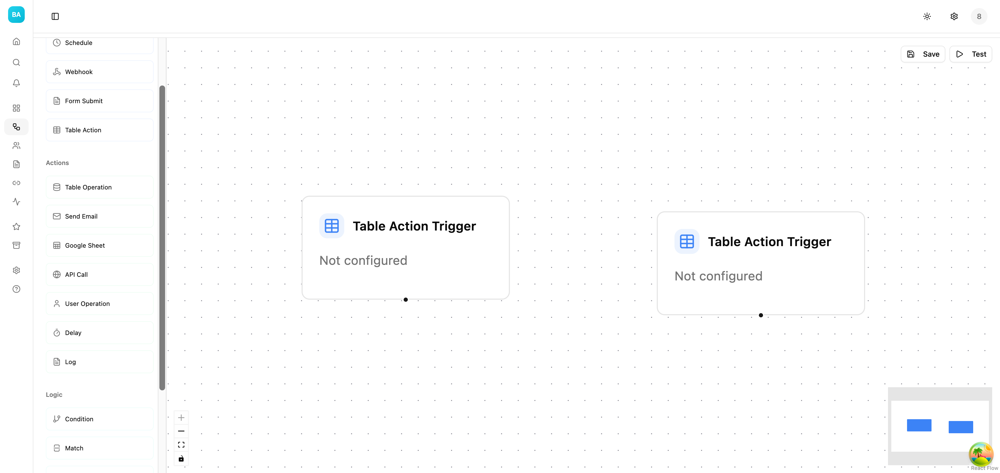
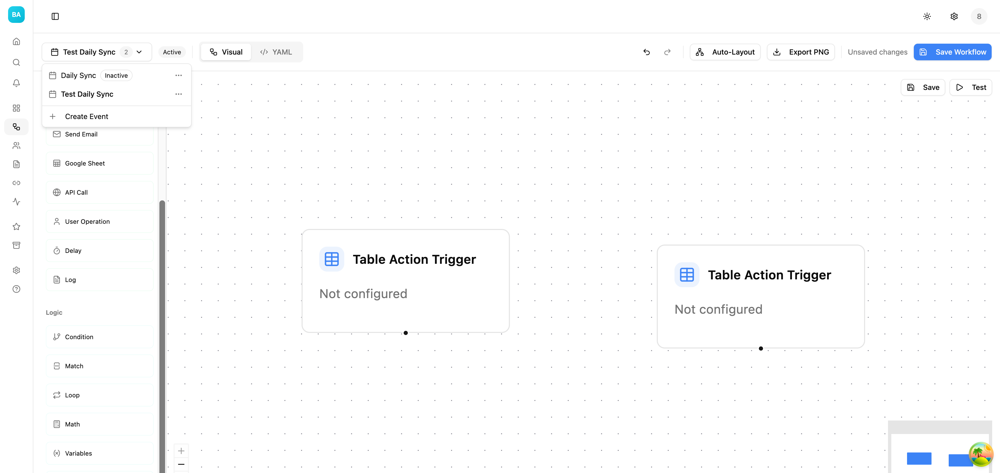
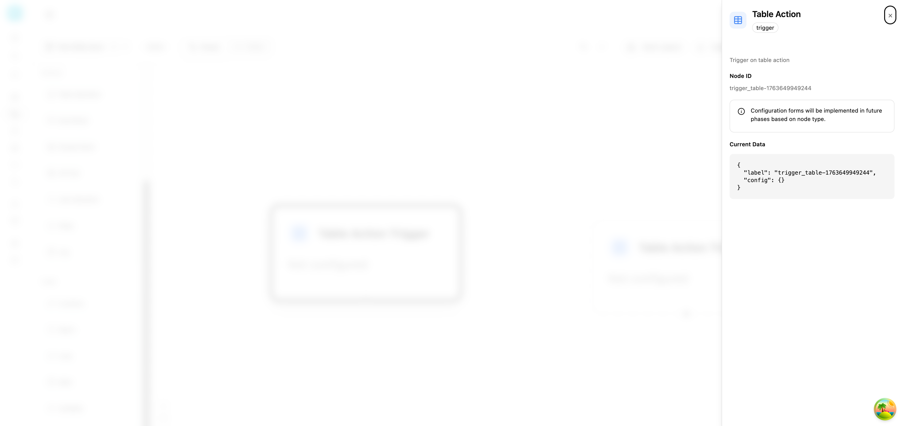
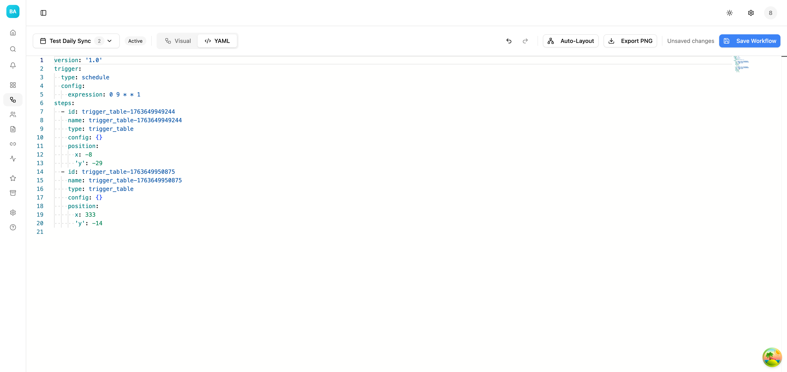
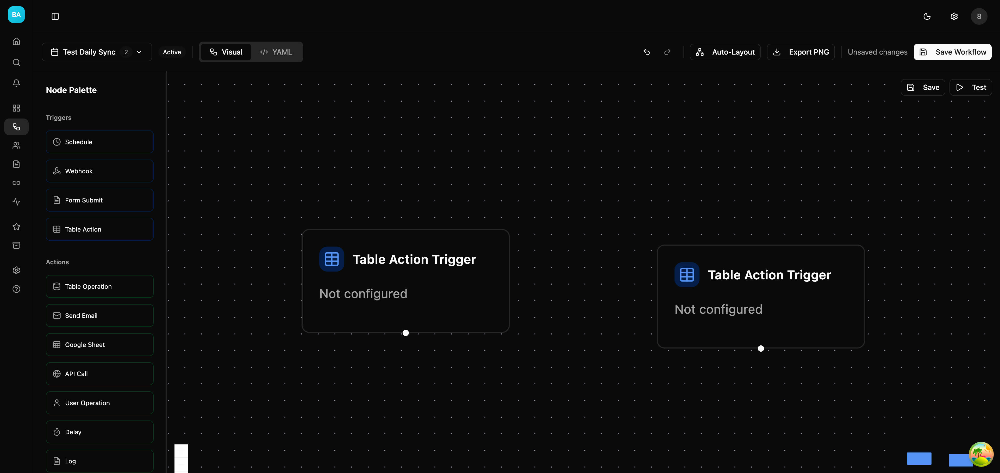
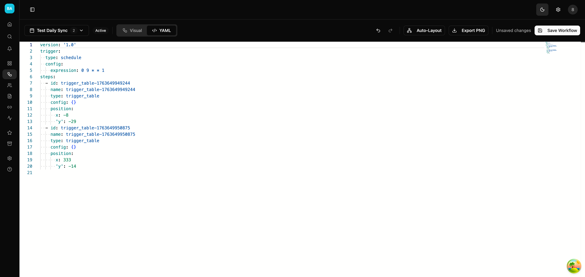

# Hướng dẫn sử dụng Workflow Editor

Workflow Editor là công cụ trực quan giúp bạn xây dựng và quản lý các quy trình tự động hóa trong Beqeek. Với giao diện kéo-thả trực quan và hỗ trợ chỉnh sửa YAML, bạn có thể tạo các workflow phức tạp một cách dễ dàng.

## Mục lục

1. [Tổng quan giao diện](#1-tổng-quan-giao-diện)
2. [Chọn và quản lý Event](#2-chọn-và-quản-lý-event)
3. [Thêm Node vào Canvas](#3-thêm-node-vào-canvas)
4. [Cấu hình Node](#4-cấu-hình-node)
5. [Chế độ YAML Editor](#5-chế-độ-yaml-editor)
6. [Phím tắt](#6-phím-tắt)
7. [Lưu và xuất Workflow](#7-lưu-và-xuất-workflow)
8. [Dark Mode](#8-dark-mode)

---

## 1. Tổng quan giao diện



Giao diện Workflow Editor bao gồm các thành phần chính:

### 1.1 Thanh Header (phía trên)

| Thành phần                | Mô tả                                 |
| ------------------------- | ------------------------------------- |
| **Event Selector**        | Dropdown chọn event đang chỉnh sửa    |
| **Badge Active/Inactive** | Trạng thái hoạt động của event        |
| **Visual/YAML Toggle**    | Chuyển đổi giữa chế độ Visual và YAML |
| **Undo/Redo**             | Hoàn tác và làm lại thao tác          |
| **Auto-Layout**           | Tự động sắp xếp các node              |
| **Export PNG**            | Xuất workflow thành ảnh PNG           |
| **Save Workflow**         | Lưu thay đổi                          |

### 1.2 Node Palette (bên trái)

Danh sách các node có sẵn được phân loại theo chức năng:

- **Triggers**: Các node kích hoạt workflow (Schedule, Webhook, Form Submit, Table Action)
- **Actions**: Các node thực hiện hành động (Table Operation, Send Email, API Call, Delay, Log...)
- **Logic**: Các node xử lý logic (Condition, Match, Loop, Math, Variables...)

### 1.3 Canvas (vùng chính giữa)

Vùng làm việc chính để kéo-thả và kết nối các node. Các điều khiển:

- **Zoom In/Out**: Phóng to/thu nhỏ canvas
- **Fit View**: Hiển thị toàn bộ workflow
- **Mini Map**: Bản đồ nhỏ để điều hướng

---

## 2. Chọn và quản lý Event



### 2.1 Chọn Event

1. Click vào **Event Selector** ở góc trên bên trái
2. Danh sách các event trong workflow unit sẽ hiển thị
3. Click vào event muốn chỉnh sửa

### 2.2 Trạng thái Event

- **Active** (badge xanh): Event đang hoạt động, sẽ được kích hoạt khi có trigger
- **Inactive** (badge xám): Event bị tắt, không chạy

### 2.3 Tạo Event mới

1. Mở Event Selector
2. Click **"Create Event"** ở cuối danh sách
3. Điền tên event và chọn loại trigger
4. Click **"Create"** để tạo

### 2.4 Quản lý Event

Mỗi event trong danh sách có menu hành động (⋮):

- **Edit**: Chỉnh sửa thông tin event
- **Delete**: Xóa event

---

## 3. Thêm Node vào Canvas

### 3.1 Kéo-thả Node

1. Chọn node từ **Node Palette** bên trái
2. Giữ chuột và kéo node vào vùng Canvas
3. Thả chuột để đặt node

### 3.2 Sử dụng bàn phím (Accessibility)

1. Di chuyển focus đến node trong palette bằng phím **Tab**
2. Nhấn **Enter** hoặc **Space** để thêm node vào canvas
3. Node sẽ được đặt ở vị trí mặc định

### 3.3 Kết nối các Node

1. Di chuột đến **handle** (chấm tròn) ở cạnh node
2. Kéo từ handle nguồn đến handle đích
3. Thả để tạo kết nối (edge)

### 3.4 Di chuyển Node

- **Chuột**: Kéo-thả node đến vị trí mới
- **Bàn phím**: Chọn node → Dùng phím mũi tên để di chuyển

---

## 4. Cấu hình Node



### 4.1 Mở panel cấu hình

Click vào node trên canvas để mở **Node Config Drawer** bên phải.

### 4.2 Thông tin hiển thị

- **Tên Node**: Loại node và mô tả
- **Category Badge**: Phân loại (Trigger/Action/Logic)
- **Node ID**: ID duy nhất của node
- **Current Data**: Dữ liệu cấu hình hiện tại (JSON)

### 4.3 Đóng panel

- Click nút **X** góc phải trên
- Click ra ngoài panel
- Nhấn phím **Escape**

---

## 5. Chế độ YAML Editor



### 5.1 Chuyển sang YAML mode

1. Click tab **"YAML"** trong thanh header
2. Hoặc nhấn **Cmd+Shift+Y** (Mac) / **Ctrl+Shift+Y** (Windows)

### 5.2 Cấu trúc YAML

```yaml
version: '1.0'
trigger:
  type: webhook
  config:
    secret: 'your-secret'
steps:
  - id: step_1
    name: 'Fetch Data'
    type: action_http_request
    config:
      url: 'https://api.example.com'
      method: GET
  - id: step_2
    name: 'Process Result'
    type: action_log
    config:
      message: 'Data fetched'
    depends_on:
      - step_1
```

### 5.3 Các thành phần YAML

| Trường               | Mô tả                             |
| -------------------- | --------------------------------- |
| `version`            | Phiên bản schema (luôn là "1.0")  |
| `trigger`            | Cấu hình trigger (type + config)  |
| `steps`              | Danh sách các bước trong workflow |
| `steps[].id`         | ID duy nhất của step              |
| `steps[].name`       | Tên hiển thị                      |
| `steps[].type`       | Loại node                         |
| `steps[].config`     | Cấu hình node                     |
| `steps[].depends_on` | Danh sách ID các step phụ thuộc   |
| `steps[].position`   | Vị trí trên canvas (x, y)         |

### 5.4 Tính năng Editor

- **Syntax highlighting**: Tô màu cú pháp YAML
- **Auto-completion**: Gợi ý tự động
- **Error detection**: Phát hiện lỗi cú pháp
- **Line numbers**: Số dòng

### 5.5 Đồng bộ Visual ↔ YAML

- Khi chuyển từ Visual → YAML: Tự động convert nodes/edges thành YAML
- Khi chuyển từ YAML → Visual: Tự động parse YAML thành nodes/edges
- Nếu YAML không hợp lệ: Hiển thị lỗi và không thể chuyển sang Visual

---

## 6. Phím tắt

### 6.1 Chung

| Phím tắt               | Chức năng                   |
| ---------------------- | --------------------------- |
| `Cmd/Ctrl + S`         | Lưu workflow                |
| `Cmd/Ctrl + Z`         | Hoàn tác (Undo)             |
| `Cmd/Ctrl + Shift + Z` | Làm lại (Redo)              |
| `Cmd/Ctrl + Shift + Y` | Chuyển đổi Visual/YAML mode |

### 6.2 Visual Mode

| Phím tắt               | Chức năng          |
| ---------------------- | ------------------ |
| `Cmd/Ctrl + A`         | Chọn tất cả nodes  |
| `Cmd/Ctrl + C`         | Copy nodes đã chọn |
| `Cmd/Ctrl + V`         | Paste nodes        |
| `Delete` / `Backspace` | Xóa nodes đã chọn  |
| `Escape`               | Bỏ chọn tất cả     |
| `Cmd/Ctrl + Shift + L` | Auto-layout nodes  |

### 6.3 Điều hướng Canvas

| Thao tác         | Chức năng   |
| ---------------- | ----------- |
| Scroll           | Zoom in/out |
| Kéo nền          | Pan canvas  |
| Double-click nền | Fit view    |

---

## 7. Lưu và xuất Workflow

### 7.1 Lưu Workflow

**Cách 1**: Click nút **"Save Workflow"** ở header

**Cách 2**: Nhấn **Cmd/Ctrl + S**

Khi có thay đổi chưa lưu, sẽ hiển thị text **"Unsaved changes"** màu xám.

### 7.2 Xuất PNG

1. Click nút **"Export PNG"** ở header
2. File PNG sẽ được tải về với tên theo format: `{event-name}.png`

### 7.3 Auto-Layout

Click nút **"Auto-Layout"** hoặc nhấn **Cmd/Ctrl + Shift + L** để tự động sắp xếp các node theo thứ tự phụ thuộc.

---

## 8. Dark Mode

Workflow Editor hỗ trợ đầy đủ Dark Mode để làm việc trong môi trường ánh sáng yếu.

### 8.1 Visual Editor - Dark Mode



### 8.2 YAML Editor - Dark Mode



### 8.3 Chuyển đổi Theme

Click nút **Sun/Moon** ở thanh header để chuyển đổi giữa Light và Dark mode.

---

## Câu hỏi thường gặp (FAQ)

### Q: Tại sao không thể chuyển từ YAML sang Visual?

**A**: YAML có thể chứa lỗi cú pháp hoặc cấu trúc không hợp lệ. Kiểm tra console log để xem chi tiết lỗi.

### Q: Làm sao để tạo workflow có nhiều nhánh?

**A**:

1. Thêm node điều kiện (Condition)
2. Kết nối các node đích vào các output khác nhau của Condition

### Q: Workflow không chạy dù đã lưu?

**A**: Kiểm tra:

1. Event có ở trạng thái **Active** không
2. Trigger đã được cấu hình đúng chưa
3. Không có lỗi trong các node

### Q: Có thể duplicate node không?

**A**: Có, sử dụng **Cmd/Ctrl + C** để copy và **Cmd/Ctrl + V** để paste.

---

## Hỗ trợ

Nếu bạn gặp vấn đề hoặc có câu hỏi, vui lòng:

1. Xem [Tài liệu API](/docs/api)
2. Liên hệ [Support Team](mailto:support@beqeek.com)
3. Tạo issue trên [GitHub](https://github.com/beqeek/beqeek)
