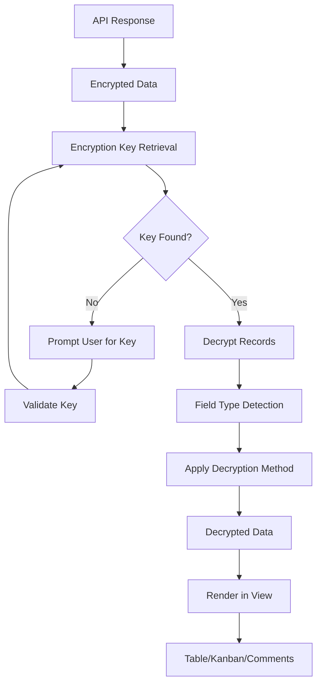

# Active Tables Record Detail Screen Rebuild Plan

## Executive Summary

Complete rebuild of the Active Tables Record Detail screen to address critical issues:
1. **Encrypted data display problems** - Data appears garbled/encrypted in UI
2. **Poor UI/UX presentation** - Table and comment sections have subpar design
3. **Missing decryption flow** - Encryption-core package not properly integrated

## Current State Analysis

### 1. Problem Areas Identified

#### A. Data Display Issues
- **Location**: `/apps/web/src/features/active-tables/pages/active-table-records-page.tsx`
- **Issue**: Records display encrypted/raw data instead of decrypted values
- **Root Cause**: Missing decryption step in data flow
- The `formatRecordValue()` function (line 41-55) directly stringifies values without decryption
- No encryption key retrieval or decryption logic in the component

#### B. Component Architecture Problems
- **RecordsTable** component (lines 64-186) - Basic HTML table without proper data handling
- **RecordKanbanView** component - Displays raw encrypted values (line 216, 225)
- **RecordCommentsPanel** - No encryption handling for comments

#### C. Missing Encryption Integration
- `useEncryption` hook is imported but not properly utilized
- Encryption key is not loaded from localStorage
- No decryption happens before rendering data

### 2. Old HTML Module Analysis

From `/docs/technical/html-module/active-table-records.blade.php`:

#### Working Encryption Flow:
1. **Key Management**:
   - Encryption key stored in localStorage with table ID as key
   - Key validation against `encryptionAuthKey` on server
   - Prompt user for key if not found

2. **Decryption Process**:
   ```javascript
   // Field type based decryption
   - AES-256-CBC for text fields (SHORT_TEXT, RICH_TEXT, EMAIL, URL)
   - OPE for numeric/date fields (INTEGER, NUMERIC, DATE, DATETIME)
   - HMAC-SHA256 for select fields (cannot be decrypted, only matched)
   ```

3. **Data Flow**:
   - Fetch encrypted data from API
   - Apply decryption based on field type
   - Display decrypted values in UI

### 3. View Types Requirements (from QUICK-VISUAL-SUMMARY.md)

#### TABLE VIEW Requirements:
- Traditional grid with columns and rows
- Sort, filter, group capabilities
- Cursor-based pagination
- Inline editing support
- Bulk operations

#### KANBAN VIEW Requirements:
- Group records by status field
- Drag & drop between columns
- Color-coded columns
- Display headline and selected fields
- Card-based record presentation

#### COMMENTS Section:
- Threaded replies support
- @mentions functionality
- File attachments
- Emoji reactions
- Edit/delete own comments
- Encrypted comment content

## Architecture Design

### 1. Data Flow Architecture



### 2. Component Architecture

```
active-tables/
├── pages/
│   └── active-table-records-page.tsx (main page - refactored)
├── components/
│   ├── data-table/
│   │   ├── data-table.tsx (TanStack Table implementation)
│   │   ├── data-table-columns.tsx (column definitions)
│   │   ├── data-table-toolbar.tsx (filters, search)
│   │   ├── data-table-pagination.tsx
│   │   └── data-table-row-actions.tsx
│   ├── kanban/
│   │   ├── kanban-board.tsx (main kanban view)
│   │   ├── kanban-column.tsx
│   │   ├── kanban-card.tsx
│   │   └── kanban-settings.tsx
│   ├── comments/
│   │   ├── comments-panel.tsx (refactored)
│   │   ├── comment-thread.tsx
│   │   ├── comment-item.tsx
│   │   └── comment-editor.tsx
│   └── encryption/
│       ├── encryption-key-dialog.tsx
│       └── encryption-status.tsx
├── hooks/
│   ├── use-decrypted-records.ts (new)
│   ├── use-encryption-key.ts (new)
│   └── use-table-encryption.ts (new)
└── utils/
    ├── encryption-helpers.ts (new)
    └── record-decryptor.ts (new)
```

### 3. Encryption Integration Architecture

```typescript
// Encryption Key Management
interface EncryptionKeyManager {
  loadKey(tableId: string): string | null
  saveKey(tableId: string, key: string): void
  validateKey(key: string, authKey: string): boolean
  promptForKey(): Promise<string>
}

// Record Decryption Service
interface RecordDecryptor {
  decryptRecord(record: ActiveTableRecord, fields: ActiveFieldConfig[], key: string): ActiveTableRecord
  decryptField(value: any, field: ActiveFieldConfig, key: string): any
  decryptComments(comments: Comment[], key: string): Comment[]
}
```

## Implementation Plan

### Phase 1: Setup and Infrastructure (Day 1)

#### Task 1.1: Create Encryption Utilities
**Files to create:**
- `/apps/web/src/features/active-tables/utils/encryption-helpers.ts`
- `/apps/web/src/features/active-tables/utils/record-decryptor.ts`

**Implementation:**
```typescript
// encryption-helpers.ts
import { AES256, OPE, HMAC } from '@workspace/encryption-core';

export class EncryptionHelper {
  static decryptByFieldType(value: any, fieldType: string, key: string): any {
    switch(getEncryptionType(fieldType)) {
      case 'AES-256-CBC':
        return AES256.decrypt(value, key);
      case 'OPE':
        return OPE.decrypt(value, key);
      case 'HMAC-SHA256':
        // Cannot decrypt, return original or matched value
        return value;
      default:
        return value;
    }
  }
}
```

#### Task 1.2: Create Encryption Hooks
**Files to create:**
- `/apps/web/src/features/active-tables/hooks/use-encryption-key.ts`
- `/apps/web/src/features/active-tables/hooks/use-table-encryption.ts`
- `/apps/web/src/features/active-tables/hooks/use-decrypted-records.ts`

**Key Features:**
- Load/save encryption keys from localStorage
- Validate keys against server auth key
- Provide decryption methods
- Handle key prompt dialog

### Phase 2: Remove Old Components (Day 1-2)

#### Task 2.1: Archive Existing Components
**Files to archive (not delete, for reference):**
- Move current `RecordsTable` to `RecordsTable.old.tsx`
- Move current `RecordKanbanView` to `RecordKanbanView.old.tsx`
- Move current `RecordCommentsPanel` to `RecordCommentsPanel.old.tsx`

#### Task 2.2: Clean Up Main Page
**File to modify:** `/apps/web/src/features/active-tables/pages/active-table-records-page.tsx`
- Remove old table rendering logic
- Remove old kanban rendering logic
- Prepare for new component integration

### Phase 3: Implement TanStack Table (Day 2-3)

#### Task 3.1: Install Dependencies
```bash
pnpm add @tanstack/react-table
```

#### Task 3.2: Create Data Table Components
**Files to create:**
- `/apps/web/src/features/active-tables/components/data-table/data-table.tsx`
- `/apps/web/src/features/active-tables/components/data-table/data-table-columns.tsx`
- `/apps/web/src/features/active-tables/components/data-table/data-table-toolbar.tsx`
- `/apps/web/src/features/active-tables/components/data-table/data-table-pagination.tsx`

**Key Implementation Points:**
```typescript
// data-table-columns.tsx
export function createColumns(fields: ActiveFieldConfig[]): ColumnDef<ActiveTableRecord>[] {
  return fields.map(field => ({
    accessorKey: `record.${field.name}`,
    header: field.label,
    cell: ({ row }) => {
      const value = row.original.record[field.name];
      const decryptedValue = useDecryptedValue(value, field);
      return <FieldRenderer field={field} value={decryptedValue} />;
    }
  }));
}
```

#### Task 3.3: Implement Data Table Features
- Sorting (client-side and server-side)
- Filtering with encrypted field support
- Pagination (cursor-based)
- Column visibility toggle
- Row selection for bulk operations
- Inline editing capability

### Phase 4: Rebuild Kanban View (Day 3-4)

#### Task 4.1: Create Kanban Components
**Files to create:**
- `/apps/web/src/features/active-tables/components/kanban/kanban-board.tsx`
- `/apps/web/src/features/active-tables/components/kanban/kanban-column.tsx`
- `/apps/web/src/features/active-tables/components/kanban/kanban-card.tsx`
- `/apps/web/src/features/active-tables/components/kanban/kanban-settings.tsx`

**Key Features:**
- Decrypt values before display
- Drag & drop with react-beautiful-dnd or @dnd-kit
- Column color customization
- Card preview with decrypted fields

#### Task 4.2: Implement Kanban Logic
```typescript
// kanban-board.tsx
export function KanbanBoard({ table, records }: Props) {
  const decryptedRecords = useDecryptedRecords(records, table);
  const columns = useKanbanColumns(decryptedRecords, table.config.kanbanConfigs);

  return (
    <DragDropContext onDragEnd={handleDragEnd}>
      {columns.map(column => (
        <KanbanColumn key={column.id} column={column} />
      ))}
    </DragDropContext>
  );
}
```

### Phase 5: Rebuild Comments Section (Day 4-5)

#### Task 5.1: Create Comment Components
**Files to create:**
- `/apps/web/src/features/active-tables/components/comments/comments-panel.tsx`
- `/apps/web/src/features/active-tables/components/comments/comment-thread.tsx`
- `/apps/web/src/features/active-tables/components/comments/comment-item.tsx`
- `/apps/web/src/features/active-tables/components/comments/comment-editor.tsx`

**Key Features:**
- Decrypt comment content before display
- Encrypt new comments before saving
- Support threaded replies
- Rich text editor with markdown support

#### Task 5.2: Implement Comment Encryption
```typescript
// comments-panel.tsx
export function CommentsPanel({ record, table }: Props) {
  const { encryptionKey } = useTableEncryption(table.id);
  const comments = useRecordComments(record.id);

  const decryptedComments = useMemo(() => {
    return comments.map(comment => ({
      ...comment,
      commentContent: decryptText(comment.commentContent, encryptionKey)
    }));
  }, [comments, encryptionKey]);

  return <CommentsList comments={decryptedComments} />;
}
```

### Phase 6: Integration and Testing (Day 5-6)

#### Task 6.1: Integrate All Components
**File to modify:** `/apps/web/src/features/active-tables/pages/active-table-records-page.tsx`

```typescript
export function ActiveTableRecordsPage() {
  const { table, records } = useTableData();
  const { encryptionKey, isKeyLoaded } = useTableEncryption(table?.id);

  if (!isKeyLoaded && table?.config?.e2eeEncryption) {
    return <EncryptionKeyDialog tableId={table.id} />;
  }

  return (
    <Tabs>
      <TabsContent value="table">
        <DataTable table={table} records={records} />
      </TabsContent>
      <TabsContent value="kanban">
        <KanbanBoard table={table} records={records} />
      </TabsContent>
    </Tabs>
  );
}
```

#### Task 6.2: Testing Strategy
1. **Unit Tests:**
   - Encryption/decryption functions
   - Hook behavior
   - Component rendering

2. **Integration Tests:**
   - Data flow from API to UI
   - Encryption key management
   - View switching

3. **E2E Tests:**
   - Create encrypted record
   - View decrypted data
   - Edit and save changes
   - Comments functionality

### Phase 7: Performance Optimization (Day 6)

#### Task 7.1: Implement Caching
- Cache decrypted values in memory
- Implement React.memo for components
- Use virtualization for large datasets

#### Task 7.2: Optimize Decryption
```typescript
// Batch decryption for better performance
const decryptBatch = async (records: ActiveTableRecord[]) => {
  const promises = records.map(record => decryptRecord(record));
  return Promise.all(promises);
};
```

## Testing Checklist

### Functional Testing
- [ ] Encryption key prompt appears for E2EE tables
- [ ] Key validation works correctly
- [ ] Data displays decrypted in table view
- [ ] Data displays decrypted in kanban view
- [ ] Comments are encrypted/decrypted properly
- [ ] Inline editing works with encryption
- [ ] Filtering works on encrypted fields
- [ ] Sorting works on OPE encrypted fields
- [ ] Pagination maintains decryption state

### Performance Testing
- [ ] Table loads within 2 seconds for 100 records
- [ ] Kanban drag & drop is smooth
- [ ] No memory leaks with encryption/decryption
- [ ] Virtual scrolling works for large datasets

### Security Testing
- [ ] Encryption keys never sent to server
- [ ] Keys stored securely in localStorage
- [ ] Invalid keys are rejected
- [ ] Decryption failures handled gracefully

## Migration Strategy

1. **Feature Flag Implementation:**
   ```typescript
   const useNewRecordView = useFeatureFlag('new-record-view');
   ```

2. **Gradual Rollout:**
   - Week 1: Internal testing
   - Week 2: 10% of users
   - Week 3: 50% of users
   - Week 4: 100% deployment

3. **Rollback Plan:**
   - Keep old components archived
   - Feature flag can disable new view
   - Database migrations not required

## Dependencies

### Package Dependencies
- `@tanstack/react-table`: ^8.x
- `@dnd-kit/sortable`: ^7.x (for kanban)
- `@workspace/encryption-core`: existing
- `@workspace/active-tables-core`: existing
- `@workspace/active-tables-hooks`: existing

### API Dependencies
- No API changes required
- Existing endpoints remain compatible
- Encryption happens client-side only

## Risk Mitigation

### Risk 1: Encryption Key Loss
**Mitigation:**
- Implement key backup reminder
- Provide export/import functionality
- Show clear warnings about key importance

### Risk 2: Performance Degradation
**Mitigation:**
- Implement progressive decryption
- Use Web Workers for heavy decryption
- Cache decrypted values

### Risk 3: Browser Compatibility
**Mitigation:**
- Test on all major browsers
- Polyfill crypto functions if needed
- Fallback for unsupported features

## Success Metrics

1. **Performance:**
   - Page load time < 2 seconds
   - Decryption time < 100ms per record
   - Memory usage < 100MB for 1000 records

2. **User Experience:**
   - 0% encrypted data visible to users
   - Smooth interactions (60 FPS)
   - Intuitive encryption key management

3. **Code Quality:**
   - 80%+ test coverage
   - TypeScript strict mode compliance
   - No console errors/warnings

## Timeline

- **Day 1:** Setup infrastructure, create utilities and hooks
- **Day 2:** Remove old components, implement TanStack Table basics
- **Day 3:** Complete table features, start kanban view
- **Day 4:** Complete kanban, start comments rebuild
- **Day 5:** Complete comments, integration
- **Day 6:** Testing, optimization, documentation

Total estimated time: **6 working days**

## TODO Checklist

### Phase 1: Infrastructure
- [ ] Create encryption-helpers.ts utility
- [ ] Create record-decryptor.ts utility
- [ ] Create use-encryption-key.ts hook
- [ ] Create use-table-encryption.ts hook
- [ ] Create use-decrypted-records.ts hook
- [ ] Create encryption-key-dialog.tsx component

### Phase 2: Cleanup
- [ ] Archive RecordsTable component
- [ ] Archive RecordKanbanView component
- [ ] Archive RecordCommentsPanel component
- [ ] Clean up main page component

### Phase 3: Table Implementation
- [ ] Install @tanstack/react-table
- [ ] Create data-table.tsx component
- [ ] Create data-table-columns.tsx
- [ ] Create data-table-toolbar.tsx
- [ ] Create data-table-pagination.tsx
- [ ] Implement sorting functionality
- [ ] Implement filtering functionality
- [ ] Implement column visibility
- [ ] Add inline editing support

### Phase 4: Kanban Implementation
- [ ] Install @dnd-kit/sortable
- [ ] Create kanban-board.tsx component
- [ ] Create kanban-column.tsx component
- [ ] Create kanban-card.tsx component
- [ ] Create kanban-settings.tsx component
- [ ] Implement drag & drop functionality
- [ ] Add column color customization

### Phase 5: Comments Implementation
- [ ] Create comments-panel.tsx component
- [ ] Create comment-thread.tsx component
- [ ] Create comment-item.tsx component
- [ ] Create comment-editor.tsx component
- [ ] Implement comment encryption/decryption
- [ ] Add threaded reply support
- [ ] Add @mentions functionality

### Phase 6: Integration
- [ ] Integrate all components in main page
- [ ] Add loading states
- [ ] Add error boundaries
- [ ] Implement view switching
- [ ] Test end-to-end flow

### Phase 7: Optimization
- [ ] Add value caching
- [ ] Implement React.memo
- [ ] Add virtualization for large datasets
- [ ] Optimize batch decryption
- [ ] Performance profiling

### Phase 8: Documentation
- [ ] Update component documentation
- [ ] Create encryption flow diagram
- [ ] Write testing guidelines
- [ ] Update CLAUDE.md with new patterns

## Conclusion

This rebuild will completely resolve the encrypted data display issues while significantly improving the UI/UX of the Active Tables Record Detail screen. The implementation follows best practices from both the old working module and modern React patterns with TanStack Table and shadcn/ui components.

The key innovation is the proper integration of the encryption-core package with a clear data flow that ensures all encrypted data is properly decrypted before display, while maintaining security by never sending encryption keys to the server.
