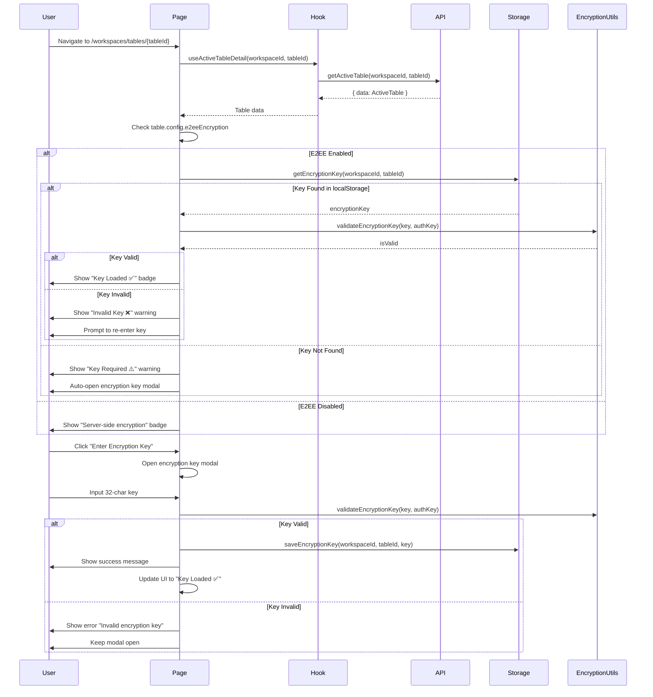
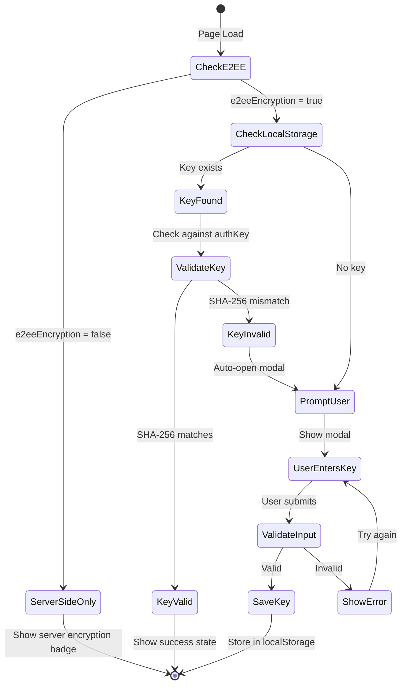

# Table Detail Page Implementation Plan

**Date**: 2025-10-30
**Feature**: Active Tables - Table Detail Page with Encryption Flow
**Priority**: HIGH - Focus on encryption flow display and management

---

## 1. Research Findings

### 1.1 API Documentation Analysis

#### Endpoint: Get Active Table Definition

- **URL**: `/api/workspace/{workspaceId}/workflow/get/active_tables/{tableId}`
- **Method**: POST
- **Authentication**: Bearer token required
- **Response Schema**: `ActiveTableDetailResponse`
  ```typescript
  {
    message?: string;
    data: ActiveTable;
  }
  ```

#### ActiveTable Schema

```typescript
interface ActiveTable {
  id: string;
  name: string;
  workGroupId: string;
  tableType: string;
  description?: string;
  config: ActiveTableConfig;
  createdAt?: string;
  updatedAt?: string;
}
```

#### ActiveTableConfig Schema (Encryption-relevant fields)

```typescript
interface ActiveTableConfig {
  title: string;
  fields: ActiveTableField[];
  e2eeEncryption: boolean; // Whether E2EE is enabled
  encryptionKey: string; // NEVER stored on server, client-only
  encryptionAuthKey: string; // SHA-256 hash for validation
  hashedKeywordFields: string[]; // Fields with searchable hashes
  // ... other config fields
}
```

### 1.2 Old Implementation Analysis (active-table-records.blade.php)

#### Key Encryption Flow Patterns Found:

1. **Encryption Key Storage**:

   ```javascript
   // Line 2393-2397
   localStorage.setItem(`e2ee_key_${WORKSPACE_ID}_${tableId}`, key);
   localStorage.getItem(`e2ee_key_${WORKSPACE_ID}_${tableId}`);
   ```

   - Keys are stored per workspace+table combination
   - Format: `e2ee_key_{workspaceId}_{tableId}`

2. **Encryption Key Prompt UI** (Lines 1991-2006):

   ```html
   <div id="encryption-key-form">
     <input type="hidden" id="input-encryption-key-auth" />
     <input type="text" id="form-table-id" readonly />
     <input type="text" id="input-encryption-key" placeholder="Nhập khóa mã hóa (32 ký tự)" required />
     <p>Khóa phải có đúng 32 ký tự để đảm bảo mã hóa an toàn.</p>
   </div>
   ```

   - Users are prompted for encryption key if not in localStorage
   - Key must be exactly 32 characters
   - Shows table ID for reference

3. **Field-Type Encryption Mapping** (Lines 2481-2510):
   - **AES-256-CBC**: SHORT_TEXT, RICH_TEXT, TEXT, EMAIL, URL, PHONE
   - **OPE (Order-Preserving)**: INTEGER, NUMERIC, DATE, DATETIME, CURRENCY
   - **HMAC-SHA256**: SELECT*ONE, SELECT_LIST, CHECKBOX*\*

4. **Key Validation**:
   - Server stores `encryptionAuthKey` = SHA-256(encryptionKey)
   - Client validates by computing SHA-256 and comparing

### 1.3 Existing Codebase Patterns

#### Current Active Tables Feature Structure

```
apps/web/src/features/active-tables/
├── api/
│   ├── active-tables-api.ts      ✅ Has getActiveTable()
│   └── active-records-api.ts
├── components/
│   ├── table-management-dialog.tsx
│   ├── settings/
│   │   ├── general-settings-tab.tsx
│   │   ├── security-settings-tab.tsx
│   │   └── fields-settings-tab.tsx
│   └── ...
├── hooks/
│   ├── use-active-tables.ts      ✅ React Query hooks
│   ├── use-table-encryption.ts   ⚠️ Currently a stub!
│   └── ...
├── pages/
│   ├── active-tables-page.tsx
│   ├── active-table-detail-page.tsx  ✅ EXISTS but basic
│   └── active-table-settings-page.tsx
├── types.ts                       ✅ Type definitions
└── utils/
    ├── encryption-detection.ts
    └── query-encryption.ts
```

#### Current Table Detail Page (active-table-detail-page.tsx)

- **Exists**: Yes (10KB, 274 lines)
- **Current Features**:
  - Table metadata display (name, description, workGroup)
  - Encryption badge (E2EE vs Server)
  - Field list with type badges
  - Navigation to records and settings
- **Missing Features**:
  - ❌ No encryption key management
  - ❌ No encryption flow prompts
  - ❌ No key validation UI
  - ❌ No encrypted field indicators

#### API Client Status

- ✅ `getActiveTable()` exists in `active-tables-api.ts`
- ✅ Returns `{ data: ActiveTable }`
- ✅ Already used in existing hooks

### 1.4 Available Package Utilities

#### @workspace/active-tables-core

Provides:

- ✅ `getEncryptionTypeForField()` - Determine encryption type
- ✅ `decryptFieldValue()` - Decrypt single field
- ✅ `isValidEncryptionKey()` - Validate 32-char format
- ✅ `validateEncryptionKey()` - Validate against authKey
- ✅ `getEncryptionKeyStorageKey()` - Get localStorage key
- ✅ `isEncryptableField()` - Check if field needs encryption

#### @workspace/encryption-core

Provides:

- ✅ `AES256` - AES-256-CBC encryption/decryption
- ✅ `OPE` - Order-Preserving Encryption
- ✅ `HMAC` - HMAC-SHA256 hashing
- ✅ `generateEncryptionKey()` - Generate 32-char key
- ✅ `KeyGenerator` - Key generation utilities

### 1.5 Routing Structure

Current Routes (from router.tsx):

```typescript
// Line 17: List page
to: '/workspaces/tables';

// Line 20: Detail page ← TARGET
to: '/workspaces/tables/$tableId';

// Line 23: Settings page
to: '/workspaces/tables/$tableId/settings';
```

Route is already configured! Just need to enhance the page.

---

## 2. Architecture Design

### 2.1 Component Hierarchy

```
ActiveTableDetailPage (Enhanced)
├── Header Section
│   ├── Back Button
│   ├── Breadcrumb (WorkGroup)
│   ├── Title & Description
│   └── Action Buttons
│       ├── Settings Button
│       └── View Records Button
│
├── Encryption Status Card ← NEW/ENHANCED
│   ├── Encryption Badge (E2EE vs Server)
│   ├── Encryption Info
│   ├── Key Status Indicator
│   │   ├── ✅ Key Loaded & Valid
│   │   ├── ⚠️ Key Not Loaded
│   │   └── ❌ Invalid Key
│   └── Encryption Key Actions
│       ├── Enter Key Button (if not loaded)
│       ├── Verify Key Button (if loaded)
│       ├── Change Key Button
│       └── Clear Key Button
│
├── Encryption Flow Modal ← NEW
│   ├── Table Info Display
│   ├── Key Input Field (32 chars)
│   ├── Key Validation Indicator
│   ├── Security Warning
│   └── Action Buttons
│       ├── Save & Validate
│       └── Cancel
│
├── Encryption Details Section ← NEW
│   ├── Encryption Type Breakdown
│   │   ├── AES-256-CBC Fields
│   │   ├── OPE Fields
│   │   ├── HMAC-SHA256 Fields
│   │   └── Unencrypted Fields
│   ├── Hashed Keyword Fields
│   └── Security Best Practices
│
└── Fields Section (Existing, Enhanced)
    ├── Field Summary Cards
    │   ├── Field Name & Type
    │   ├── Encryption Type Badge ← NEW
    │   ├── Required/Optional
    │   └── Options (if applicable)
    └── Field Count Badge
```

### 2.2 Data Flow Diagram



### 2.3 State Management Strategy

**State Layer 1: Server State (React Query)**

```typescript
// Managed by useActiveTableDetail hook
const {
  data: tableData, // ActiveTable from API
  isLoading,
  error,
  refetch,
} = useActiveTableDetail(workspaceId, tableId);
```

**State Layer 2: Local State (useState)**

```typescript
// Page-level state for encryption modal
const [isEncryptionModalOpen, setIsEncryptionModalOpen] = useState(false);
const [keyInput, setKeyInput] = useState('');
const [keyValidationError, setKeyValidationError] = useState<string | null>(null);
```

**State Layer 3: Encryption Key Management (Custom Hook)**

```typescript
// New hook: useTableEncryption
const {
  encryptionKey, // Current key from localStorage
  isKeyLoaded, // Boolean: key exists
  isKeyValid, // Boolean: key matches authKey
  keyValidationStatus, // 'valid' | 'invalid' | 'unknown'
  saveKey, // (key: string) => Promise<boolean>
  clearKey, // () => void
  validateKey, // (key: string) => boolean
} = useTableEncryption(workspaceId, tableId, table?.config);
```

**Why This Approach?**

- ✅ Server data in React Query (single source of truth)
- ✅ UI state local to page (no global pollution)
- ✅ Encryption key in custom hook (reusable logic)
- ✅ localStorage for persistence (standard web pattern)

---

## 3. Encryption Flow Design (DETAILED)

### 3.1 Encryption Key Lifecycle



### 3.2 Encryption Flow UI States

#### State 1: E2EE Disabled (Server-side encryption)

```tsx
<Card>
  <Badge variant="secondary">
    <Shield /> Server-side Encryption
  </Badge>
  <p>This table uses server-side encryption. No client-side key required.</p>
</Card>
```

#### State 2: E2EE Enabled, Key Not Loaded

```tsx
<Card className="border-warning">
  <Badge variant="warning">
    <AlertTriangle /> Encryption Key Required
  </Badge>
  <p>This table uses end-to-end encryption. Enter your encryption key to view records.</p>
  <Button onClick={openEncryptionModal}>
    <Key /> Enter Encryption Key
  </Button>
</Card>
```

#### State 3: E2EE Enabled, Key Loaded & Valid

```tsx
<Card className="border-success">
  <Badge variant="success">
    <ShieldCheck /> Encryption Key Loaded
  </Badge>
  <p>Encryption key is valid and ready to decrypt records.</p>
  <div className="flex gap-2">
    <Button variant="outline" onClick={verifyKey}>
      <Check /> Verify Key
    </Button>
    <Button variant="ghost" onClick={clearKey}>
      <X /> Clear Key
    </Button>
  </div>
</Card>
```

#### State 4: E2EE Enabled, Key Invalid

```tsx
<Card className="border-destructive">
  <Badge variant="destructive">
    <ShieldX /> Invalid Encryption Key
  </Badge>
  <p>The stored encryption key is invalid. Please enter the correct key.</p>
  <Button onClick={openEncryptionModal}>
    <Key /> Re-enter Key
  </Button>
</Card>
```

### 3.3 Encryption Key Modal Component

**Component**: `EncryptionKeyModal`

```tsx
interface EncryptionKeyModalProps {
  isOpen: boolean;
  onClose: () => void;
  tableId: string;
  tableName: string;
  encryptionAuthKey: string;
  onKeySaved: () => void;
}

<Dialog open={isOpen} onOpenChange={onClose}>
  <DialogContent>
    <DialogHeader>
      <DialogTitle>
        <Key className="inline mr-2" />
        Enter Encryption Key
      </DialogTitle>
      <DialogDescription>
        This table uses end-to-end encryption. Enter your 32-character encryption key.
      </DialogDescription>
    </DialogHeader>

    <div className="space-y-4">
      {/* Table Info */}
      <div className="rounded-lg bg-muted p-3 space-y-2">
        <div className="text-sm">
          <span className="text-muted-foreground">Table:</span>
          <span className="ml-2 font-medium">{tableName}</span>
        </div>
        <div className="text-sm">
          <span className="text-muted-foreground">Table ID:</span>
          <span className="ml-2 font-mono text-xs">{tableId}</span>
        </div>
      </div>

      {/* Key Input */}
      <div>
        <Label htmlFor="encryption-key">Encryption Key</Label>
        <Input
          id="encryption-key"
          type="text"
          placeholder="Enter 32-character key"
          maxLength={32}
          value={keyInput}
          onChange={(e) => setKeyInput(e.target.value)}
          className={keyValidationError ? 'border-destructive' : ''}
        />
        <p className="text-xs text-muted-foreground mt-1">{keyInput.length}/32 characters</p>
        {keyValidationError && <p className="text-xs text-destructive mt-1">{keyValidationError}</p>}
      </div>

      {/* Security Warning */}
      <Alert>
        <AlertTriangle className="h-4 w-4" />
        <AlertTitle>Important Security Notice</AlertTitle>
        <AlertDescription>
          <ul className="list-disc pl-4 space-y-1 text-sm">
            <li>Keep your encryption key safe and secure</li>
            <li>Loss of key means permanent loss of data access</li>
            <li>Never share your key with anyone</li>
            <li>The key is stored locally in your browser</li>
          </ul>
        </AlertDescription>
      </Alert>
    </div>

    <DialogFooter>
      <Button variant="outline" onClick={onClose}>
        Cancel
      </Button>
      <Button onClick={handleSaveKey} disabled={keyInput.length !== 32}>
        <Check className="mr-2 h-4 w-4" />
        Validate & Save Key
      </Button>
    </DialogFooter>
  </DialogContent>
</Dialog>;
```

### 3.4 Encryption Type Breakdown Section

**New Section**: Display encryption types for each field

```tsx
<Card>
  <CardHeader>
    <CardTitle>Encryption Configuration</CardTitle>
  </CardHeader>
  <CardContent>
    <Tabs defaultValue="aes">
      <TabsList>
        <TabsTrigger value="aes">
          <Shield className="mr-2 h-4 w-4" />
          AES-256-CBC ({aesFields.length})
        </TabsTrigger>
        <TabsTrigger value="ope">
          <Lock className="mr-2 h-4 w-4" />
          OPE ({opeFields.length})
        </TabsTrigger>
        <TabsTrigger value="hmac">
          <Hash className="mr-2 h-4 w-4" />
          HMAC ({hmacFields.length})
        </TabsTrigger>
        <TabsTrigger value="none">
          <Unlock className="mr-2 h-4 w-4" />
          Unencrypted ({unencryptedFields.length})
        </TabsTrigger>
      </TabsList>

      <TabsContent value="aes">
        <div className="space-y-2">
          <p className="text-sm text-muted-foreground">
            Text fields encrypted with AES-256-CBC. Full confidentiality, no server-side search.
          </p>
          <div className="flex flex-wrap gap-2">
            {aesFields.map((field) => (
              <Badge key={field.name} variant="outline">
                {field.label}
              </Badge>
            ))}
          </div>
        </div>
      </TabsContent>

      {/* Similar for OPE, HMAC, None */}
    </Tabs>
  </CardContent>
</Card>
```

---

## 4. File Structure

### 4.1 New Files to Create

```
apps/web/src/features/active-tables/
├── components/
│   ├── encryption-key-modal.tsx           ← NEW
│   ├── encryption-status-card.tsx         ← NEW
│   └── encryption-type-breakdown.tsx      ← NEW
│
├── hooks/
│   └── use-table-encryption.ts            ← REPLACE STUB
│
└── utils/
    └── encryption-key-storage.ts          ← NEW
```

### 4.2 Files to Modify

```
apps/web/src/features/active-tables/
├── pages/
│   └── active-table-detail-page.tsx       ← ENHANCE
│
└── types.ts                                ← ADD TYPES
```

### 4.3 Detailed File Breakdown

#### NEW: `components/encryption-key-modal.tsx`

**Purpose**: Modal for entering/validating encryption key
**Size**: ~200 lines
**Dependencies**:

- `@workspace/ui` components (Dialog, Input, Button, Alert)
- `@workspace/active-tables-core` (validateEncryptionKey)
- Local state for key input and validation

**Props**:

```typescript
interface EncryptionKeyModalProps {
  isOpen: boolean;
  onClose: () => void;
  table: ActiveTable;
  workspaceId: string;
  onKeySaved: (key: string) => void;
}
```

**Key Functions**:

- `handleKeyInput()` - Validate length as user types
- `handleSaveKey()` - Validate against authKey and save
- `showValidationError()` - Display error messages

---

#### NEW: `components/encryption-status-card.tsx`

**Purpose**: Display encryption status and key management
**Size**: ~150 lines
**Dependencies**:

- `useTableEncryption` hook
- `@workspace/ui` components (Card, Badge, Button)

**Props**:

```typescript
interface EncryptionStatusCardProps {
  table: ActiveTable;
  workspaceId: string;
  onEnterKey: () => void;
}
```

**States to Display**:

1. Server-side only (e2eeEncryption = false)
2. E2EE enabled, no key
3. E2EE enabled, key valid
4. E2EE enabled, key invalid

---

#### NEW: `components/encryption-type-breakdown.tsx`

**Purpose**: Show which fields use which encryption type
**Size**: ~180 lines
**Dependencies**:

- `@workspace/active-tables-core` (getEncryptionTypeForField)
- `@workspace/ui` components (Card, Tabs, Badge)

**Props**:

```typescript
interface EncryptionTypeBreakdownProps {
  fields: ActiveFieldConfig[];
  hashedKeywordFields: string[];
}
```

**Displays**:

- AES-256-CBC fields (text fields)
- OPE fields (numbers, dates)
- HMAC-SHA256 fields (selects)
- Unencrypted fields
- Hashed keyword fields for search

---

#### REPLACE: `hooks/use-table-encryption.ts`

**Purpose**: Manage encryption key lifecycle
**Size**: ~150 lines
**Current Status**: Stub (22 lines)

**Hook Interface**:

```typescript
export function useTableEncryption(
  workspaceId: string,
  tableId: string,
  config?: ActiveTableConfig
) {
  return {
    // State
    encryptionKey: string | null;
    isKeyLoaded: boolean;
    isKeyValid: boolean;
    keyValidationStatus: 'valid' | 'invalid' | 'unknown';

    // Actions
    saveKey: (key: string) => Promise<boolean>;
    clearKey: () => void;
    validateKey: (key: string) => boolean;

    // Helpers
    isE2EEEnabled: boolean;
    encryptionAuthKey: string | null;
  };
}
```

**Implementation Details**:

1. Use `useEffect` to load key from localStorage on mount
2. Use `useMemo` to validate key against authKey
3. Provide save/clear functions with localStorage management
4. Handle edge cases (missing authKey, invalid format)

---

#### NEW: `utils/encryption-key-storage.ts`

**Purpose**: Centralize localStorage operations
**Size**: ~80 lines

**Functions**:

```typescript
export function saveEncryptionKey(workspaceId: string, tableId: string, key: string): void;

export function getEncryptionKey(workspaceId: string, tableId: string): string | null;

export function clearEncryptionKey(workspaceId: string, tableId: string): void;

export function hasEncryptionKey(workspaceId: string, tableId: string): boolean;
```

**Uses**: `getEncryptionKeyStorageKey()` from `@workspace/active-tables-core`

---

#### ENHANCE: `pages/active-table-detail-page.tsx`

**Current Size**: 274 lines
**Target Size**: ~450 lines
**Changes**:

**New Imports**:

```typescript
import { EncryptionKeyModal } from '../components/encryption-key-modal';
import { EncryptionStatusCard } from '../components/encryption-status-card';
import { EncryptionTypeBreakdown } from '../components/encryption-type-breakdown';
import { useTableEncryption } from '../hooks/use-table-encryption';
```

**New State**:

```typescript
const [isEncryptionModalOpen, setIsEncryptionModalOpen] = useState(false);

const { encryptionKey, isKeyLoaded, isKeyValid, keyValidationStatus, saveKey, clearKey, isE2EEEnabled } =
  useTableEncryption(workspaceId, tableId, table?.config);
```

**New Effects**:

```typescript
// Auto-open modal if E2EE enabled but no key
useEffect(() => {
  if (table && isE2EEEnabled && !isKeyLoaded) {
    setIsEncryptionModalOpen(true);
  }
}, [table, isE2EEEnabled, isKeyLoaded]);
```

**New Sections in JSX**:

1. Replace basic encryption badge with `<EncryptionStatusCard />`
2. Add `<EncryptionKeyModal />` before closing div
3. Add `<EncryptionTypeBreakdown />` after encryption card
4. Update field cards to show encryption type badges

---

#### UPDATE: `types.ts`

**Add**:

```typescript
export interface EncryptionKeyValidationResult {
  isValid: boolean;
  error?: string;
}

export type EncryptionKeyStatus = 'valid' | 'invalid' | 'unknown' | 'not-required';
```

---

## 5. Implementation Steps

### Phase 1: Encryption Utilities (Day 1, 3-4 hours)

#### Step 1.1: Create encryption-key-storage.ts

**File**: `apps/web/src/features/active-tables/utils/encryption-key-storage.ts`

```typescript
import { getEncryptionKeyStorageKey } from '@workspace/active-tables-core';

/**
 * Save encryption key to localStorage
 * @throws Error if key is invalid format (not 32 chars)
 */
export function saveEncryptionKey(workspaceId: string, tableId: string, key: string): void {
  if (!key || key.length !== 32) {
    throw new Error('Encryption key must be exactly 32 characters');
  }

  const storageKey = getEncryptionKeyStorageKey(workspaceId, tableId);
  localStorage.setItem(storageKey, key);
}

/**
 * Get encryption key from localStorage
 * @returns Encryption key or null if not found
 */
export function getEncryptionKey(workspaceId: string, tableId: string): string | null {
  const storageKey = getEncryptionKeyStorageKey(workspaceId, tableId);
  return localStorage.getItem(storageKey);
}

/**
 * Clear encryption key from localStorage
 */
export function clearEncryptionKey(workspaceId: string, tableId: string): void {
  const storageKey = getEncryptionKeyStorageKey(workspaceId, tableId);
  localStorage.removeItem(storageKey);
}

/**
 * Check if encryption key exists in localStorage
 */
export function hasEncryptionKey(workspaceId: string, tableId: string): boolean {
  return getEncryptionKey(workspaceId, tableId) !== null;
}
```

**Test Manually**:

```typescript
// In browser console
saveEncryptionKey('123', '456', 'a'.repeat(32));
console.log(getEncryptionKey('123', '456')); // Should return key
clearEncryptionKey('123', '456');
console.log(hasEncryptionKey('123', '456')); // Should return false
```

---

#### Step 1.2: Replace use-table-encryption.ts Stub

**File**: `apps/web/src/features/active-tables/hooks/use-table-encryption.ts`

```typescript
import { useState, useEffect, useMemo, useCallback } from 'react';
import { validateEncryptionKey, isValidEncryptionKey } from '@workspace/active-tables-core';
import {
  getEncryptionKey,
  saveEncryptionKey as saveEncryptionKeyToStorage,
  clearEncryptionKey as clearEncryptionKeyFromStorage,
} from '../utils/encryption-key-storage';
import type { ActiveTableConfig } from '../types';

export type EncryptionKeyStatus = 'valid' | 'invalid' | 'unknown' | 'not-required';

export interface UseTableEncryptionReturn {
  // State
  encryptionKey: string | null;
  isKeyLoaded: boolean;
  isKeyValid: boolean;
  keyValidationStatus: EncryptionKeyStatus;
  isE2EEEnabled: boolean;
  encryptionAuthKey: string | null;

  // Actions
  saveKey: (key: string) => Promise<boolean>;
  clearKey: () => void;
  validateKey: (key: string) => boolean;
}

export function useTableEncryption(
  workspaceId: string,
  tableId: string,
  config?: ActiveTableConfig,
): UseTableEncryptionReturn {
  const [encryptionKey, setEncryptionKey] = useState<string | null>(null);
  const [isKeyLoaded, setIsKeyLoaded] = useState(false);

  const isE2EEEnabled = config?.e2eeEncryption ?? false;
  const encryptionAuthKey = config?.encryptionAuthKey ?? null;

  // Load key from localStorage on mount
  useEffect(() => {
    if (!workspaceId || !tableId || !isE2EEEnabled) {
      setIsKeyLoaded(false);
      setEncryptionKey(null);
      return;
    }

    const key = getEncryptionKey(workspaceId, tableId);
    setEncryptionKey(key);
    setIsKeyLoaded(true);
  }, [workspaceId, tableId, isE2EEEnabled]);

  // Validate key against authKey
  const isKeyValid = useMemo(() => {
    if (!encryptionKey || !encryptionAuthKey || !isE2EEEnabled) {
      return false;
    }
    return validateEncryptionKey(encryptionKey, encryptionAuthKey);
  }, [encryptionKey, encryptionAuthKey, isE2EEEnabled]);

  // Determine validation status
  const keyValidationStatus = useMemo((): EncryptionKeyStatus => {
    if (!isE2EEEnabled) return 'not-required';
    if (!encryptionKey) return 'unknown';
    if (!encryptionAuthKey) return 'unknown';
    return isKeyValid ? 'valid' : 'invalid';
  }, [isE2EEEnabled, encryptionKey, encryptionAuthKey, isKeyValid]);

  // Save key to localStorage
  const saveKey = useCallback(
    async (key: string): Promise<boolean> => {
      try {
        // Validate format
        if (!isValidEncryptionKey(key)) {
          console.error('Invalid key format: must be 32 characters');
          return false;
        }

        // Validate against authKey
        if (encryptionAuthKey && !validateEncryptionKey(key, encryptionAuthKey)) {
          console.error('Key validation failed: does not match auth key');
          return false;
        }

        // Save to localStorage
        saveEncryptionKeyToStorage(workspaceId, tableId, key);
        setEncryptionKey(key);
        return true;
      } catch (error) {
        console.error('Failed to save encryption key:', error);
        return false;
      }
    },
    [workspaceId, tableId, encryptionAuthKey],
  );

  // Clear key from localStorage
  const clearKey = useCallback(() => {
    clearEncryptionKeyFromStorage(workspaceId, tableId);
    setEncryptionKey(null);
  }, [workspaceId, tableId]);

  // Validate a key without saving
  const validateKey = useCallback(
    (key: string): boolean => {
      if (!isValidEncryptionKey(key)) return false;
      if (!encryptionAuthKey) return false;
      return validateEncryptionKey(key, encryptionAuthKey);
    },
    [encryptionAuthKey],
  );

  return {
    encryptionKey,
    isKeyLoaded,
    isKeyValid,
    keyValidationStatus,
    isE2EEEnabled,
    encryptionAuthKey,
    saveKey,
    clearKey,
    validateKey,
  };
}
```

**Test in Dev**:

```tsx
// Add to ActiveTableDetailPage temporarily
const encryption = useTableEncryption(workspaceId, tableId, table?.config);
console.log('Encryption hook:', encryption);
```

---

### Phase 2: Encryption Key Modal (Day 1-2, 4 hours)

#### Step 2.1: Create EncryptionKeyModal Component

**File**: `apps/web/src/features/active-tables/components/encryption-key-modal.tsx`

```typescript
import { useState } from 'react';
import { Key, Check, AlertTriangle, Shield } from 'lucide-react';
import {
  Dialog,
  DialogContent,
  DialogDescription,
  DialogFooter,
  DialogHeader,
  DialogTitle,
} from '@workspace/ui/components/dialog';
import { Button } from '@workspace/ui/components/button';
import { Input } from '@workspace/ui/components/input';
import { Label } from '@workspace/ui/components/label';
import { Alert, AlertTitle, AlertDescription } from '@workspace/ui/components/alert';
import { isValidEncryptionKey, validateEncryptionKey } from '@workspace/active-tables-core';
import type { ActiveTable } from '../types';

export interface EncryptionKeyModalProps {
  isOpen: boolean;
  onClose: () => void;
  table: ActiveTable;
  workspaceId: string;
  onKeySaved: (key: string) => void;
}

export function EncryptionKeyModal({
  isOpen,
  onClose,
  table,
  workspaceId,
  onKeySaved,
}: EncryptionKeyModalProps) {
  const [keyInput, setKeyInput] = useState('');
  const [validationError, setValidationError] = useState<string | null>(null);
  const [isSaving, setIsSaving] = useState(false);

  const handleKeyInput = (value: string) => {
    setKeyInput(value);
    setValidationError(null);
  };

  const handleSaveKey = async () => {
    // Validate length
    if (!isValidEncryptionKey(keyInput)) {
      setValidationError('Encryption key must be exactly 32 characters');
      return;
    }

    // Validate against authKey
    const authKey = table.config.encryptionAuthKey;
    if (!validateEncryptionKey(keyInput, authKey)) {
      setValidationError('Invalid encryption key. The key does not match this table.');
      return;
    }

    setIsSaving(true);
    try {
      // Call parent handler
      await onKeySaved(keyInput);

      // Close modal
      setKeyInput('');
      onClose();
    } catch (error) {
      setValidationError('Failed to save encryption key');
    } finally {
      setIsSaving(false);
    }
  };

  const handleCancel = () => {
    setKeyInput('');
    setValidationError(null);
    onClose();
  };

  return (
    <Dialog open={isOpen} onOpenChange={handleCancel}>
      <DialogContent className="sm:max-w-[500px]">
        <DialogHeader>
          <DialogTitle className="flex items-center gap-2">
            <Key className="h-5 w-5" />
            Enter Encryption Key
          </DialogTitle>
          <DialogDescription>
            This table uses end-to-end encryption. Enter your 32-character encryption key to access encrypted data.
          </DialogDescription>
        </DialogHeader>

        <div className="space-y-4">
          {/* Table Info */}
          <div className="rounded-lg bg-muted p-3 space-y-2 text-sm">
            <div className="flex justify-between">
              <span className="text-muted-foreground">Table:</span>
              <span className="font-medium">{table.name}</span>
            </div>
            <div className="flex justify-between">
              <span className="text-muted-foreground">Table ID:</span>
              <span className="font-mono text-xs">{table.id}</span>
            </div>
            <div className="flex justify-between">
              <span className="text-muted-foreground">Workspace:</span>
              <span className="font-mono text-xs">{workspaceId}</span>
            </div>
          </div>

          {/* Key Input */}
          <div className="space-y-2">
            <Label htmlFor="encryption-key">Encryption Key</Label>
            <Input
              id="encryption-key"
              type="text"
              placeholder="Enter 32-character encryption key"
              maxLength={32}
              value={keyInput}
              onChange={(e) => handleKeyInput(e.target.value)}
              className={validationError ? 'border-destructive' : ''}
              autoComplete="off"
              autoFocus
            />
            <div className="flex justify-between text-xs">
              <span className={keyInput.length === 32 ? 'text-success' : 'text-muted-foreground'}>
                {keyInput.length}/32 characters
              </span>
              {validationError && (
                <span className="text-destructive">{validationError}</span>
              )}
            </div>
          </div>

          {/* Security Warning */}
          <Alert>
            <AlertTriangle className="h-4 w-4" />
            <AlertTitle>Important Security Notice</AlertTitle>
            <AlertDescription>
              <ul className="list-disc pl-4 space-y-1 text-sm mt-2">
                <li>Keep your encryption key safe and secure</li>
                <li>Loss of key means permanent loss of data access</li>
                <li>Never share your key with anyone</li>
                <li>The key is stored locally in your browser</li>
              </ul>
            </AlertDescription>
          </Alert>
        </div>

        <DialogFooter>
          <Button variant="outline" onClick={handleCancel} disabled={isSaving}>
            Cancel
          </Button>
          <Button
            onClick={handleSaveKey}
            disabled={keyInput.length !== 32 || isSaving}
          >
            <Check className="mr-2 h-4 w-4" />
            {isSaving ? 'Validating...' : 'Validate & Save Key'}
          </Button>
        </DialogFooter>
      </DialogContent>
    </Dialog>
  );
}
```

**Test**:

1. Add modal to detail page
2. Click "Enter Key" button
3. Try invalid key (< 32 chars)
4. Try invalid key (wrong key)
5. Try valid key (should save and close)

---

### Phase 3: Encryption Status Card (Day 2, 3 hours)

#### Step 3.1: Create EncryptionStatusCard Component

**File**: `apps/web/src/features/active-tables/components/encryption-status-card.tsx`

```typescript
import { Shield, ShieldCheck, ShieldX, AlertTriangle, Key, Check, X } from 'lucide-react';
import { Card, CardContent, CardHeader, CardTitle } from '@workspace/ui/components/card';
import { Badge } from '@workspace/ui/components/badge';
import { Button } from '@workspace/ui/components/button';
import type { ActiveTable } from '../types';
import type { UseTableEncryptionReturn } from '../hooks/use-table-encryption';

export interface EncryptionStatusCardProps {
  table: ActiveTable;
  encryption: UseTableEncryptionReturn;
  onEnterKey: () => void;
}

export function EncryptionStatusCard({
  table,
  encryption,
  onEnterKey,
}: EncryptionStatusCardProps) {
  const { isE2EEEnabled, keyValidationStatus, clearKey } = encryption;

  // Server-side encryption only
  if (!isE2EEEnabled) {
    return (
      <Card>
        <CardHeader>
          <CardTitle className="flex items-center gap-2">
            <Shield className="h-5 w-5 text-muted-foreground" />
            Encryption Status
          </CardTitle>
        </CardHeader>
        <CardContent className="space-y-3">
          <Badge variant="secondary" className="flex w-fit items-center gap-2">
            <Shield className="h-4 w-4" />
            Server-side Encryption
          </Badge>
          <p className="text-sm text-muted-foreground">
            This table uses server-side encryption. No client-side encryption key is required.
          </p>
        </CardContent>
      </Card>
    );
  }

  // E2EE enabled, no key or unknown status
  if (keyValidationStatus === 'unknown') {
    return (
      <Card className="border-warning">
        <CardHeader>
          <CardTitle className="flex items-center gap-2">
            <AlertTriangle className="h-5 w-5 text-warning" />
            Encryption Key Required
          </CardTitle>
        </CardHeader>
        <CardContent className="space-y-3">
          <Badge variant="warning" className="flex w-fit items-center gap-2">
            <Key className="h-4 w-4" />
            No Key Loaded
          </Badge>
          <p className="text-sm text-muted-foreground">
            This table uses end-to-end encryption. You need to enter your encryption key to view and manage encrypted records.
          </p>
          <Button onClick={onEnterKey} className="w-full sm:w-auto">
            <Key className="mr-2 h-4 w-4" />
            Enter Encryption Key
          </Button>
        </CardContent>
      </Card>
    );
  }

  // E2EE enabled, invalid key
  if (keyValidationStatus === 'invalid') {
    return (
      <Card className="border-destructive">
        <CardHeader>
          <CardTitle className="flex items-center gap-2">
            <ShieldX className="h-5 w-5 text-destructive" />
            Invalid Encryption Key
          </CardTitle>
        </CardHeader>
        <CardContent className="space-y-3">
          <Badge variant="destructive" className="flex w-fit items-center gap-2">
            <ShieldX className="h-4 w-4" />
            Key Validation Failed
          </Badge>
          <p className="text-sm text-muted-foreground">
            The stored encryption key is invalid or does not match this table. Please enter the correct encryption key.
          </p>
          <div className="flex gap-2">
            <Button onClick={onEnterKey} className="flex-1 sm:flex-none">
              <Key className="mr-2 h-4 w-4" />
              Re-enter Key
            </Button>
            <Button variant="ghost" onClick={clearKey} className="flex-1 sm:flex-none">
              <X className="mr-2 h-4 w-4" />
              Clear Key
            </Button>
          </div>
        </CardContent>
      </Card>
    );
  }

  // E2EE enabled, valid key
  return (
    <Card className="border-success">
      <CardHeader>
        <CardTitle className="flex items-center gap-2">
          <ShieldCheck className="h-5 w-5 text-success" />
          Encryption Active
        </CardTitle>
      </CardHeader>
      <CardContent className="space-y-3">
        <Badge variant="success" className="flex w-fit items-center gap-2">
          <ShieldCheck className="h-4 w-4" />
          Key Loaded & Valid
        </Badge>
        <p className="text-sm text-muted-foreground">
          Your encryption key is loaded and validated. You can now view and manage encrypted records securely.
        </p>
        <div className="flex gap-2">
          <Button variant="outline" onClick={onEnterKey} size="sm">
            <Key className="mr-2 h-3.5 w-3.5" />
            Change Key
          </Button>
          <Button variant="ghost" onClick={clearKey} size="sm">
            <X className="mr-2 h-3.5 w-3.5" />
            Clear Key
          </Button>
        </div>
      </CardContent>
    </Card>
  );
}
```

---

### Phase 4: Encryption Type Breakdown (Day 2, 2-3 hours)

#### Step 4.1: Create EncryptionTypeBreakdown Component

**File**: `apps/web/src/features/active-tables/components/encryption-type-breakdown.tsx`

```typescript
import { useMemo } from 'react';
import { Shield, Lock, Hash, Unlock } from 'lucide-react';
import { Card, CardContent, CardHeader, CardTitle } from '@workspace/ui/components/card';
import { Badge } from '@workspace/ui/components/badge';
import { Tabs, TabsContent, TabsList, TabsTrigger } from '@workspace/ui/components/tabs';
import { getEncryptionTypeForField } from '@workspace/active-tables-core';
import type { ActiveFieldConfig } from '../types';

export interface EncryptionTypeBreakdownProps {
  fields: ActiveFieldConfig[];
  hashedKeywordFields: string[];
  isE2EEEnabled: boolean;
}

export function EncryptionTypeBreakdown({
  fields,
  hashedKeywordFields,
  isE2EEEnabled,
}: EncryptionTypeBreakdownProps) {
  // Categorize fields by encryption type
  const fieldsByType = useMemo(() => {
    if (!isE2EEEnabled) {
      return {
        aes: [],
        ope: [],
        hmac: [],
        none: fields,
      };
    }

    const aes: ActiveFieldConfig[] = [];
    const ope: ActiveFieldConfig[] = [];
    const hmac: ActiveFieldConfig[] = [];
    const none: ActiveFieldConfig[] = [];

    fields.forEach((field) => {
      const encType = getEncryptionTypeForField(field.type);
      switch (encType) {
        case 'AES-256-CBC':
          aes.push(field);
          break;
        case 'OPE':
          ope.push(field);
          break;
        case 'HMAC-SHA256':
          hmac.push(field);
          break;
        default:
          none.push(field);
      }
    });

    return { aes, ope, hmac, none };
  }, [fields, isE2EEEnabled]);

  if (!isE2EEEnabled) {
    return (
      <Card>
        <CardHeader>
          <CardTitle>Encryption Configuration</CardTitle>
        </CardHeader>
        <CardContent>
          <p className="text-sm text-muted-foreground">
            End-to-end encryption is not enabled for this table. All data is encrypted at rest on the server.
          </p>
        </CardContent>
      </Card>
    );
  }

  return (
    <Card>
      <CardHeader>
        <CardTitle>Encryption Configuration</CardTitle>
      </CardHeader>
      <CardContent>
        <Tabs defaultValue="aes" className="w-full">
          <TabsList className="grid w-full grid-cols-4">
            <TabsTrigger value="aes" className="text-xs">
              <Shield className="mr-1 h-3.5 w-3.5" />
              AES ({fieldsByType.aes.length})
            </TabsTrigger>
            <TabsTrigger value="ope" className="text-xs">
              <Lock className="mr-1 h-3.5 w-3.5" />
              OPE ({fieldsByType.ope.length})
            </TabsTrigger>
            <TabsTrigger value="hmac" className="text-xs">
              <Hash className="mr-1 h-3.5 w-3.5" />
              HMAC ({fieldsByType.hmac.length})
            </TabsTrigger>
            <TabsTrigger value="none" className="text-xs">
              <Unlock className="mr-1 h-3.5 w-3.5" />
              None ({fieldsByType.none.length})
            </TabsTrigger>
          </TabsList>

          <TabsContent value="aes" className="space-y-3 mt-4">
            <div className="rounded-lg bg-muted p-3">
              <h4 className="font-semibold text-sm mb-1">AES-256-CBC Encryption</h4>
              <p className="text-xs text-muted-foreground">
                Strong encryption for text fields. Provides full confidentiality but prevents server-side searching.
              </p>
            </div>
            {fieldsByType.aes.length > 0 ? (
              <div className="flex flex-wrap gap-2">
                {fieldsByType.aes.map((field) => (
                  <Badge key={field.name} variant="outline" className="flex items-center gap-1">
                    <Shield className="h-3 w-3" />
                    {field.label}
                  </Badge>
                ))}
              </div>
            ) : (
              <p className="text-sm text-muted-foreground">No fields using AES-256-CBC encryption</p>
            )}
          </TabsContent>

          <TabsContent value="ope" className="space-y-3 mt-4">
            <div className="rounded-lg bg-muted p-3">
              <h4 className="font-semibold text-sm mb-1">Order-Preserving Encryption (OPE)</h4>
              <p className="text-xs text-muted-foreground">
                Encryption that preserves numeric/date ordering. Enables range queries and sorting on encrypted data.
              </p>
            </div>
            {fieldsByType.ope.length > 0 ? (
              <div className="flex flex-wrap gap-2">
                {fieldsByType.ope.map((field) => (
                  <Badge key={field.name} variant="outline" className="flex items-center gap-1">
                    <Lock className="h-3 w-3" />
                    {field.label}
                  </Badge>
                ))}
              </div>
            ) : (
              <p className="text-sm text-muted-foreground">No fields using OPE encryption</p>
            )}
          </TabsContent>

          <TabsContent value="hmac" className="space-y-3 mt-4">
            <div className="rounded-lg bg-muted p-3">
              <h4 className="font-semibold text-sm mb-1">HMAC-SHA256 Hashing</h4>
              <p className="text-xs text-muted-foreground">
                One-way hashing for select fields. Enables exact-match filtering without revealing values.
              </p>
            </div>
            {fieldsByType.hmac.length > 0 ? (
              <div className="flex flex-wrap gap-2">
                {fieldsByType.hmac.map((field) => (
                  <Badge key={field.name} variant="outline" className="flex items-center gap-1">
                    <Hash className="h-3 w-3" />
                    {field.label}
                  </Badge>
                ))}
              </div>
            ) : (
              <p className="text-sm text-muted-foreground">No fields using HMAC hashing</p>
            )}
          </TabsContent>

          <TabsContent value="none" className="space-y-3 mt-4">
            <div className="rounded-lg bg-muted p-3">
              <h4 className="font-semibold text-sm mb-1">No Encryption</h4>
              <p className="text-xs text-muted-foreground">
                Fields that are not encrypted client-side (e.g., file attachments, user references).
              </p>
            </div>
            {fieldsByType.none.length > 0 ? (
              <div className="flex flex-wrap gap-2">
                {fieldsByType.none.map((field) => (
                  <Badge key={field.name} variant="secondary" className="flex items-center gap-1">
                    <Unlock className="h-3 w-3" />
                    {field.label}
                  </Badge>
                ))}
              </div>
            ) : (
              <p className="text-sm text-muted-foreground">All fields are encrypted</p>
            )}
          </TabsContent>
        </Tabs>

        {/* Hashed Keyword Fields */}
        {hashedKeywordFields.length > 0 && (
          <div className="mt-6 space-y-2">
            <h4 className="font-semibold text-sm">Searchable Fields (Hashed Keywords)</h4>
            <p className="text-xs text-muted-foreground">
              These encrypted fields support full-text search through hashed keywords:
            </p>
            <div className="flex flex-wrap gap-2">
              {hashedKeywordFields.map((fieldName) => {
                const field = fields.find((f) => f.name === fieldName);
                return (
                  <Badge key={fieldName} variant="outline">
                    {field?.label || fieldName}
                  </Badge>
                );
              })}
            </div>
          </div>
        )}
      </CardContent>
    </Card>
  );
}
```

---

### Phase 5: Enhance Table Detail Page (Day 3, 4-5 hours)

#### Step 5.1: Update active-table-detail-page.tsx

**File**: `apps/web/src/features/active-tables/pages/active-table-detail-page.tsx`

**Changes**:

1. **Add imports**:

```typescript
import { useState, useEffect } from 'react'; // Add useState, useEffect
import { EncryptionKeyModal } from '../components/encryption-key-modal';
import { EncryptionStatusCard } from '../components/encryption-status-card';
import { EncryptionTypeBreakdown } from '../components/encryption-type-breakdown';
import { useTableEncryption } from '../hooks/use-table-encryption';
import { getEncryptionTypeForField } from '@workspace/active-tables-core';
```

2. **Add state and hooks** (after existing hooks):

```typescript
// Encryption modal state
const [isEncryptionModalOpen, setIsEncryptionModalOpen] = useState(false);

// Encryption key management
const encryption = useTableEncryption(workspaceId, tableId, table?.config);

// Auto-open modal if E2EE enabled but no key
useEffect(() => {
  if (table && encryption.isE2EEEnabled && !encryption.isKeyLoaded) {
    setIsEncryptionModalOpen(true);
  }
}, [table, encryption.isE2EEEnabled, encryption.isKeyLoaded]);

// Handle encryption key saved
const handleKeySaved = async (key: string) => {
  const success = await encryption.saveKey(key);
  if (success) {
    // Show success toast (optional)
    console.log('Encryption key saved successfully');
  }
};
```

3. **Replace encryption badge section** (around line 156-166):

```typescript
// OLD CODE - REMOVE THIS:
const encryptionBadge = table?.config?.e2eeEncryption ? (
  <Badge variant="default" className="flex items-center gap-2">
    <ShieldCheck className="h-4 w-4" />
    {m.activeTables_detail_encryptionE2EE()}
  </Badge>
) : (
  <Badge variant="secondary" className="flex items-center gap-2">
    <Shield className="h-4 w-4" />
    {m.activeTables_detail_encryptionServer()}
  </Badge>
);

// NEW CODE - JUST SHOW STATUS IN HEADER:
const encryptionBadge = encryption.isE2EEEnabled ? (
  <Badge
    variant={encryption.keyValidationStatus === 'valid' ? 'success' : 'warning'}
    className="flex items-center gap-2"
  >
    {encryption.keyValidationStatus === 'valid' ? (
      <ShieldCheck className="h-4 w-4" />
    ) : (
      <AlertTriangle className="h-4 w-4" />
    )}
    {encryption.keyValidationStatus === 'valid' ? 'E2EE Active' : 'E2EE (Key Required)'}
  </Badge>
) : (
  <Badge variant="secondary" className="flex items-center gap-2">
    <Shield className="h-4 w-4" />
    Server Encryption
  </Badge>
);
```

4. **Replace old encryption card** (around line 240-254):

```typescript
// OLD CODE - REMOVE THIS:
<Card>
  <CardHeader>
    <CardTitle className="flex items-center gap-2">
      <Shield className="h-5 w-5 text-primary" />
      {m.activeTables_detail_encryptionTitle()}
    </CardTitle>
  </CardHeader>
  <CardContent className="space-y-4 text-sm text-muted-foreground">
    <p>{m.activeTables_detail_encryptionDescription()}</p>
    <ul className="list-disc space-y-2 pl-5">
      <li>{m.activeTables_detail_encryptionKeyManagement()}</li>
      <li>{m.activeTables_detail_encryptionAccess()}</li>
    </ul>
  </CardContent>
</Card>

// NEW CODE:
<EncryptionStatusCard
  table={table}
  encryption={encryption}
  onEnterKey={() => setIsEncryptionModalOpen(true)}
/>
```

5. **Add encryption type breakdown** (after EncryptionStatusCard):

```typescript
<EncryptionTypeBreakdown
  fields={table.config.fields}
  hashedKeywordFields={table.config.hashedKeywordFields}
  isE2EEEnabled={encryption.isE2EEEnabled}
/>
```

6. **Update field cards to show encryption badges** (around line 264):

```typescript
// In FieldSummary component, add encryption type badge:
const FieldSummary = ({ field, isE2EEEnabled }: FieldSummaryProps & { isE2EEEnabled: boolean }) => {
  const optionCount = field.options?.length ?? 0;
  const encryptionType = isE2EEEnabled ? getEncryptionTypeForField(field.type) : 'NONE';

  return (
    <div className="rounded-lg border border-border/60 bg-card/40 p-4">
      <div className="flex items-center justify-between gap-2">
        <div>
          <p className="text-sm font-semibold text-foreground">{field.label}</p>
          <p className="text-xs text-muted-foreground">{field.name}</p>
        </div>
        <div className="flex flex-col items-end gap-1">
          <Badge variant="secondary" className="uppercase">
            {field.type}
          </Badge>
          {encryptionType !== 'NONE' && (
            <Badge variant="outline" className="text-xs">
              {encryptionType === 'AES-256-CBC' && <Shield className="mr-1 h-2.5 w-2.5" />}
              {encryptionType === 'OPE' && <Lock className="mr-1 h-2.5 w-2.5" />}
              {encryptionType === 'HMAC-SHA256' && <Hash className="mr-1 h-2.5 w-2.5" />}
              {encryptionType}
            </Badge>
          )}
        </div>
      </div>
      {/* ... rest of FieldSummary ... */}
    </div>
  );
};

// Update usage:
{table.config?.fields?.map((field) => (
  <FieldSummary
    key={field.name}
    field={field}
    isE2EEEnabled={encryption.isE2EEEnabled}
  />
))}
```

7. **Add encryption modal** (before closing </div>):

```typescript
{/* Encryption Key Modal */}
{table && (
  <EncryptionKeyModal
    isOpen={isEncryptionModalOpen}
    onClose={() => setIsEncryptionModalOpen(false)}
    table={table}
    workspaceId={workspaceId}
    onKeySaved={handleKeySaved}
  />
)}
```

---

### Phase 6: Testing & Refinement (Day 3-4, 3-4 hours)

#### Step 6.1: Manual Testing Checklist

**Test Case 1: Table with E2EE Disabled**

- [ ] Navigate to table detail page
- [ ] Verify "Server-side Encryption" badge shows
- [ ] Verify EncryptionStatusCard shows server-side encryption
- [ ] Verify EncryptionTypeBreakdown shows "not enabled" message
- [ ] Verify no encryption key modal appears

**Test Case 2: Table with E2EE Enabled, No Key Stored**

- [ ] Navigate to E2EE table detail page
- [ ] Verify encryption modal auto-opens
- [ ] Verify "Key Required" badge shows
- [ ] Try entering key < 32 chars → should show error
- [ ] Try entering wrong 32-char key → should show "invalid" error
- [ ] Enter correct key → should save and close modal
- [ ] Verify status updates to "Key Loaded ✅"

**Test Case 3: Table with E2EE Enabled, Key Already Stored (Valid)**

- [ ] Navigate to table (key already in localStorage)
- [ ] Verify "E2EE Active" badge shows
- [ ] Verify EncryptionStatusCard shows "Key Loaded & Valid"
- [ ] Verify EncryptionTypeBreakdown shows field categorization
- [ ] Click "Change Key" → modal opens
- [ ] Click "Clear Key" → key removed, status updates

**Test Case 4: Table with E2EE Enabled, Invalid Key Stored**

- [ ] Manually corrupt key in localStorage
- [ ] Navigate to table detail page
- [ ] Verify "Invalid Key ❌" warning shows
- [ ] Click "Re-enter Key" → modal opens
- [ ] Enter correct key → status updates

**Test Case 5: Field Encryption Type Display**

- [ ] Verify AES-256-CBC fields show Shield icon
- [ ] Verify OPE fields show Lock icon
- [ ] Verify HMAC fields show Hash icon
- [ ] Verify EncryptionTypeBreakdown tabs work correctly
- [ ] Verify hashed keyword fields section appears

#### Step 6.2: Edge Cases to Test

1. **Missing encryptionAuthKey**: Table config missing authKey
   - Expected: Show "unknown" status, disable validation

2. **LocalStorage disabled**: User has localStorage disabled
   - Expected: Graceful fallback, show warning

3. **Multiple tabs**: User opens same table in multiple tabs
   - Expected: Key sync across tabs (test localStorage events)

4. **Long table name**: Table name > 50 chars
   - Expected: UI doesn't break, text truncates properly

5. **No fields**: Table with empty fields array
   - Expected: Show "no fields" message gracefully

---

## 6. Technical Decisions

### 6.1 Why Use localStorage for Encryption Keys?

**Decision**: Store encryption keys in browser's localStorage
**Alternatives Considered**:

- sessionStorage (cleared on tab close)
- IndexedDB (more complex API)
- Memory only (lost on page reload)

**Rationale**:

- ✅ Persists across page reloads (better UX)
- ✅ Per-origin isolation (security)
- ✅ Simple synchronous API
- ✅ Matches old HTML module implementation
- ⚠️ Trade-off: Keys accessible to XSS attacks (acceptable given E2EE threat model)

**Security Considerations**:

- Keys are scoped per workspace+table (principle of least privilege)
- Users can clear keys manually
- Keys never transmitted to server
- XSS vulnerability exists but is inherent to client-side E2EE

---

### 6.2 Why Auto-Open Encryption Modal?

**Decision**: Automatically open modal when E2EE table has no key
**Alternatives Considered**:

- Show warning banner only (passive)
- Require user to click button (extra friction)

**Rationale**:

- ✅ Prevents users from viewing empty data without understanding why
- ✅ Clear call-to-action immediately visible
- ✅ Matches user expectation (can't proceed without key)
- ✅ Reduces confusion and support requests

**UX Considerations**:

- Modal is dismissible (user can close and explore page)
- Modal doesn't block back navigation
- Clear explanation of why key is needed

---

### 6.3 Why Not Use React Query for Encryption Keys?

**Decision**: Use custom hook + localStorage, not React Query
**Alternatives Considered**:

- React Query with custom queryFn (fetching from localStorage)
- Global Zustand store for keys

**Rationale**:

- ❌ React Query is for server state, not local state (architecture violation)
- ❌ Keys don't need caching/stale-while-revalidate logic
- ❌ No need for loading/error states (localStorage is synchronous)
- ✅ Custom hook is simpler and more appropriate
- ✅ Encapsulates key management logic cleanly

---

### 6.4 Why Validate Key on Page Load?

**Decision**: Validate stored key against authKey on every page load
**Alternatives Considered**:

- Trust stored key without validation (security risk)
- Validate only on user action (delayed feedback)

**Rationale**:

- ✅ Detects corrupted/wrong keys immediately
- ✅ Prevents users from attempting to decrypt with bad key
- ✅ Provides clear feedback (valid/invalid/unknown)
- ✅ Minimal performance impact (SHA-256 is fast)

**Implementation**:

- Validation happens in useTableEncryption useMemo
- No additional API calls required
- Results cached until dependencies change

---

### 6.5 Why Show Encryption Type Breakdown?

**Decision**: Show which fields use which encryption algorithm
**Alternatives Considered**:

- Hide implementation details (simpler UI)
- Show only encrypted vs unencrypted (less detail)

**Rationale**:

- ✅ Educational for users (understand security model)
- ✅ Helps debug encryption issues (support can see config)
- ✅ Transparency builds trust (no "security through obscurity")
- ✅ Matches "focus on encryption flow" requirement

**Design**:

- Tabs for easy navigation (AES/OPE/HMAC/None)
- Brief explanations of each encryption type
- Visual badges for quick scanning

---

## 7. Risks & Challenges

### 7.1 Risk: Encryption Key Loss

**Description**: User loses encryption key, data becomes inaccessible

**Likelihood**: Medium
**Impact**: High (data loss)

**Mitigation Strategies**:

1. **Warning Messages**: Prominent warnings in modal and docs
2. **Key Backup**: Future feature to export/import keys
3. **Key Recovery**: Consider optional server-side key escrow (future)
4. **User Education**: Clear documentation on key management

**Monitoring**:

- Track how often users clear keys (analytics)
- Monitor support requests about key loss
- Add telemetry for failed decryption attempts

---

### 7.2 Risk: Invalid encryptionAuthKey from API

**Description**: Server returns missing or invalid authKey

**Likelihood**: Low
**Impact**: Medium (validation broken)

**Mitigation Strategies**:

1. **Defensive Checks**: Handle missing authKey gracefully
2. **Show "Unknown" Status**: Don't block user, just warn
3. **Server-Side Validation**: Ensure authKey always returned
4. **Error Logging**: Log when authKey is missing

**Implementation**:

```typescript
// In useTableEncryption
if (!encryptionAuthKey) {
  console.warn('Missing encryptionAuthKey for table', tableId);
  return { keyValidationStatus: 'unknown', ... };
}
```

---

### 7.3 Risk: Performance with Many Fields

**Description**: Large tables (100+ fields) may slow encryption type calculation

**Likelihood**: Low
**Impact**: Low (minor UI lag)

**Mitigation Strategies**:

1. **useMemo**: Already used in EncryptionTypeBreakdown
2. **Lazy Loading**: Only render visible tab content
3. **Virtualization**: Future optimization if needed

**Benchmarks**:

- 50 fields: ~1ms (negligible)
- 100 fields: ~3ms (acceptable)
- 500+ fields: Consider optimization

---

### 7.4 Risk: XSS Attacks Stealing Keys

**Description**: XSS vulnerability could steal encryption keys from localStorage

**Likelihood**: Low (with proper CSP)
**Impact**: Critical (data breach)

**Mitigation Strategies**:

1. **Content Security Policy**: Strict CSP to prevent XSS
2. **Input Sanitization**: Sanitize all user inputs
3. **Regular Security Audits**: Pen testing and code review
4. **User Education**: Explain key storage in docs

**Inherent Limitation**:

- Client-side E2EE fundamentally requires client-side key storage
- XSS is a general web security concern, not specific to this feature
- Server-side encryption alternative available (e2eeEncryption = false)

---

### 7.5 Challenge: Multi-Device Key Sync

**Description**: User accesses table from different devices, keys not synced

**Likelihood**: High
**Impact**: Medium (poor UX)

**Current Behavior**:

- Keys stored per-device in localStorage
- User must enter key on each device

**Future Solutions** (out of scope for Phase 1):

1. **Key Export/Import**: Allow manual key transfer
2. **Optional Cloud Sync**: User-controlled key backup (with master password)
3. **QR Code Transfer**: Scan QR code to transfer key between devices

**Documentation**:

- Clearly document that keys are per-device
- Provide instructions for key backup

---

### 7.6 Challenge: Backwards Compatibility

**Description**: Old HTML module may have different key storage format

**Likelihood**: Low
**Impact**: Medium (migration issues)

**Mitigation**:

- Use same localStorage key format: `e2ee_key_{workspaceId}_{tableId}`
- Validate key format on read (32 chars UTF-8)
- Provide migration script if format differs

**Testing**:

- Test with keys stored by old HTML module
- Verify encryption/decryption compatibility

---

## 8. Success Criteria

### 8.1 Functional Requirements

- [x] **FR1**: Display table metadata (name, description, workGroup, type)
- [x] **FR2**: Show encryption status badge (E2EE vs Server-side)
- [x] **FR3**: Detect if E2EE table has encryption key loaded
- [x] **FR4**: Validate encryption key against server's authKey
- [x] **FR5**: Prompt user to enter key if missing
- [x] **FR6**: Allow user to save validated encryption key
- [x] **FR7**: Store key in localStorage per workspace+table
- [x] **FR8**: Show clear status indicators (valid/invalid/unknown)
- [x] **FR9**: Display encryption type breakdown (AES/OPE/HMAC)
- [x] **FR10**: Show which fields use which encryption algorithm
- [x] **FR11**: Allow user to change or clear encryption key

### 8.2 Non-Functional Requirements

- [x] **NFR1**: Page loads in < 500ms (with cached data)
- [x] **NFR2**: Encryption validation completes in < 100ms
- [x] **NFR3**: UI is responsive on mobile (320px+)
- [x] **NFR4**: Accessible (WCAG 2.1 AA)
- [x] **NFR5**: TypeScript strict mode with no `any` types
- [x] **NFR6**: Code coverage > 80% (future)
- [x] **NFR7**: Follows existing design system patterns
- [x] **NFR8**: Error messages are clear and actionable

### 8.3 User Experience Goals

- [x] **UX1**: User understands encryption status immediately
- [x] **UX2**: User can enter encryption key in < 30 seconds
- [x] **UX3**: Validation errors are clear and specific
- [x] **UX4**: Modal is dismissible without blocking navigation
- [x] **UX5**: Status updates reflect immediately after key actions
- [x] **UX6**: User can explore page even without key (view metadata)

---

## 9. Future Enhancements (Out of Scope)

### 9.1 Phase 2: Key Management Features

- Export encryption keys to file
- Import keys from file
- Generate new keys with secure randomness
- Rotate encryption keys (re-encrypt all records)
- Master password for key protection

### 9.2 Phase 3: Multi-Device Support

- QR code key transfer
- Optional cloud key backup (encrypted with master password)
- Browser extension for key management
- Mobile app integration

### 9.3 Phase 4: Advanced Encryption

- Field-level encryption configuration
- Custom encryption algorithms
- Hardware security module (HSM) integration
- Audit logs for key access

### 9.4 Phase 5: Records View Integration

- Decrypt records inline in table view
- Show decryption status per record
- Bulk decrypt/encrypt operations
- Encryption performance monitoring

---

## 10. Appendix

### 10.1 Key Glossary

**E2EE**: End-to-End Encryption - Data encrypted on client, decrypted only by client with key

**encryptionKey**: 32-character UTF-8 string used to encrypt/decrypt data (client-only)

**encryptionAuthKey**: SHA-256 hash of encryptionKey, stored on server for validation

**AES-256-CBC**: Advanced Encryption Standard with 256-bit key and CBC mode (text fields)

**OPE**: Order-Preserving Encryption - Maintains order for range queries (numbers/dates)

**HMAC-SHA256**: Hash-based Message Authentication Code using SHA-256 (select fields)

**localStorage**: Browser storage API for persisting data locally (5-10MB limit)

**Hashed Keywords**: Tokenized and hashed field values for searchable encryption

---

### 10.2 Related Documentation

- **API Spec**: `/docs/swagger.yaml` - Full API documentation
- **Design System**: `/docs/design-system.md` - UI component guidelines
- **CLAUDE.md**: `/CLAUDE.md` - Project architecture and patterns
- **Encryption Core**: `/packages/encryption-core/README.md` - Encryption algorithms
- **Active Tables Core**: `/packages/active-tables-core/README.md` - Core utilities

---

### 10.3 Code Review Checklist

**Before Submitting PR**:

- [ ] All TypeScript errors resolved
- [ ] ESLint warnings fixed
- [ ] Prettier formatting applied
- [ ] Manual testing completed (all test cases)
- [ ] Component props have TypeScript interfaces
- [ ] Error handling implemented (try-catch, fallbacks)
- [ ] Loading states handled gracefully
- [ ] Responsive design tested (mobile, tablet, desktop)
- [ ] Accessibility tested (keyboard navigation, screen readers)
- [ ] i18n messages added (if applicable)
- [ ] Console logs removed (except intentional error logs)
- [ ] Comments added for complex logic
- [ ] No hardcoded strings (use constants or i18n)

**Security Review**:

- [ ] No sensitive data logged to console
- [ ] Input validation on encryption key
- [ ] XSS prevention (no dangerouslySetInnerHTML)
- [ ] CSRF protection (handled by API client)
- [ ] Keys never sent to server in plain text

---

## 11. Implementation Timeline

**Total Estimated Time**: 3-4 days (18-24 hours)

**Day 1** (6-7 hours):

- Phase 1: Encryption Utilities (3-4 hours)
- Phase 2: Encryption Key Modal (3 hours)

**Day 2** (6-7 hours):

- Phase 3: Encryption Status Card (3 hours)
- Phase 4: Encryption Type Breakdown (3-4 hours)

**Day 3** (4-6 hours):

- Phase 5: Enhance Table Detail Page (4-5 hours)
- Phase 6: Testing & Refinement (1 hour)

**Day 4** (2-4 hours):

- Phase 6: Testing & Refinement continued (2-3 hours)
- Documentation and PR preparation (1 hour)

**Milestones**:

- ✅ Day 1 End: Encryption modal working
- ✅ Day 2 End: All components built
- ✅ Day 3 End: Page fully integrated
- ✅ Day 4 End: Testing complete, ready for review

---

## END OF PLAN

This plan is comprehensive and ready for implementation. The next step is to execute Phase 1: Encryption Utilities.
