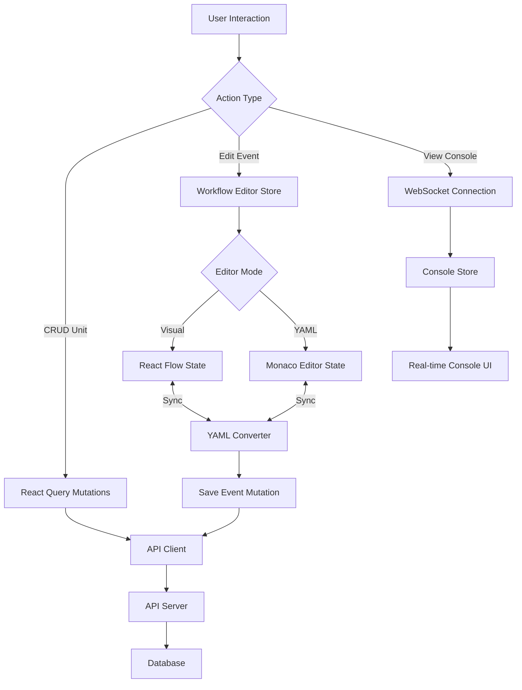

# Kế hoạch Migration: Workflow Units Module

**Ngày tạo**: 2025-11-19
**Trạng thái**: Draft
**Tác giả**: Claude Code Assistant

---

## 1. Tổng quan

### 1.1. Mục tiêu Migration

Migrate module **Workflow Units** từ legacy codebase (Blade template + Blockly) sang kiến trúc hiện đại với:

- **React Flow** thay thế Blockly cho workflow builder
- React 19 + TypeScript architecture
- TanStack Router cho routing
- Design system tokens và component library
- Modern state management (React Query + Zustand)

### 1.2. Phân tích Legacy Code

**File nguồn**: `docs/html-module/workflow-units.blade.php` (line 326+)

**Công nghệ cũ**:

- Blade template (PHP server-side rendering)
- Monaco Editor (YAML editor) - CDN version 0.34.1
- Google Blockly (visual workflow builder)
- Vanilla JavaScript classes (WorkflowBlockly, ListView, DetailView, ConsoleView)
- Manual routing với regex patterns
- Inline styles và hardcoded CSS
- WebSocket cho real-time console logs

**Tính năng chính**:

1. **Workflow Units (Luồng)**: CRUD operations cho workflow containers
2. **Workflow Events (Sự kiện)**: Trigger-based automation events
3. **Dual-mode editor**: YAML (Monaco) ↔️ Visual blocks (Blockly)
4. **Event triggers**: SCHEDULE, WEBHOOK, OPTIN_FORM, ACTIVE_TABLE
5. **Real-time console**: WebSocket-based log monitoring
6. **YAML-based logic**: 13 block types (table, email, loop, condition, math, etc.)

### 1.3. Lý do chọn React Flow thay vì Blockly

**React Flow** (✅ Recommended):

- Native React component với TypeScript support
- Enterprise-ready: Dùng bởi n8n, Temporal, Stripe
- Node-based UI phù hợp workflow automation
- Highly customizable nodes và edges
- Built-in features: mini-map, controls, background, selection
- Active development và community support (2025)
- Flexible layout: horizontal, vertical, custom algorithms

**Blockly** (❌ Không phù hợp):

- Education-focused, block-based syntax builder
- Limited customization cho enterprise workflows
- Không tích hợp tốt với React ecosystem
- UI/UX không match với modern automation tools (n8n, Zapier, Make.com)
- Legacy approach cho workflow builders

**Tham khảo best practices từ các tools phổ biến**:

- **n8n**: Node-based graph, complex workflows, technical users
- **Make.com**: Flowchart-style, visual clarity, balanced complexity
- **Zapier**: Linear approach, non-technical users, simple triggers

**Beqeek sẽ theo hướng**: n8n-style với React Flow - balancing power và flexibility.

---

## 2. Kiến trúc Mới

### 2.1. Tech Stack

```
Frontend Framework:
- React 19 + TypeScript 5.9
- TanStack Router (file-based routing)
- TanStack Query (server state)
- Zustand (global state - workflow editor state)

Workflow Builder:
- React Flow v12+ (node-based workflow editor)
- Monaco Editor (@monaco-editor/react) cho YAML editing
- react-hook-form + zod (form validation)

UI Components:
- @workspace/ui (shadcn/ui components)
- Layout primitives (Stack, Inline, Grid, Box, Container)
- Typography components (Heading, Text, Code)
- Design tokens (CSS custom properties)

Real-time:
- WebSocket client (native or library như socket.io-client)
- React Query cho WebSocket state management

Data Validation:
- Zod schemas cho workflow event config
- YAML validation library (js-yaml)
```

### 2.2. Cấu trúc Thư mục

```
apps/web/src/features/workflow-units/
├── api/
│   ├── workflow-units-api.ts          # API client cho workflow units
│   ├── workflow-events-api.ts         # API client cho workflow events
│   └── types.ts                       # API request/response types
├── components/
│   ├── workflow-builder/
│   │   ├── workflow-canvas.tsx        # React Flow canvas
│   │   ├── nodes/                     # Custom node components
│   │   │   ├── trigger-node.tsx       # Trigger node (SCHEDULE, WEBHOOK, etc.)
│   │   │   ├── action-node.tsx        # Action nodes (table, email, API call)
│   │   │   ├── condition-node.tsx     # Conditional logic
│   │   │   ├── loop-node.tsx          # Loop/iteration
│   │   │   └── index.ts
│   │   ├── edges/
│   │   │   ├── custom-edge.tsx        # Custom edge styling
│   │   │   └── index.ts
│   │   ├── panels/
│   │   │   ├── node-config-panel.tsx  # Right sidebar cho node config
│   │   │   ├── workflow-controls.tsx  # Top controls (save, deploy, test)
│   │   │   └── minimap-panel.tsx      # Minimap
│   │   └── yaml-editor.tsx            # Monaco editor wrapper
│   ├── workflow-unit-list.tsx         # List view
│   ├── workflow-event-list.tsx        # Event list in detail view
│   ├── event-trigger-config.tsx       # Trigger configuration form
│   ├── console-viewer.tsx             # Real-time console logs
│   └── dialogs/
│       ├── create-workflow-unit-dialog.tsx
│       ├── create-event-dialog.tsx
│       └── delete-confirm-dialog.tsx
├── hooks/
│   ├── use-workflow-units.ts          # React Query: list workflow units
│   ├── use-workflow-unit.ts           # React Query: single unit
│   ├── use-create-workflow-unit.ts
│   ├── use-update-workflow-unit.ts
│   ├── use-delete-workflow-unit.ts
│   ├── use-workflow-events.ts         # React Query: list events
│   ├── use-workflow-event.ts
│   ├── use-create-event.ts
│   ├── use-update-event.ts
│   ├── use-delete-event.ts
│   ├── use-workflow-builder.ts        # Custom hook cho React Flow state
│   ├── use-yaml-editor.ts             # Monaco editor state
│   └── use-console-websocket.ts       # WebSocket connection
├── stores/
│   └── workflow-editor-store.ts       # Zustand store cho editor state
├── utils/
│   ├── yaml-to-nodes.ts               # Convert YAML → React Flow nodes
│   ├── nodes-to-yaml.ts               # Convert React Flow nodes → YAML
│   ├── yaml-validator.ts              # YAML validation
│   └── node-types.ts                  # Node type definitions
├── pages/
│   ├── workflow-units-list.tsx        # List page
│   ├── workflow-unit-detail.tsx       # Unit detail with events
│   ├── workflow-event-editor.tsx      # Event editor (React Flow)
│   └── workflow-console.tsx           # Console monitoring
└── types.ts                           # Feature types

apps/web/src/routes/
└── $locale/
    └── workspaces/
        └── $workspaceId/
            └── workflow-units/
                ├── index.tsx                           # List page route
                ├── $unitId/
                │   ├── index.tsx                       # Unit detail route
                │   └── events/
                │       ├── $eventId/
                │       │   ├── edit.tsx                # Event editor route
                │       │   └── console.tsx             # Console route
                │       └── create.tsx                  # Create event route
                └── create.tsx                          # Create unit route
```

### 2.3. Data Flow



**State Management Strategy**:

1. **Server State (React Query)**:
   - Workflow units list
   - Workflow events list
   - Single unit/event details
   - Mutations: create, update, delete

2. **Global State (Zustand)**:
   - Workflow editor mode (visual/YAML)
   - Current editing event ID
   - Canvas zoom/pan state
   - Selected nodes

3. **Local State (useState)**:
   - Form inputs (dialogs)
   - UI toggles (dropdowns, panels)
   - Temporary data

### 2.4. API Integration

**Endpoint mapping** (giữ nguyên spec):

```typescript
// Workflow Units API
POST /api/workspace/{workspaceId}/workflow/get/workflow_units
POST /api/workspace/{workspaceId}/workflow/get/workflow_units/{unitId}
POST /api/workspace/{workspaceId}/workflow/post/workflow_units
POST /api/workspace/{workspaceId}/workflow/patch/workflow_units/{unitId}
POST /api/workspace/{workspaceId}/workflow/delete/workflow_units/{unitId}

// Workflow Events API
POST /api/workspace/{workspaceId}/workflow/get/workflow_events
POST /api/workspace/{workspaceId}/workflow/get/workflow_events/{eventId}
POST /api/workspace/{workspaceId}/workflow/post/workflow_events
POST /api/workspace/{workspaceId}/workflow/patch/workflow_events/{eventId}
POST /api/workspace/{workspaceId}/workflow/delete/workflow_events/{eventId}

// Helper APIs
POST /api/workspace/{workspaceId}/workflow/get/workflow_forms
POST /api/workspace/{workspaceId}/workflow/get/active_tables
POST /api/workspace/{workspaceId}/workflow/get/active_tables/{tableId}

// WebSocket
ws://connect.o1erp.com?sys={workspaceId}&token=nvmteam&response_id={responseId}
```

---

## 3. React Flow Implementation

### 3.1. Node Types

**13 custom nodes** tương ứng với YAML block types:

```typescript
// Node type mapping
const NODE_TYPES = {
  // Triggers (special start nodes)
  trigger_schedule: TriggerScheduleNode,
  trigger_webhook: TriggerWebhookNode,
  trigger_form: TriggerFormNode,
  trigger_table: TriggerTableNode,

  // Actions
  table_operation: TableOperationNode, // get_list, get_one, create, update, delete
  table_comment: TableCommentNode, // comment_create, comment_get_one
  user_operation: UserOperationNode, // get_list, get_one
  smtp_email: SmtpEmailNode,
  google_sheet: GoogleSheetNode, // sheet_create, sheet_append, sheet_read, sheet_update
  api_call: ApiCallNode,
  delay: DelayNode,

  // Logic
  condition: ConditionNode, // if/else with expressions
  match: MatchNode, // switch/case pattern matching
  loop: LoopNode, // foreach iteration
  math: MathNode, // calculations
  definition: DefinitionNode, // variable declarations
  log: LogNode, // debug logging
};
```

### 3.2. Node Component Structure

**Example: Table Operation Node**

```tsx
// apps/web/src/features/workflow-units/components/workflow-builder/nodes/table-operation-node.tsx

import { memo } from 'react';
import { Handle, Position, NodeProps } from '@xyflow/react';
import { Database, Plus, Edit, Trash, Eye } from 'lucide-react';
import { Box, Stack, Inline } from '@workspace/ui/components/primitives';
import { Text } from '@workspace/ui/components/typography';
import { cn } from '@workspace/ui/lib/utils';

export interface TableOperationNodeData {
  name: string;
  connector: string;
  action: 'get_list' | 'get_one' | 'create' | 'update' | 'delete';
  config?: Record<string, unknown>;
}

export const TableOperationNode = memo(({ data, selected }: NodeProps<TableOperationNodeData>) => {
  const actionIcons = {
    get_list: Eye,
    get_one: Eye,
    create: Plus,
    update: Edit,
    delete: Trash,
  };

  const ActionIcon = actionIcons[data.action];

  return (
    <Box
      padding="space-200"
      backgroundColor="card"
      borderRadius="md"
      border="default"
      className={cn('min-w-[200px] transition-shadow', selected && 'ring-2 ring-primary shadow-lg')}
    >
      <Handle type="target" position={Position.Top} />

      <Stack space="space-150">
        <Inline space="space-100" align="center">
          <Database className="size-4 text-primary" />
          <Text size="small" weight="semibold">
            {data.name || 'Table Operation'}
          </Text>
        </Inline>

        <Inline space="space-100" align="center">
          <ActionIcon className="size-3 text-muted-foreground" />
          <Text size="small" color="muted">
            {data.action}
          </Text>
        </Inline>
      </Stack>

      <Handle type="source" position={Position.Bottom} />
    </Box>
  );
});

TableOperationNode.displayName = 'TableOperationNode';
```

### 3.3. Workflow Canvas Component

```tsx
// apps/web/src/features/workflow-units/components/workflow-builder/workflow-canvas.tsx

import { useCallback, useMemo } from 'react';
import {
  ReactFlow,
  Background,
  Controls,
  MiniMap,
  useNodesState,
  useEdgesState,
  addEdge,
  Connection,
  Edge,
  Panel,
} from '@xyflow/react';
import '@xyflow/react/dist/style.css';
import { NODE_TYPES } from './nodes';
import { useWorkflowBuilderStore } from '../../stores/workflow-editor-store';

export const WorkflowCanvas = () => {
  const { nodes: storeNodes, edges: storeEdges, updateNodes, updateEdges } = useWorkflowBuilderStore();

  const [nodes, setNodes, onNodesChange] = useNodesState(storeNodes);
  const [edges, setEdges, onEdgesChange] = useEdgesState(storeEdges);

  const onConnect = useCallback(
    (params: Connection | Edge) => {
      const newEdges = addEdge(params, edges);
      setEdges(newEdges);
      updateEdges(newEdges);
    },
    [edges, setEdges, updateEdges],
  );

  const nodeTypes = useMemo(() => NODE_TYPES, []);

  return (
    <div className="h-full w-full">
      <ReactFlow
        nodes={nodes}
        edges={edges}
        onNodesChange={onNodesChange}
        onEdgesChange={onEdgesChange}
        onConnect={onConnect}
        nodeTypes={nodeTypes}
        fitView
        attributionPosition="bottom-right"
      >
        <Background />
        <Controls />
        <MiniMap />

        <Panel position="top-right" className="space-y-2">
          {/* Workflow controls: Save, Test, Deploy */}
        </Panel>
      </ReactFlow>
    </div>
  );
};
```

### 3.4. YAML ↔ React Flow Conversion

**YAML → Nodes converter**:

```typescript
// apps/web/src/features/workflow-units/utils/yaml-to-nodes.ts

import { Node, Edge } from '@xyflow/react';
import * as yaml from 'js-yaml';

export interface YamlStage {
  name: string;
  blocks: YamlBlock[];
}

export interface YamlBlock {
  type: string;
  name: string;
  input?: Record<string, unknown>;
  blocks?: YamlBlock[]; // For loop/condition nested blocks
  then?: YamlBlock[];
  else?: YamlBlock[];
  cases?: Array<{ pattern: string; then: YamlBlock[] }>;
}

export const yamlToNodes = (yamlString: string): { nodes: Node[]; edges: Edge[] } => {
  const parsed = yaml.load(yamlString) as { stages: YamlStage[] };

  const nodes: Node[] = [];
  const edges: Edge[] = [];
  let yPos = 100;

  parsed.stages.forEach((stage, stageIdx) => {
    let xPos = 100;

    stage.blocks.forEach((block, blockIdx) => {
      const nodeId = `${stage.name}-${block.name}-${blockIdx}`;

      nodes.push({
        id: nodeId,
        type: getNodeType(block.type),
        position: { x: xPos, y: yPos },
        data: {
          name: block.name,
          ...block.input,
        },
      });

      // Connect to previous block
      if (blockIdx > 0) {
        const prevNodeId = `${stage.name}-${stage.blocks[blockIdx - 1].name}-${blockIdx - 1}`;
        edges.push({
          id: `${prevNodeId}-${nodeId}`,
          source: prevNodeId,
          target: nodeId,
        });
      }

      // Handle nested blocks (condition, loop, match)
      if (block.then || block.else || block.cases || block.blocks) {
        // TODO: Implement nested block conversion with proper positioning
      }

      xPos += 250;
    });

    yPos += 150;
  });

  return { nodes, edges };
};

const getNodeType = (blockType: string): string => {
  const mapping: Record<string, string> = {
    table: 'table_operation',
    user: 'user_operation',
    smtp_email: 'smtp_email',
    google_sheet: 'google_sheet',
    api_call: 'api_call',
    delay: 'delay',
    condition: 'condition',
    match: 'match',
    loop: 'loop',
    math: 'math',
    definition: 'definition',
    log: 'log',
  };

  return mapping[blockType] || 'log';
};
```

**Nodes → YAML converter**:

```typescript
// apps/web/src/features/workflow-units/utils/nodes-to-yaml.ts

import { Node, Edge } from '@xyflow/react';
import * as yaml from 'js-yaml';

export const nodesToYaml = (nodes: Node[], edges: Edge[]): string => {
  // Build dependency graph from edges
  const graph = buildGraph(edges);

  // Topological sort to determine execution order
  const executionOrder = topologicalSort(nodes, graph);

  // Group nodes into stages (can be enhanced later)
  const stages = [
    {
      name: 'main',
      blocks: executionOrder.map((node) => nodeToBlock(node)),
    },
  ];

  return yaml.dump(
    { stages },
    {
      indent: 2,
      lineWidth: 120,
      noRefs: true,
    },
  );
};

const nodeToBlock = (node: Node): YamlBlock => {
  const { type, data } = node;

  // Extract block type from node type
  const blockType = getBlockType(type);

  return {
    type: blockType,
    name: data.name,
    input: {
      ...data,
      // Remove internal fields
      name: undefined,
    },
  };
};

const getBlockType = (nodeType: string): string => {
  const mapping: Record<string, string> = {
    table_operation: 'table',
    user_operation: 'user',
    smtp_email: 'smtp_email',
    // ... etc
  };

  return mapping[nodeType] || nodeType;
};
```

---

## 4. Design System Integration

### 4.1. Component Standards

**MUST use design tokens**:

```tsx
// ✅ CORRECT
<div className="border border-input bg-background text-foreground rounded-md">

// ❌ WRONG
<div className="border border-gray-300 bg-white text-gray-900 rounded-md">
```

### 4.2. Layout với Primitives

```tsx
import { Container, Stack, Inline, Box, Grid, GridItem } from '@workspace/ui/components/primitives';

export const WorkflowUnitDetailPage = () => {
  return (
    <Container maxWidth="xl" padding="margin">
      <Stack space="space-400">
        {/* Header */}
        <Inline justify="between" align="center">
          <Heading level={1}>Workflow Unit Name</Heading>
          <Inline space="space-200">
            <Button variant="outline">Settings</Button>
            <Button variant="destructive">Delete</Button>
          </Inline>
        </Inline>

        {/* Main content */}
        <Grid columns={12} gap="space-400">
          {/* Event list sidebar */}
          <GridItem span={12} spanLg={3}>
            <Box padding="space-300" backgroundColor="card" borderRadius="lg" border="default">
              <Stack space="space-200">
                <Text weight="semibold">Events</Text>
                {/* Event list items */}
              </Stack>
            </Box>
          </GridItem>

          {/* Workflow canvas */}
          <GridItem span={12} spanLg={9}>
            <Box
              padding="space-0"
              backgroundColor="background"
              borderRadius="lg"
              border="default"
              className="h-[600px]"
            >
              <WorkflowCanvas />
            </Box>
          </GridItem>
        </Grid>
      </Stack>
    </Container>
  );
};
```

### 4.3. Typography Components

```tsx
import { Heading, Text, Code } from '@workspace/ui/components/typography';

<Heading level={2}>Event Configuration</Heading>
<Text size="small" color="muted">Configure trigger and actions</Text>
<Code inline={false}>{yamlContent}</Code>
```

### 4.4. Node Styling với Design Tokens

```tsx
// Custom node với design system
const nodeStyle = {
  default: 'bg-card border-border text-card-foreground',
  selected: 'ring-2 ring-primary shadow-lg',
  error: 'border-destructive bg-destructive/10',
  disabled: 'opacity-50 cursor-not-allowed',
};
```

---

## 5. Migration Phases

### Phase 1: Foundation Setup (Week 1)

**Mục tiêu**: Cấu trúc cơ bản và routing

**Tasks**:

- [ ] Tạo folder structure theo kiến trúc mới
- [ ] Setup TanStack Router routes:
  - `/$locale/workspaces/$workspaceId/workflow-units/index.tsx`
  - `/$locale/workspaces/$workspaceId/workflow-units/$unitId/index.tsx`
  - `/$locale/workspaces/$workspaceId/workflow-units/$unitId/events/$eventId/edit.tsx`
  - `/$locale/workspaces/$workspaceId/workflow-units/$unitId/events/$eventId/console.tsx`
- [ ] Install dependencies:
  - `@xyflow/react`
  - `@monaco-editor/react`
  - `js-yaml` + `@types/js-yaml`
- [ ] Tạo API client skeleton (`workflow-units-api.ts`, `workflow-events-api.ts`)
- [ ] Setup Zustand store (`workflow-editor-store.ts`)
- [ ] Tạo route constants trong `shared/route-paths.ts`

**Deliverables**:

- Folder structure hoàn chỉnh
- Routes hoạt động với placeholder content
- API types definition

### Phase 2: Workflow Units CRUD (Week 2)

**Mục tiêu**: Quản lý Workflow Units

**Tasks**:

- [ ] Implement API client methods:
  - `getWorkflowUnits()`
  - `getWorkflowUnit(unitId)`
  - `createWorkflowUnit(data)`
  - `updateWorkflowUnit(unitId, data)`
  - `deleteWorkflowUnit(unitId)`
- [ ] React Query hooks:
  - `useWorkflowUnits()`
  - `useWorkflowUnit(unitId)`
  - `useCreateWorkflowUnit()`
  - `useUpdateWorkflowUnit()`
  - `useDeleteWorkflowUnit()`
- [ ] Components:
  - `workflow-unit-list.tsx` (list view with cards)
  - `create-workflow-unit-dialog.tsx`
  - `delete-confirm-dialog.tsx`
- [ ] List page (`workflow-units-list.tsx`)
- [ ] Detail page skeleton (`workflow-unit-detail.tsx`)

**Deliverables**:

- Functional CRUD cho Workflow Units
- List page với create/delete actions
- Detail page routing

### Phase 3: React Flow Integration (Week 3-4) ✅ 90% COMPLETE

**Mục tiêu**: Visual workflow builder

**Status**: ⚠️ **Requires Fixes Before Phase 4**

**Tasks**:

- [x] Define node types và interfaces ✅
- [x] Implement custom nodes (17 types - exceeded 13): ✅
  - Trigger nodes (4 types) ✅
  - Action nodes (7 types) ✅
  - Logic nodes (6 types) ✅
- [x] Create `workflow-canvas.tsx` với React Flow ✅
- [x] Implement node palette/toolbar (drag-and-drop new nodes) ✅
- [x] Node configuration panel (right sidebar) ✅
- [ ] Implement basic YAML ↔ Nodes conversion: ⚠️ **Placeholder only**
  - [ ] `yaml-to-nodes.ts` (parser) - Deferred to Phase 4
  - [ ] `nodes-to-yaml.ts` (serializer) - Deferred to Phase 4
- [x] Node connection validation (type checking) ⚠️ **Incomplete - needs circular dependency fix**
- [x] Canvas controls (zoom, pan, fit view, minimap) ✅

**Deliverables**:

- [x] Working React Flow canvas ✅
- [x] All 17 custom node types (exceeded plan: 17 vs 13) ✅
- [ ] Bi-directional YAML conversion (basic) ⚠️ **Deferred to Phase 4**

**Code Review Report**: `plans/workflow-units-migration-plan/reports/251119-code-review-phase-3-react-flow-integration.md`

**Critical Issues to Fix (6)**:

1. ❌ Hardcoded colors - violates design system (must use tokens)
2. ❌ Incomplete circular dependency detection in connection validator
3. 🔴 Console statements in production code
4. 🔴 Missing error boundaries
5. 🔴 Unused imports causing lint warnings
6. 🔴 Missing type guards in drag-and-drop

**Quality Score**: 70/100

- Architecture: 90/100 (Excellent DRY principles)
- Design System: 65/100 (Needs color token fixes)
- Type Safety: 85/100 (Good)
- Performance: 70/100 (Acceptable for Phase 3)
- Security: 95/100 (Excellent)

**Next Steps**:

1. Fix all 6 critical/high priority issues
2. Replace placeholder YAML conversion with Phase 4 implementation
3. Test connection validation thoroughly
4. Run linting and fix warnings

### Phase 4: Event Management (Week 5)

**Mục tiêu**: Workflow Events CRUD

**Tasks**:

- [ ] API client methods cho events
- [ ] React Query hooks cho events
- [ ] Components:
  - `workflow-event-list.tsx` (left sidebar)
  - `event-trigger-config.tsx` (trigger configuration form)
  - `create-event-dialog.tsx`
- [ ] Event editor page (`workflow-event-editor.tsx`)
- [ ] Trigger configuration:
  - SCHEDULE: Cron expression input
  - WEBHOOK: Auto-generate webhook URL
  - OPTIN_FORM: Form selector + action selector
  - ACTIVE_TABLE: Table selector + action selector
- [ ] Save event với YAML từ React Flow nodes

**Deliverables**:

- Event CRUD operations
- Trigger configuration UI
- Event list integration

### Phase 5: Monaco Editor Integration (Week 6)

**Mục tiêu**: YAML code editor

**Tasks**:

- [ ] Integrate `@monaco-editor/react`
- [ ] Create `yaml-editor.tsx` wrapper component
- [ ] YAML syntax highlighting và validation
- [ ] Auto-complete cho YAML keywords
- [ ] Dual-mode toggle: Visual (React Flow) ↔️ YAML (Monaco)
- [ ] Sync state between modes:
  - Visual → YAML: Convert nodes to YAML on mode switch
  - YAML → Visual: Parse YAML to nodes on mode switch
- [ ] YAML validation với error highlighting

**Deliverables**:

- Functional Monaco YAML editor
- Mode switching
- Bi-directional sync

### Phase 6: Console Monitoring (Week 7)

**Mục tiêu**: Real-time console logs

**Tasks**:

- [ ] WebSocket client setup
- [ ] `use-console-websocket.ts` hook
- [ ] Console page (`workflow-console.tsx`)
- [ ] Components:
  - `console-viewer.tsx` (log display)
  - Real-time log streaming
  - Log filtering (level: info, warn, error)
  - Auto-scroll to latest log
- [ ] Connect to WebSocket endpoint: `ws://connect.o1erp.com?sys={workspaceId}&token=nvmteam&response_id={responseId}`

**Deliverables**:

- Real-time console monitoring
- WebSocket integration

### Phase 7: Advanced Features (Week 8-9)

**Mục tiêu**: Enhanced workflow editing

**Tasks**:

- [ ] Advanced YAML ↔ Nodes conversion:
  - Nested blocks (condition with then/else)
  - Loop with nested blocks
  - Match/case branching
- [ ] Node grouping (stages)
- [ ] Undo/redo functionality
- [ ] Keyboard shortcuts:
  - Delete node: Delete/Backspace
  - Select all: Cmd+A
  - Copy/Paste: Cmd+C, Cmd+V
- [ ] Auto-layout algorithms (dagre for hierarchical layout)
- [ ] Node validation rules
- [ ] Error indicators on nodes
- [ ] Export/import workflow templates

**Deliverables**:

- Advanced editing features
- Better UX với keyboard shortcuts

### Phase 8: Testing & Polish (Week 10)

**Mục tiêu**: Testing và optimization

**Tasks**:

- [ ] Unit tests cho utilities:
  - `yaml-to-nodes.test.ts`
  - `nodes-to-yaml.test.ts`
  - `yaml-validator.test.ts`
- [ ] Integration tests cho API hooks
- [ ] E2E tests với Playwright:
  - Create workflow unit
  - Create event
  - Edit workflow visually
  - Switch to YAML mode
  - Save and reload
- [ ] Performance optimization:
  - Memoization cho node components
  - Virtual scrolling cho large workflows
  - Debounce auto-save
- [ ] Accessibility audit (WCAG 2.1 AA)
- [ ] Mobile responsive (if applicable)

**Deliverables**:

- Test coverage >80%
- Performance benchmarks
- Accessibility compliance

### Phase 9: Documentation & Deployment (Week 11)

**Mục tiêu**: Docs và deployment

**Tasks**:

- [ ] User documentation:
  - Workflow Units user guide
  - YAML syntax reference
  - Node types reference
  - Best practices
- [ ] Developer documentation:
  - Architecture diagrams
  - API documentation
  - Component storybook (optional)
- [ ] Migration guide từ legacy system
- [ ] Deploy to staging
- [ ] User acceptance testing (UAT)
- [ ] Deploy to production

**Deliverables**:

- Complete documentation
- Production deployment

---

## 6. Technical Challenges & Solutions

### Challenge 1: YAML ↔ React Flow Bi-directional Conversion

**Problem**: Complex YAML structures (nested conditions, loops) khó map sang graph.

**Solution**:

- Use hierarchical node system với parent-child relationships
- Condition nodes có 2 output handles: "then" và "else"
- Loop nodes có special "iteration" edge type
- Maintain metadata trong node data để preserve YAML structure

### Challenge 2: WebSocket Real-time Console

**Problem**: WebSocket connection management, reconnection, state sync.

**Solution**:

- Use custom hook `use-console-websocket.ts` với auto-reconnect
- Buffer logs client-side khi connection dropped
- React Query integration cho persistent state
- Visual indicators cho connection status

### Challenge 3: Large Workflow Performance

**Problem**: React Flow performance với 100+ nodes.

**Solution**:

- Enable `nodesDraggable`, `nodesConnectable`, `elementsSelectable` conditionally
- Use `memo()` cho custom node components
- Lazy rendering với viewport-based culling
- Virtual edges (only render visible connections)

### Challenge 4: Nested Block Visualization

**Problem**: YAML cho phép nested blocks (condition trong loop trong condition).

**Solution**:

- Use subflows/swimlanes cho nested contexts
- Visual grouping với background nodes
- Breadcrumb navigation cho nested contexts
- Expandable/collapsible groups

### Challenge 5: Type Safety với Dynamic YAML

**Problem**: YAML structure dynamic, TypeScript validation khó.

**Solution**:

- Zod schemas cho từng block type
- Runtime validation khi parse YAML
- TypeScript discriminated unions cho node data
- Error boundaries cho parsing failures

---

## 7. Design References

### 7.1. Workflow Builders để tham khảo

**n8n** (Node-based, Technical):

- Complex workflows với nhiều nodes
- Clear visual hierarchy
- Node grouping và labeling
- Mini-map cho navigation

**Make.com** (Flowchart, Balanced):

- Visual clarity với large nodes
- Color-coded node types
- Clear connection lines
- Configuration panels

**Zapier** (Linear, Simple):

- Step-by-step linear flow
- Simple trigger → actions
- Inline configuration
- Minimal visual complexity

**Beqeek approach**: Kết hợp n8n (technical power) + Make.com (visual clarity).

### 7.2. UI/UX Principles

1. **Progressive Disclosure**: Show simple first, reveal complexity on demand
2. **Visual Hierarchy**: Clear distinction giữa triggers, actions, logic
3. **Immediate Feedback**: Real-time validation, error indicators
4. **Consistent Patterns**: Same interaction patterns across all nodes
5. **Accessible**: Keyboard navigation, screen reader support
6. **Responsive**: Work on desktop (primary), tablet (secondary)

### 7.3. Node Design Patterns

```
┌─────────────────────────┐
│  [Icon] Node Type       │  ← Header with icon + type
├─────────────────────────┤
│  Configuration Summary  │  ← Key config preview
│  • Field 1: Value       │
│  • Field 2: Value       │
└─────────────────────────┘
    ↓ (connection point)
```

**Color coding**:

- Triggers: Blue (#5C81A6)
- Table operations: Green (#5CA65C)
- Logic: Teal (#5CA68C)
- Math: Orange (#A65C5C)
- Email/External: Purple (#A65CA6)

---

## 8. Migration Checklist

### Pre-Migration

- [ ] Backup legacy database
- [ ] Document current workflows in production
- [ ] User training plan
- [ ] Rollback strategy

### Migration

- [ ] Data migration script (if needed)
- [ ] Feature flag for gradual rollout
- [ ] A/B testing setup
- [ ] Monitor performance metrics

### Post-Migration

- [ ] User feedback collection
- [ ] Bug tracking và fixes
- [ ] Performance optimization
- [ ] Deprecate legacy code

---

## 9. Risks & Mitigation

| Risk                       | Impact | Probability | Mitigation                                             |
| -------------------------- | ------ | ----------- | ------------------------------------------------------ |
| YAML parser complexity     | High   | Medium      | Use battle-tested `js-yaml` library, extensive testing |
| React Flow performance     | Medium | Low         | Memoization, virtual rendering, benchmark testing      |
| WebSocket reliability      | High   | Medium      | Auto-reconnect, offline queue, fallback polling        |
| User adoption resistance   | Medium | Medium      | Gradual rollout, training, keep legacy for transition  |
| Nested block visualization | Medium | High        | Iterative UX testing, simplify initial version         |
| Browser compatibility      | Low    | Low         | Test on Chrome, Firefox, Safari, Edge                  |

---

## 10. Success Metrics

### Technical Metrics

- Time to Interactive (TTI) < 3s
- React Flow canvas render < 500ms for 100 nodes
- YAML parsing < 100ms for 1000 lines
- WebSocket latency < 100ms

### User Metrics

- Workflow creation time: 50% faster than legacy
- User satisfaction score: >4.0/5.0
- Bug reports: <5 per week after launch
- Feature adoption: >60% within 3 months

---

## 11. Next Steps

1. **Review & Approve**: Stakeholder review của migration plan
2. **Resource Allocation**: Assign developers, designers
3. **Timeline Confirmation**: Validate 11-week timeline
4. **Kickoff Meeting**: Align team on architecture và standards
5. **Phase 1 Start**: Begin foundation setup

---

## Phụ lục A: Dependency List

```json
{
  "dependencies": {
    "@xyflow/react": "^12.0.0",
    "@monaco-editor/react": "^4.6.0",
    "js-yaml": "^4.1.0",
    "dagre": "^0.8.5",
    "zod": "^3.22.4"
  },
  "devDependencies": {
    "@types/js-yaml": "^4.0.9",
    "@types/dagre": "^0.7.52"
  }
}
```

## Phụ lục B: Code Examples

Chi tiết implementation examples trong separate docs:

- `workflow-units-api-examples.md`
- `react-flow-node-examples.md`
- `yaml-conversion-examples.md`
- `websocket-integration-examples.md`

---

**Kết luận**: Migration plan này cung cấp roadmap chi tiết để migrate Workflow Units module từ legacy Blockly sang modern React Flow architecture, tuân thủ design system và best practices của Beqeek platform. Timeline 11 weeks với 9 phases rõ ràng, covering foundation → CRUD → visual builder → advanced features → testing → deployment.
